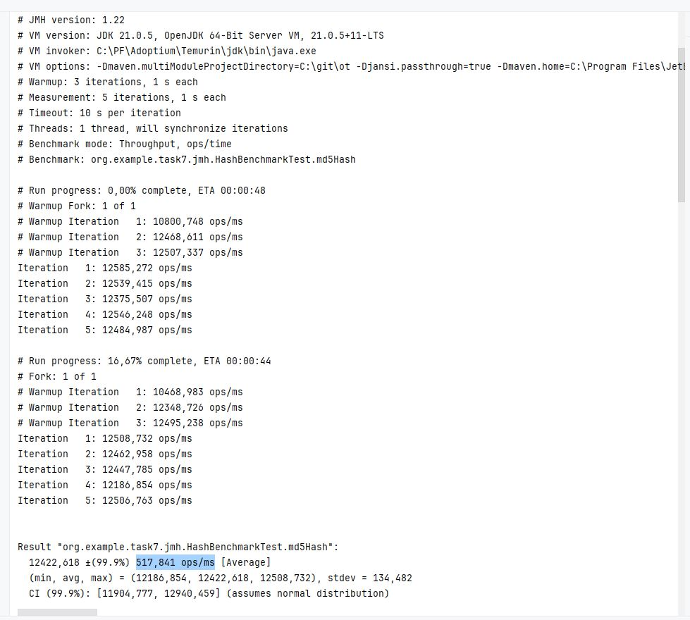
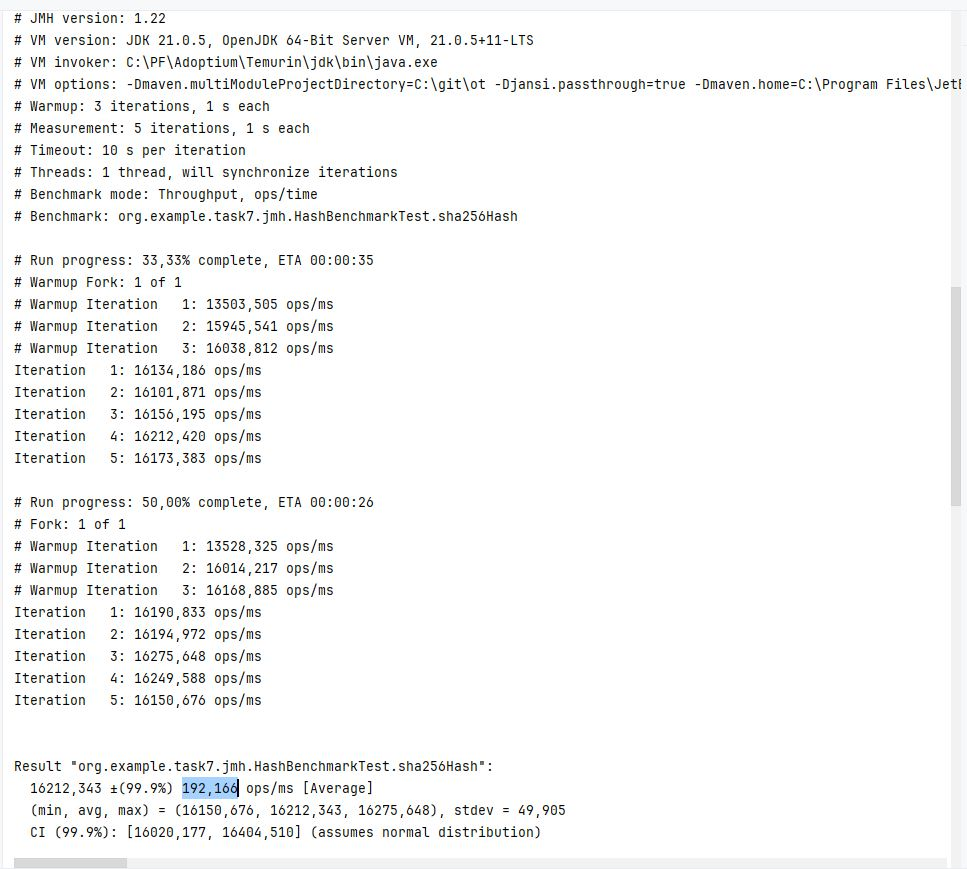
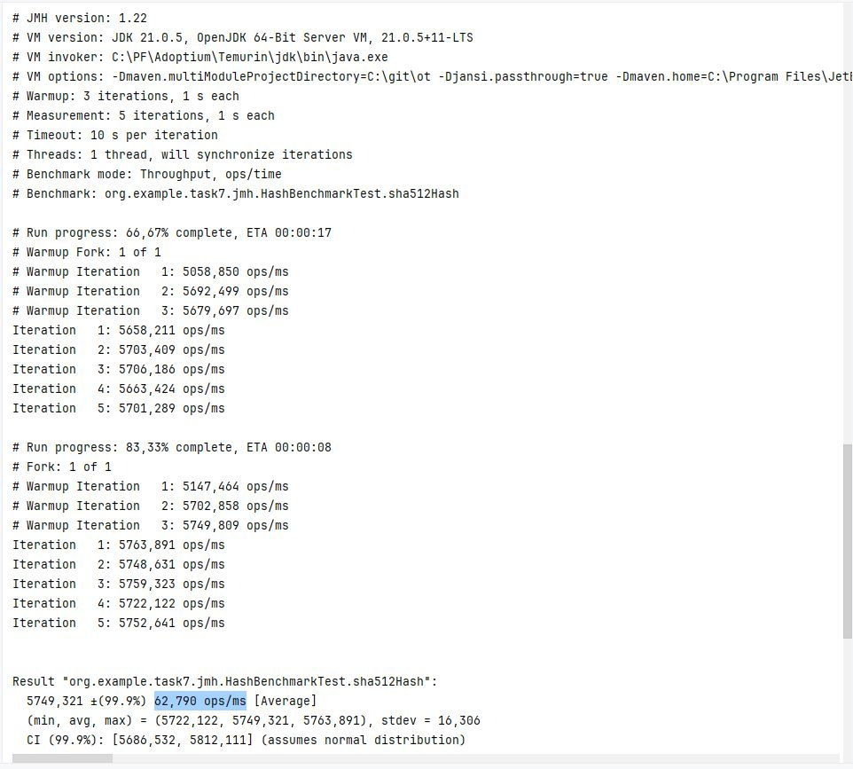
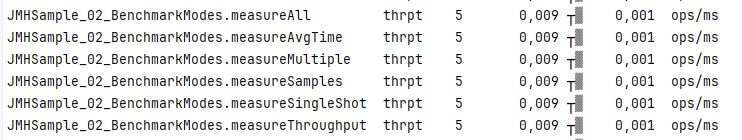
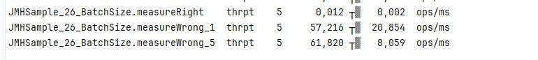
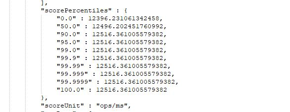

# Spring boot приложение. (утечка памяти) 

### Описание:
* сборка mvn clean package
* Запустить можно плагином  (task7-->Plugins-->jmh:jmh)

### Результаты работы алгоритмов md5, sha256, sha512:

В результате видно что оптимально использовать алгоритм sha256 
(Throughput -операций в секунду), на железе CPU: (i5-14600K), RAM: (32 Gb) 

### 3 различых теста:
JMHSample_02_BenchmarkModes:

JMHSample_26_BatchSize Влияние размера batch на производительность:

JMHSample_32_BulkWarmup прогрев:

### По всем тестам можно поссмотреть в результирующем файле percentiles:

