# Helm
Spring приложение энпойнт - GET /hello, который возвращает строку "Hello world!"

Собираем приложение имежд и паблишим в dockerhub

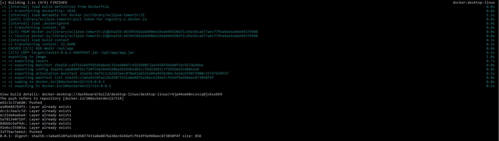

Создаём вручную деплойметн и деплоим

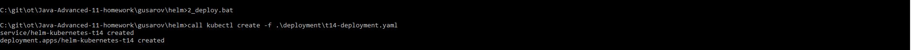

Проверяем в докер десктопе что контейнер запущен

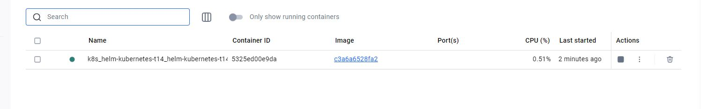

Проверяем результат

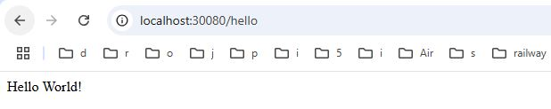

Удаляем сервис, деплоймент

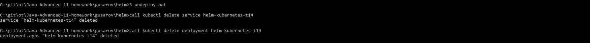

В deployment\helm создаём Chart.yaml и темплейты для деплоймента и сервиса. Выносим настройки в values.yaml

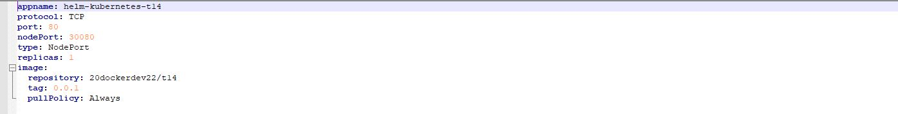

Проверяем как подставятся настройки

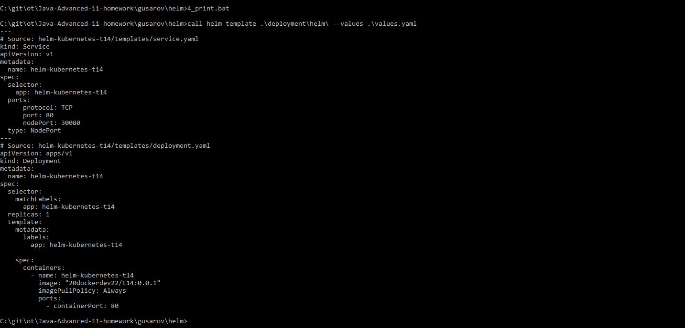

Инсиалим с помошью helm

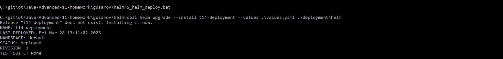

Проверяем в докер десктопе что контейнер запущен

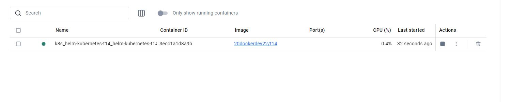

Проверяем результат

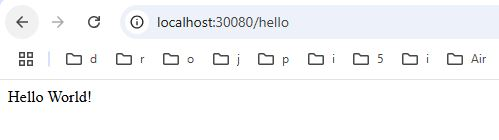

Uninstall с помошью helm

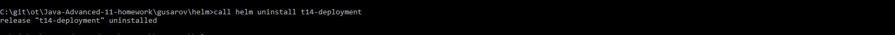
