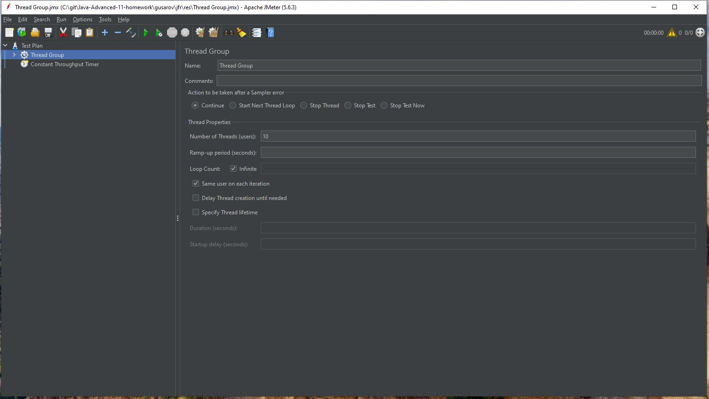
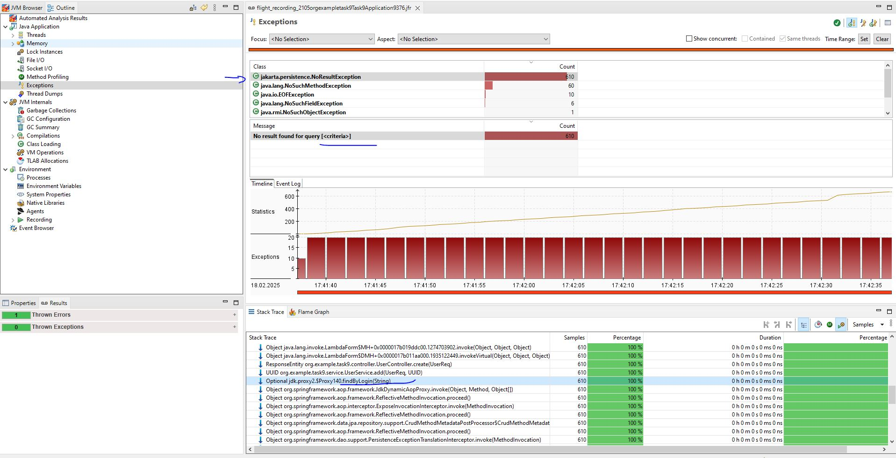
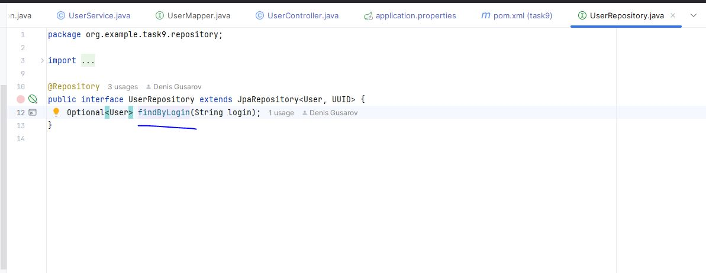
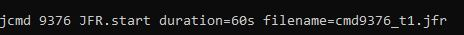
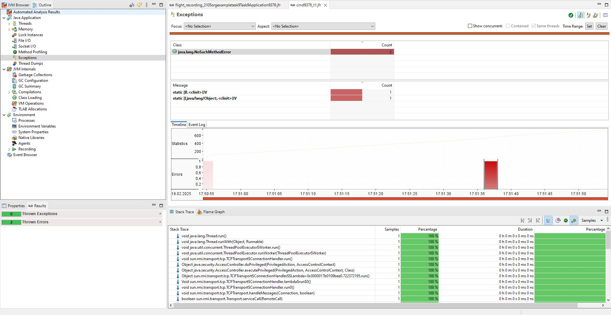
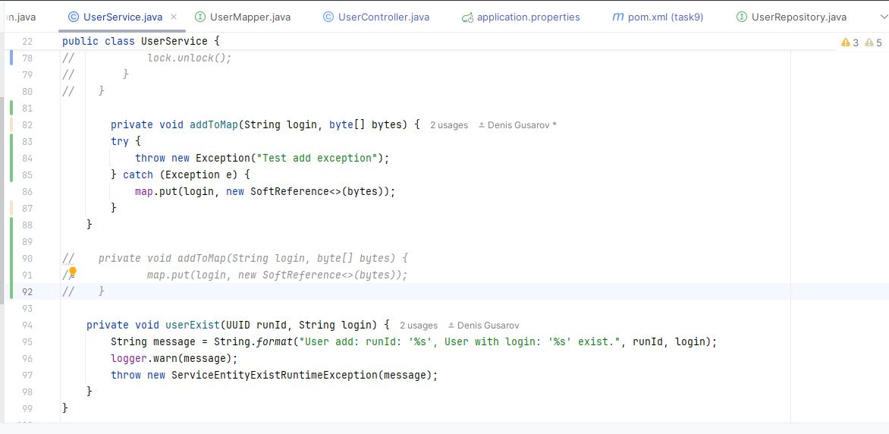
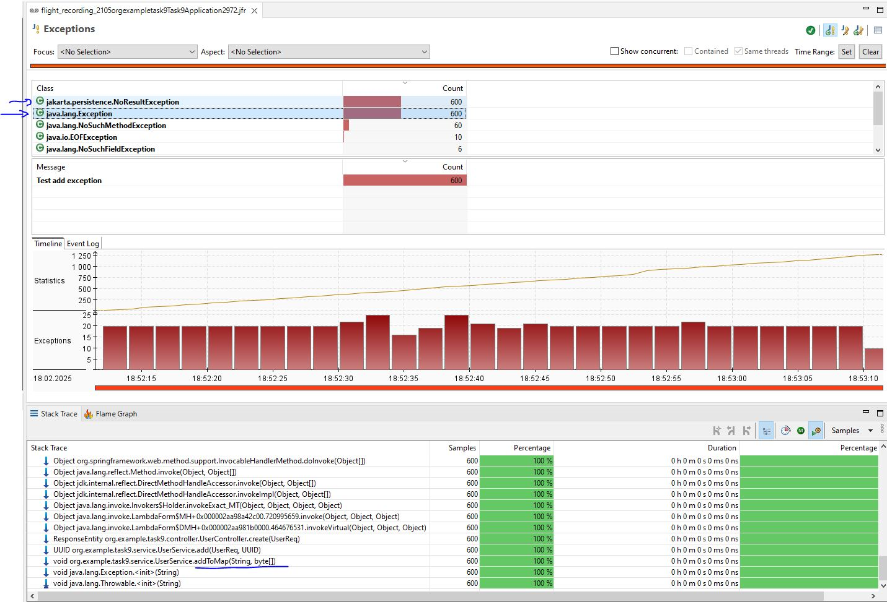
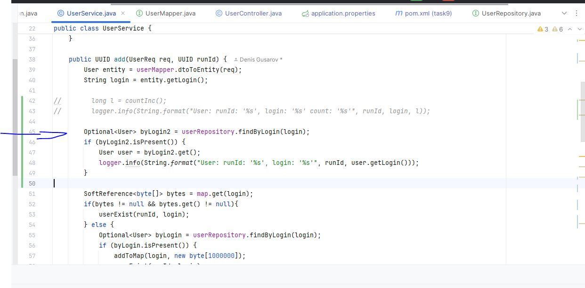
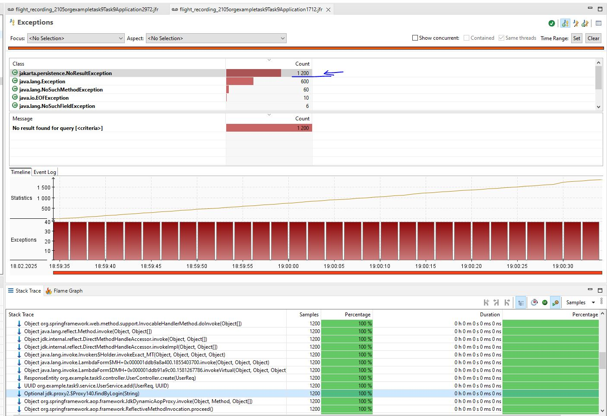

# JFR 

### Описание:
* Swagger: http://127.0.0.1:8089/swagger-ui/index.html
* Добавлен метод (POST) http://localhost:8089/api/v1/users которому в теле передаётся login и password
* Логин уникальный, длина логина и пароля ограничена 100 символами.

### Нагрузка 10 rps:
JMeter посылает 10 запросов в секунду.

### JMC:
После прогрева и запуска JFR на минуту видно 600 NoResultException (в query по <criteria>).  

После изучения места падения видно, что при запросе к БД для поиска (По логину происходит внутри NoResultException)

Запуск JFR при работающем приложении

 

Полного описания ошибок нет ( по умолчанию)

Если в код добавить и отловить исключение (метод addToMap)

То после анализа видно что добавилось ещё 600 исключений (Всего стало порядка 1270) 

Если добавить в код лишний вызов поиска по логину (строка 45)

то исключений NoResultException становиться 1200 что ( наводит на мысль двойного вызова)

Также можно ослеживать сколько раз читался файл из ресурсов ( валидация по схеме). И откуда он был вызван

Писимистичная блокировка была реализована так (стр 72) (но видимо задержки не велики и особенно это не возможно отследить при нагрузке в 10 rps)

