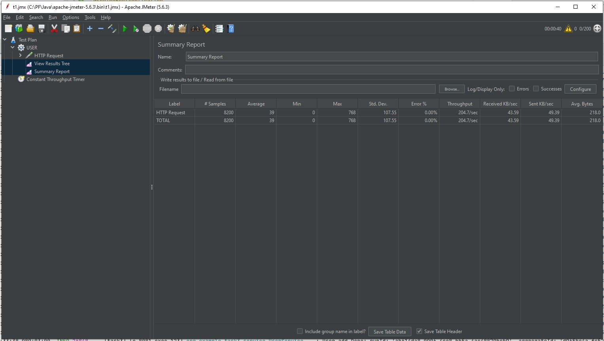
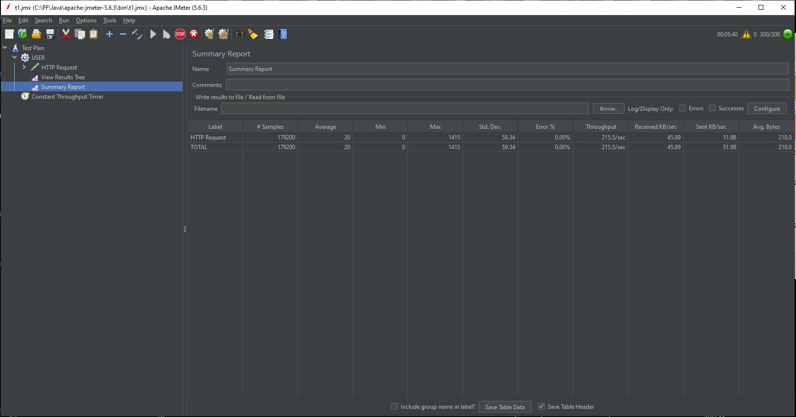
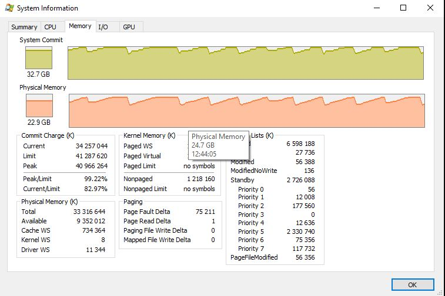
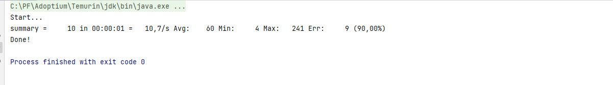
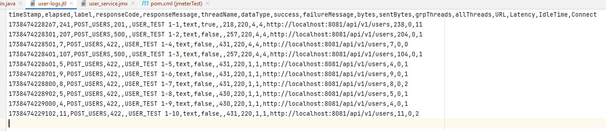
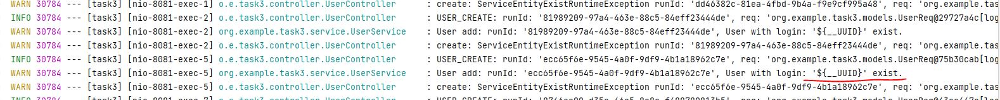
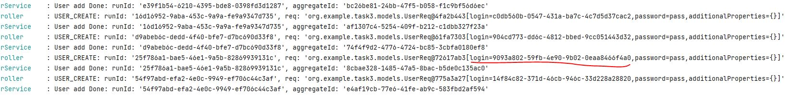

# JMETER.

### Запуск через GUI Jmeter сервис используется из task3:
200 threads, 40 sec (205 запросов в секунду):

300 threads, 5min 40sec (215 запросов в секунду) :

Видно как работает GC:

### Создание плана и запуск через код:
Видно что запуск 90% не успешен

Если посмотреть статусы видно что один запрос прошел ( параллельно с ним 2 получили по 500 так как в БД стоит ограничение на униальный логин), остальные получили 422 ( не возможно создать так как такой есть):

В сервисе видно что Функция UUID не подставила гуид.

Если же созданный кодом план запустить в ГУИ jmeter то всё отработает.

Остался вопрос всё таки как заставить подставлять гуид из кода. (Понятно что если дёргать get без параметра то сработает...)

### Передача параметра и генерация гуида прям в коде:

Пропускная способность метода 244,5 в секунду

Но получается пришлось подправить план в 1 поток без задержки

Создалось 300 запросов с жёстко заданным гуидом

В коде сам генерю 300 запросов

Передача гуида через параметр

В сервисных логах вижно вызовы с различным гуидом

