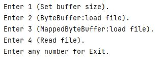
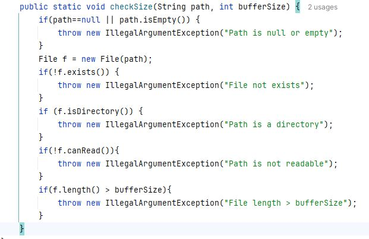
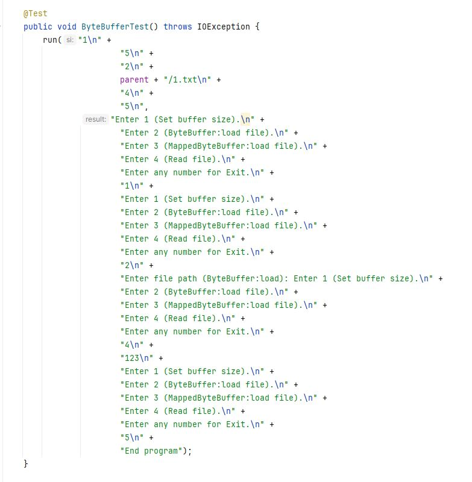
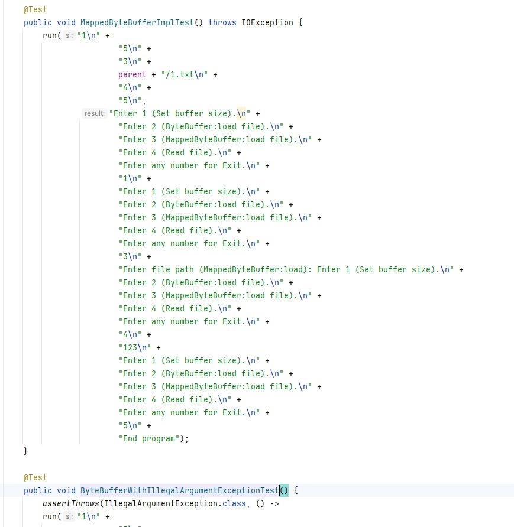

# Java NIO:ByteBuffer и MappedByteBuffer
Добавлены две реализации хранения данных off-heap.
По умолчанию размер буффера max(int).

При запуске программа выводит:

Можно задать размер буфера

Пункт2 и 3 потребует ввести путь до файла для загрузки.

4 чтение

Любое другое число выход.

При чтении файла проверяются следующие случаи:

В тесте можно увидеть ввод вывод 

