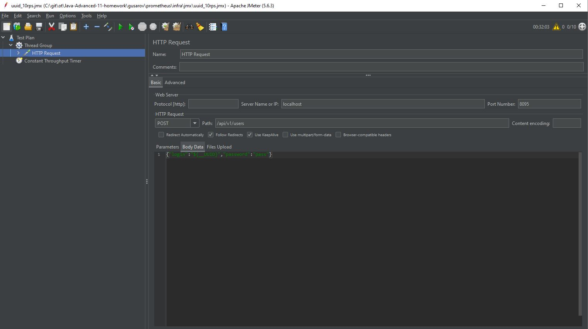
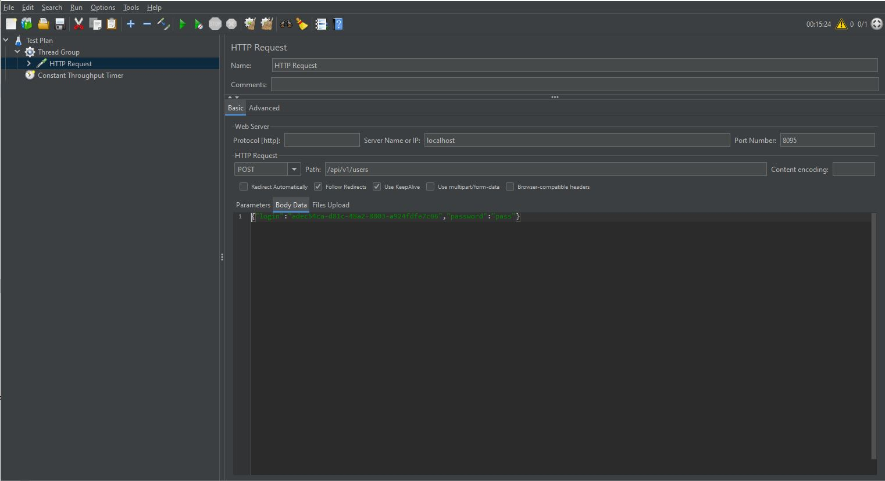
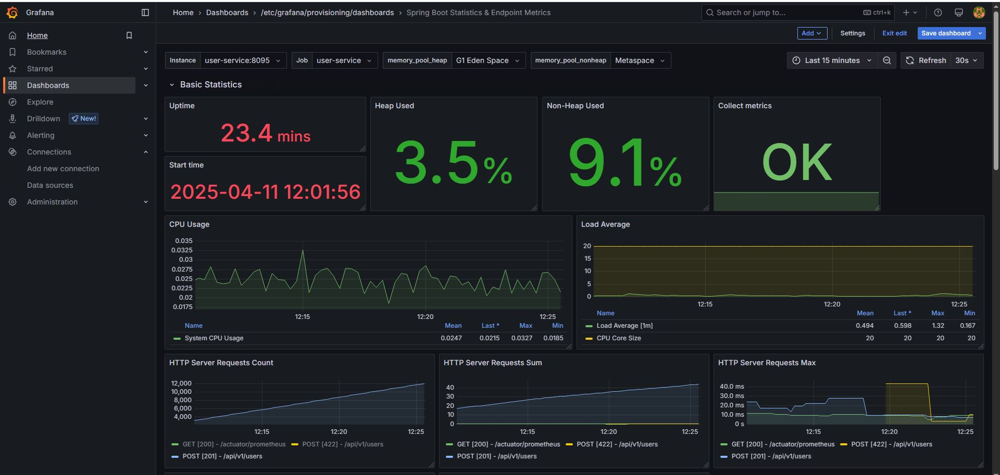
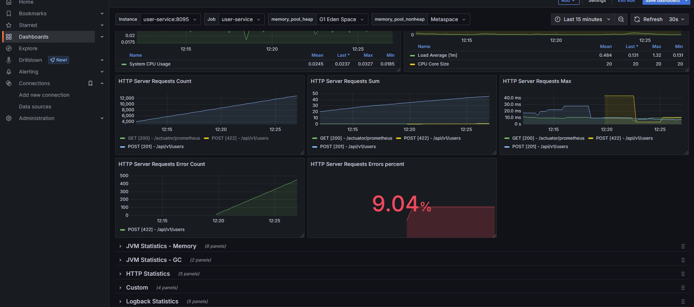
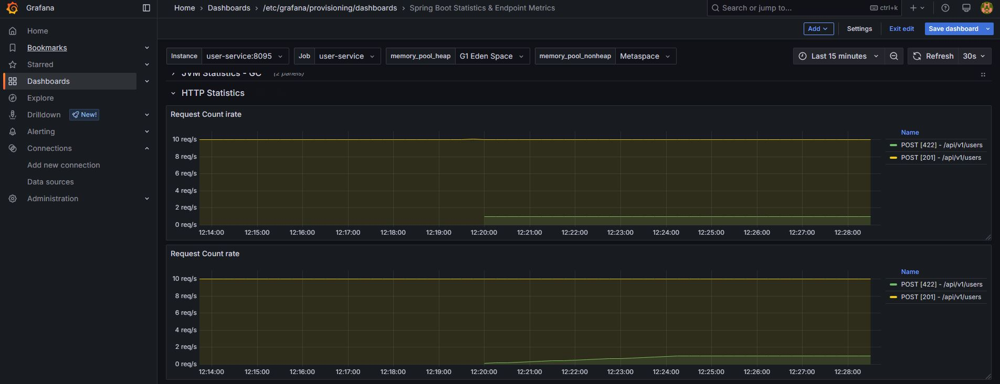
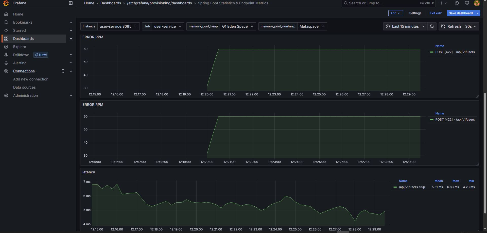
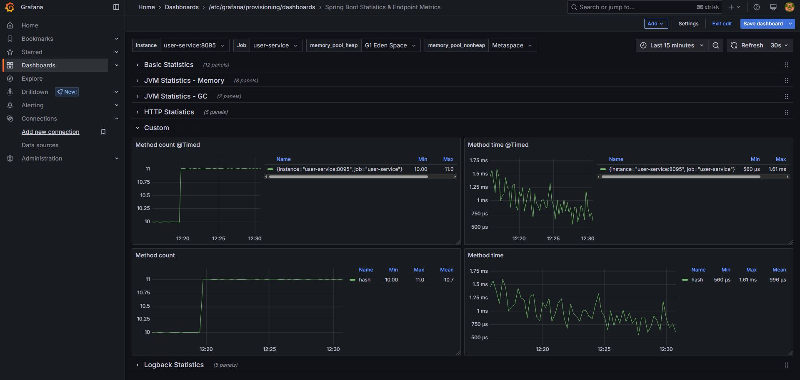
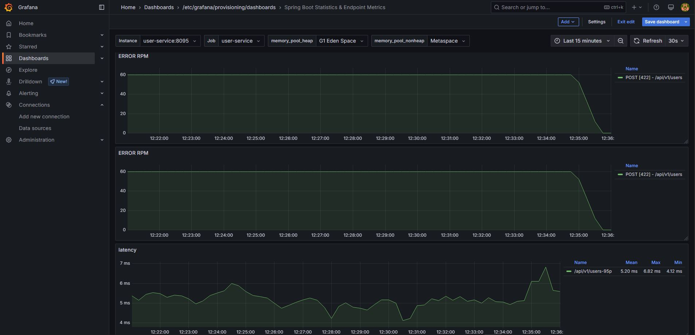
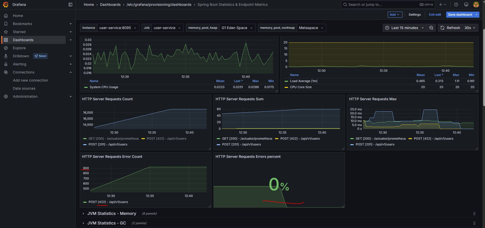
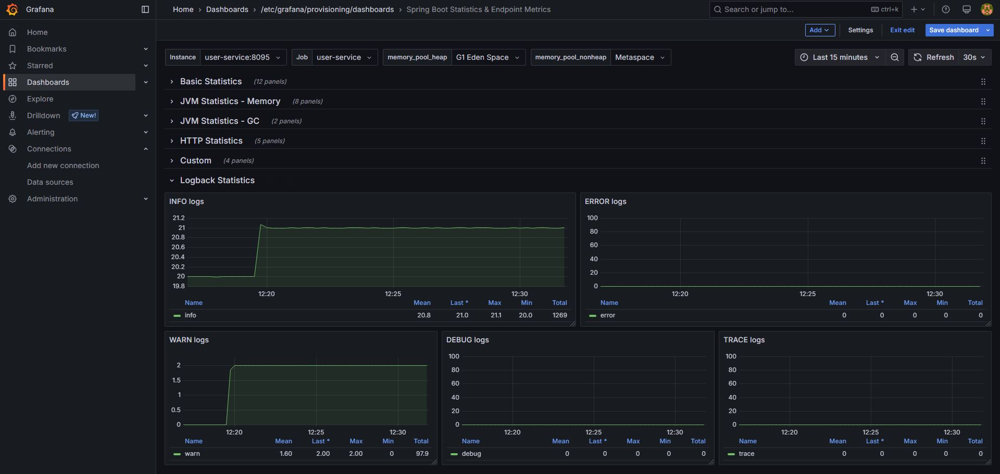

# Prometheus & Grafana

### Описание:
* сборка mvn clean package
* сервис доступен на порту 8095
* prometheus 9090
* grafana 3000

### Нагрузка
* 10 rps логин всегда разный гуид. Эта нагрузка подавалась постоянно

* 1 rps логин всегда разный гуид. При одинаковом логине приложение вернёт статус 422 - логин должен быть уникален. Эта нагрузка подалась в 12:20 

### Основные показатели в графане:
* Видны порядка 12000 запросов POST со статусом 201 (Created) по пути /api/v1/users

* После подачи нагрузки с одинаковым гуидом видно как растут ошибки 422 статус.

* HTTP статистика показывает для 201 статуса (10 rps), а для 422 (1 rps)

* Отображение ошибок. (в 12:20) и latancy в 95p.

* В коде добавлена кастомная метрика замера времени

* Отображение кастомной метрики ( вижно что идет нагрузка в 11rps и время ответа метода)

* Нагрузка в 1rps была остановлена  это тоже видно ( ошибки упали в 0)

* То же и на основном окне ( Также видна общая сумма ошибок 422)

* Статистика по логам

