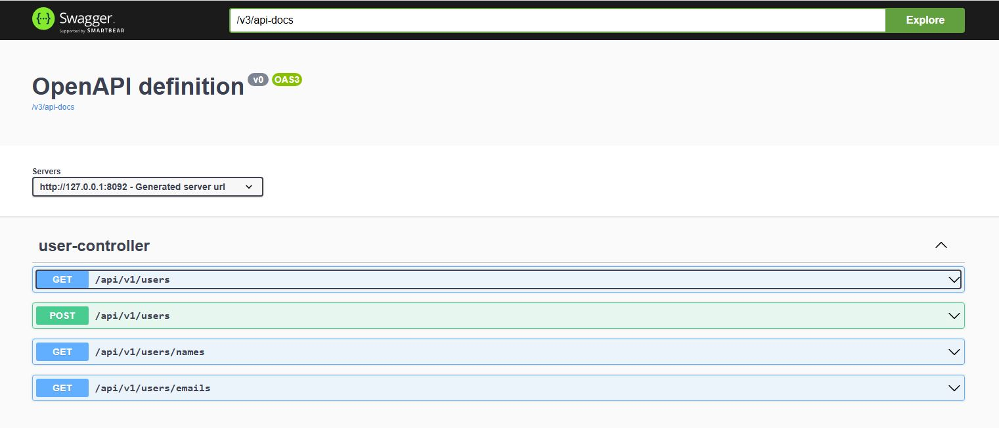
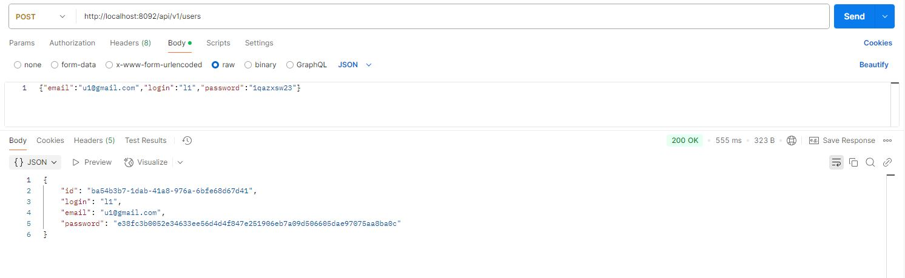
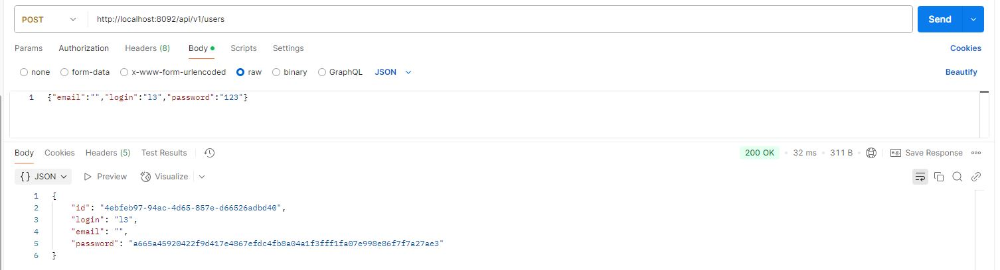
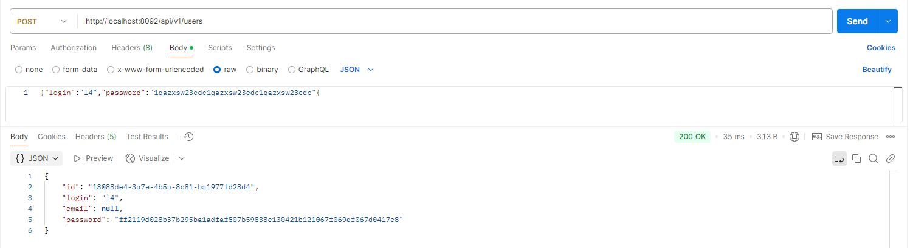
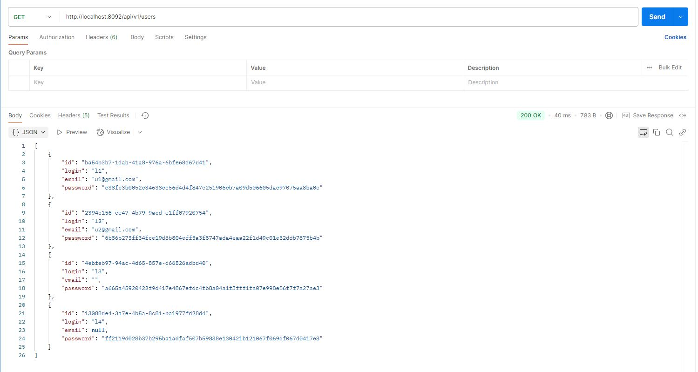
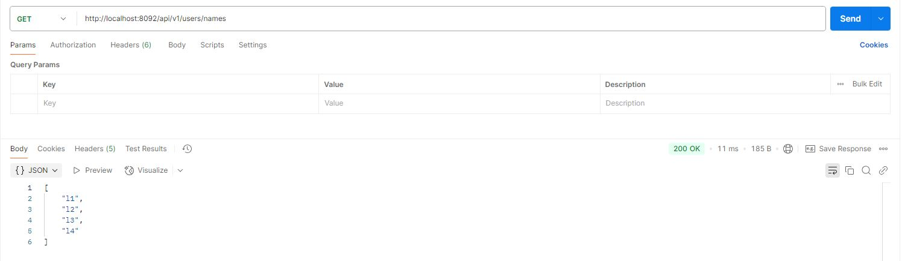
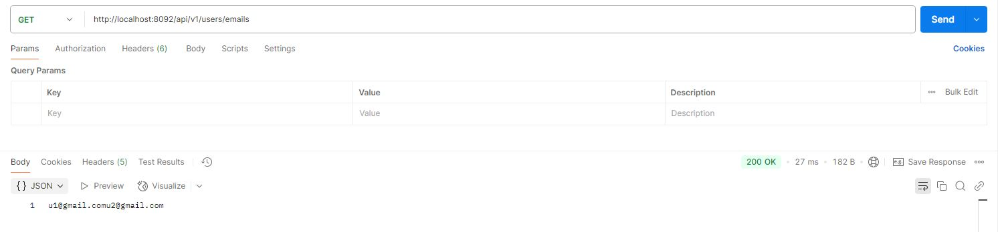

# Реактивное программирование: Reactor // ДЗ

### Описание:
* Swagger: http://127.0.0.1:8092/swagger-ui/index.html
* Добавлен метод (POST) http://localhost:8081/api/v1/users которому в теле передаётся login, email и password
* Логин уникальный, длина логина и пароля ограничена 100 символами. Email ограничен 250 символами.

### Используется r2dbc драйвер для посгресса:
Необходимо создать базу localhost:5432/task12db

Скрипт создания таблицы:
CREATE TABLE public.task12_users (
id uuid NOT NULL,
login varchar(100) NULL,
email varchar(250) NULL,
password varchar(100) NULL,
CONSTRAINT task12_users_login_key UNIQUE (login),
CONSTRAINT task12_users_pkey PRIMARY KEY (id)
);

### Swagger и вызовы методов:
http://127.0.0.1:8092/swagger-ui/index.html

Добавление пользователей:

Все поля заполнены

Пустой email

Email отсутствует

Получение списока пользователей

Получение списока всех имен пользователей, массивом JSON

Получение списока email'ов, но только заполненных

