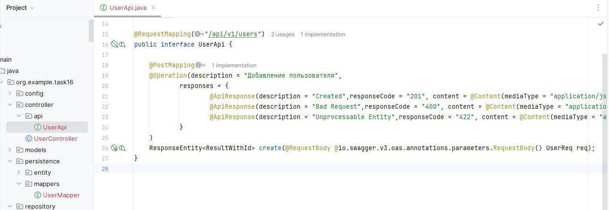
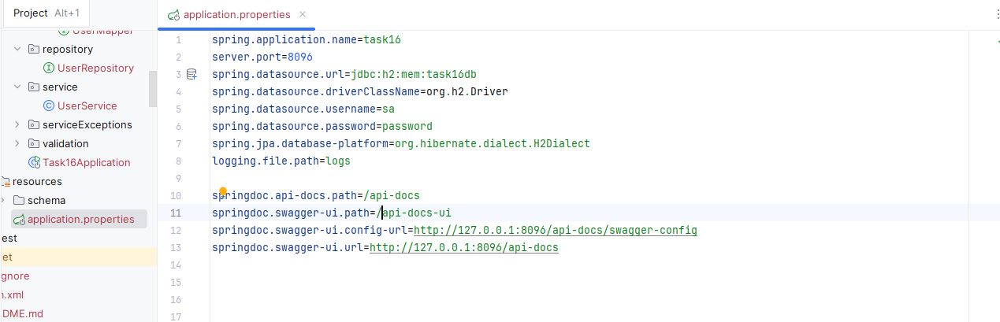
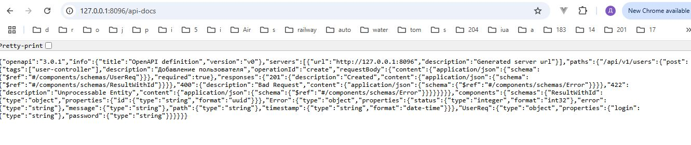
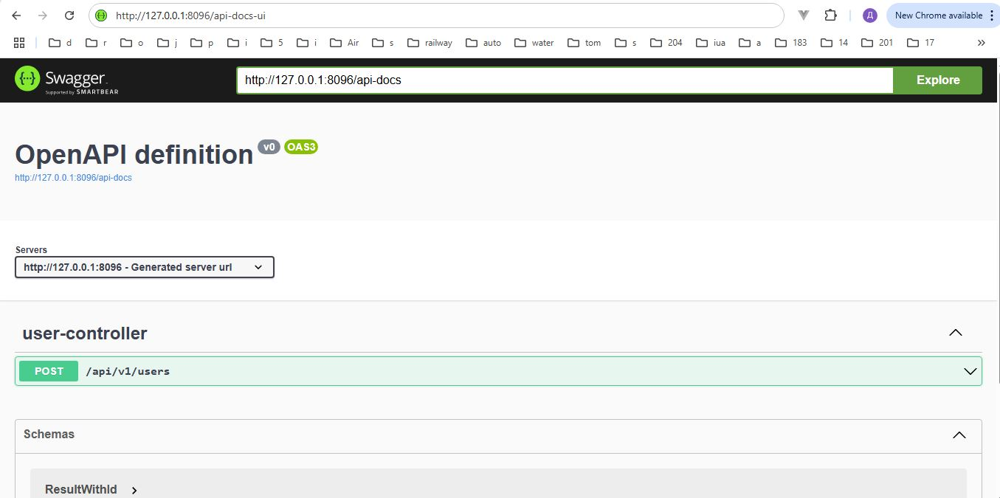
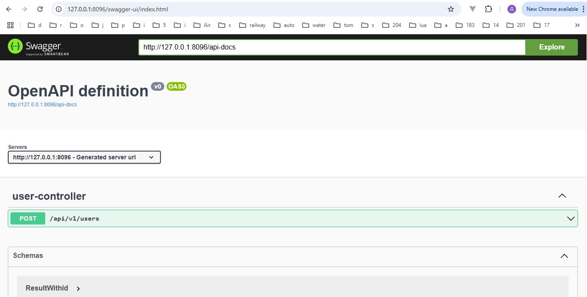
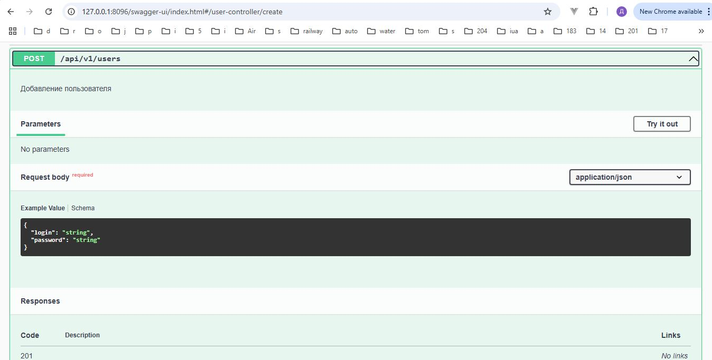
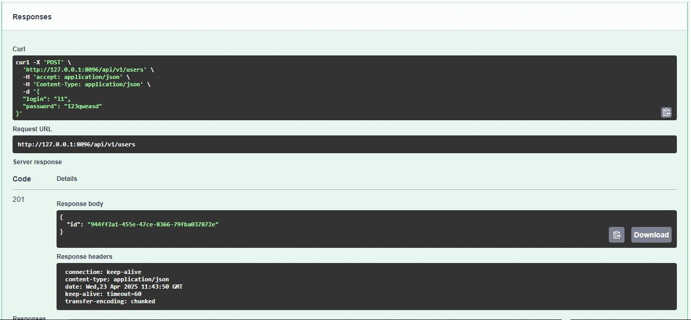

# Rest: Swagger, OpenAPI

### Описание:
* Swagger: http://127.0.0.1:8096/swagger-ui/index.html
* Добавлен метод (POST) http://localhost:8096/api/v1/users которому в теле передаётся login и password
* Логин уникальный, длина логина и пароля ограничена 100 символами.

* Описание метода

* Настройка пропертей

* OpenAPI URL

* Swagger URL

* Swagger перебрасывает на свою страницу и показывает путь до OpenAPI и метод добавления пользователя.

* Если развернуть метод то видно какие нужны данные и по какой схеме. Также видны возможные ответы.

* Запуск метода и получение результата.

