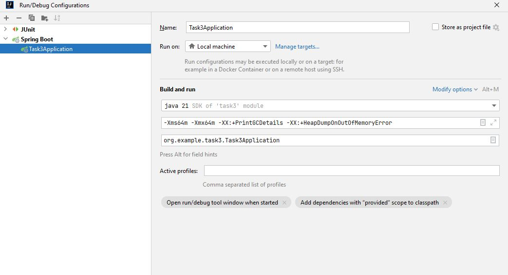
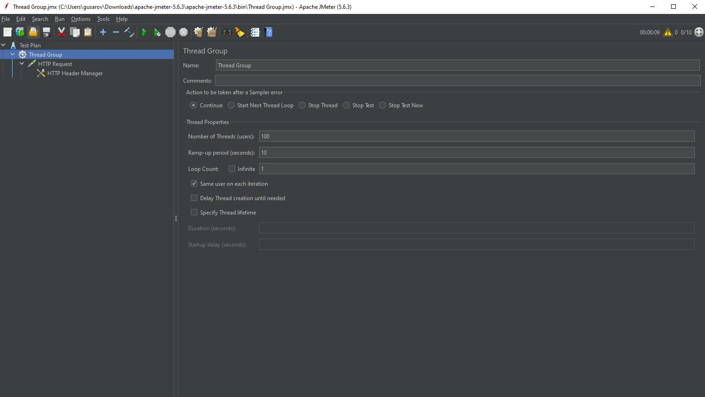
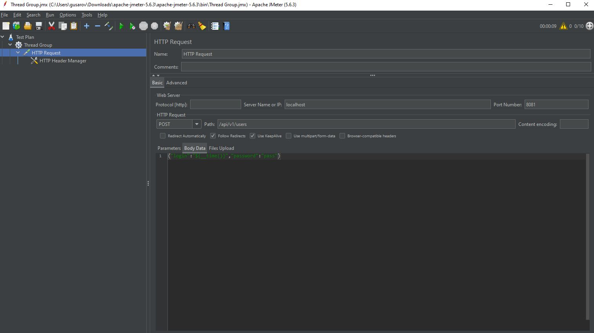
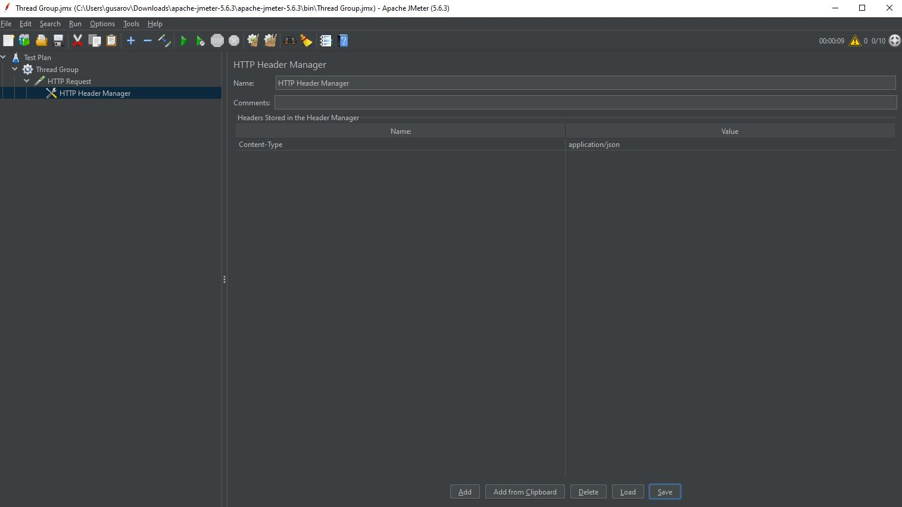
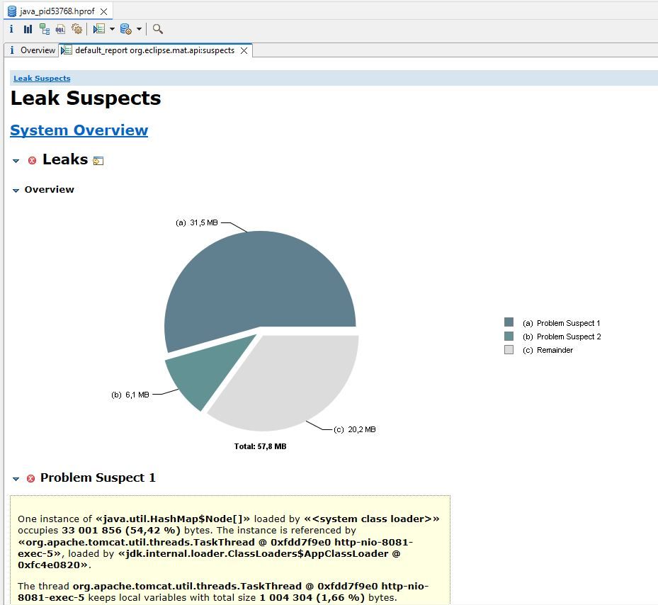
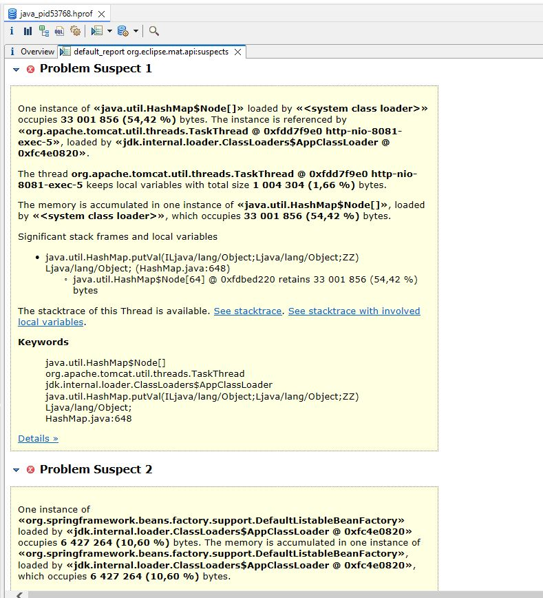
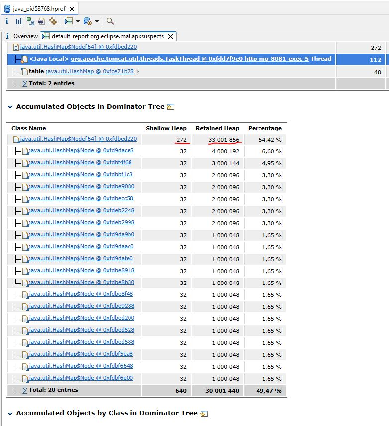
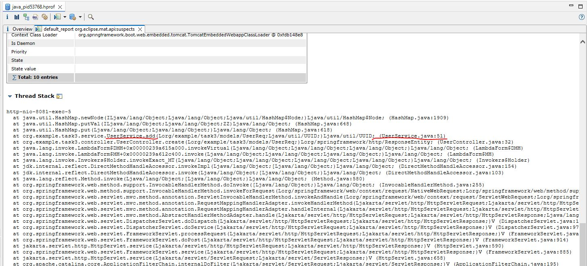
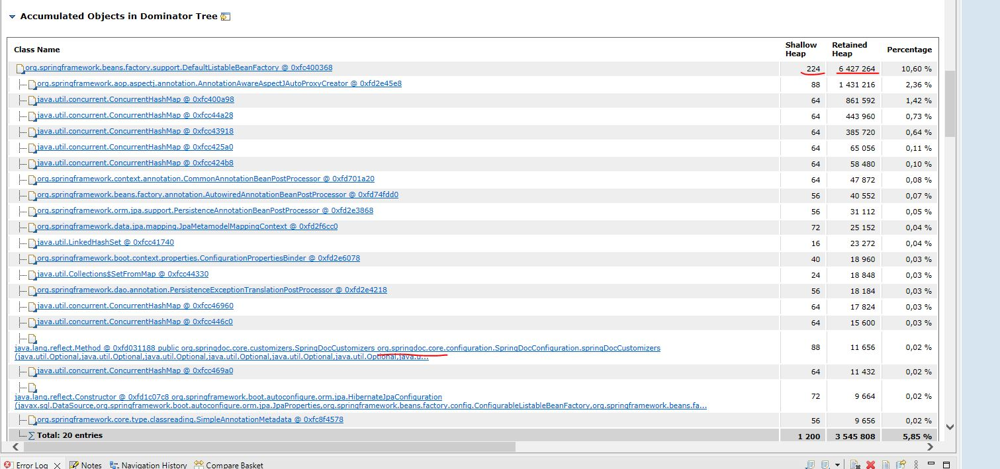

# Spring boot приложение. (утечка памяти) 

### Описание:
* Swagger: http://127.0.0.1:8081/swagger-ui/index.html
* Добавлен метод (POST) http://localhost:8081/api/v1/users которому в теле передаётся login и password
* Логин уникальный, длина логина и пароля ограничена 100 символами.

### VM options:
-Xms64m -Xmx64m -XX:+PrintGCDetails -XX:+HeapDumpOnOutOfMemoryError

### Запуск с использованием jmeter (Файл приложен в папке res):

### Анализ дампа Eclipse Memory Analyzer Tool:
Видно 2 представителя на утечку:

После детального изучения видно что 31,5MB занял хешмап,  а 6,1MB оказалось springdoc (Swagger то я включил...) ( на принскринах выделены Shallow Heap, Retained Heap  и пути в приложении.) Видно что Хешмап находится в сервисе.

### После изменения кеша на SoftReference утечка перестала происходить!

