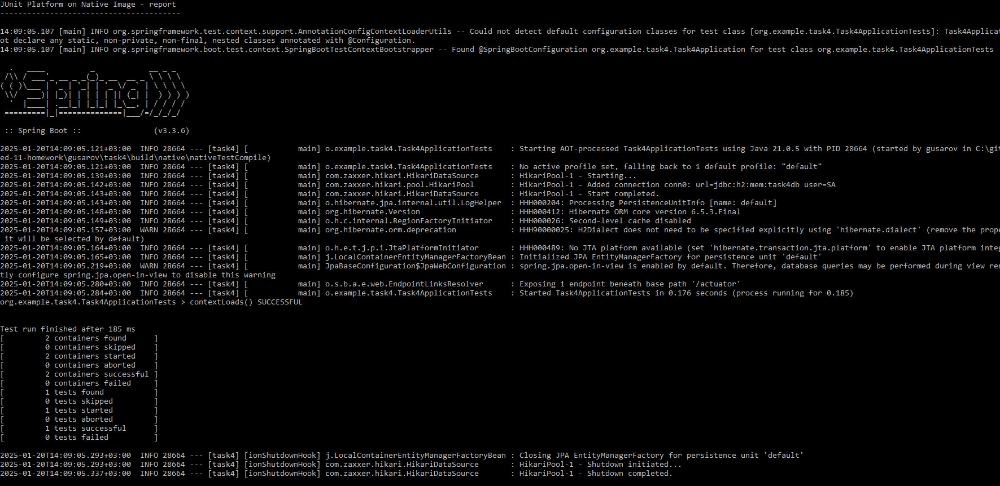

# Spring boot нативное приложение.

### Описание:
* maven заменён gradle. Метод (POST) http://localhost:8081/api/v1/users которому в теле передаётся login и password

### Запуск:
В студии за 2.638 сек 

### Запуск нативного приложения:
За 0.2 сек

### Файлы нативного приложения:

### Запуск теста нативного приложения:

