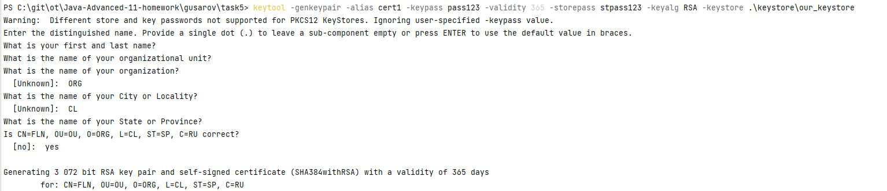
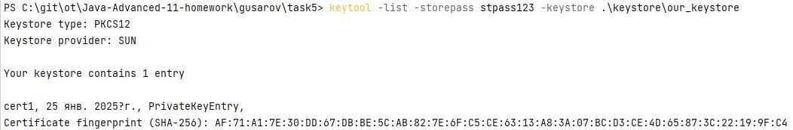
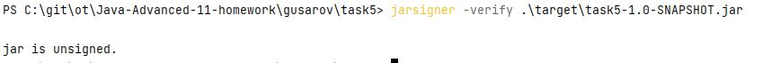
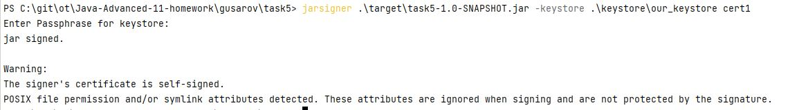
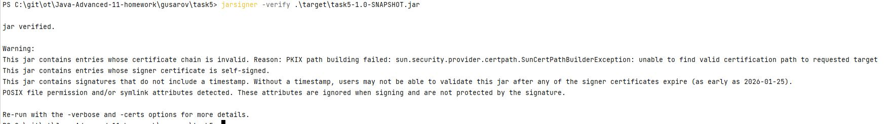
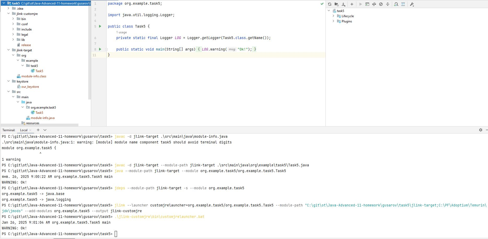
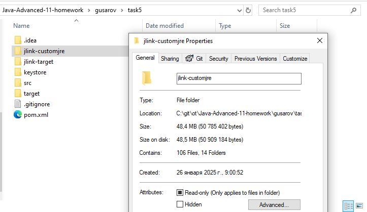

# JDK tools.

### keytool & jarsigner:
Выпуск самоподписанного сертификата:

Просмотр к кейсторе:

Просмотр подписана ли jar (не подписана):

Подпись jar:

Просмотр подписана ли jar (подписана):

### jlink:
Сборка и запуск приложение в custom lighthweight jre

Просмотр размера среды:
