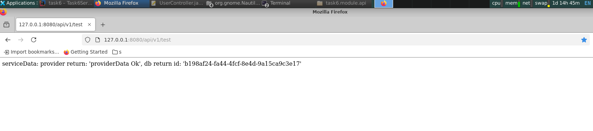

# Java Module 

### Описание:
* Добавлен метод (GET) http://localhost:8081/api/v1/test для запуска процесса
  

### Запуск приложения:

### Сборка мавеном clean и package (стандартно)

В результате выполнения метода и логах (при запуске) видны возращаемые данные (разных модулей).