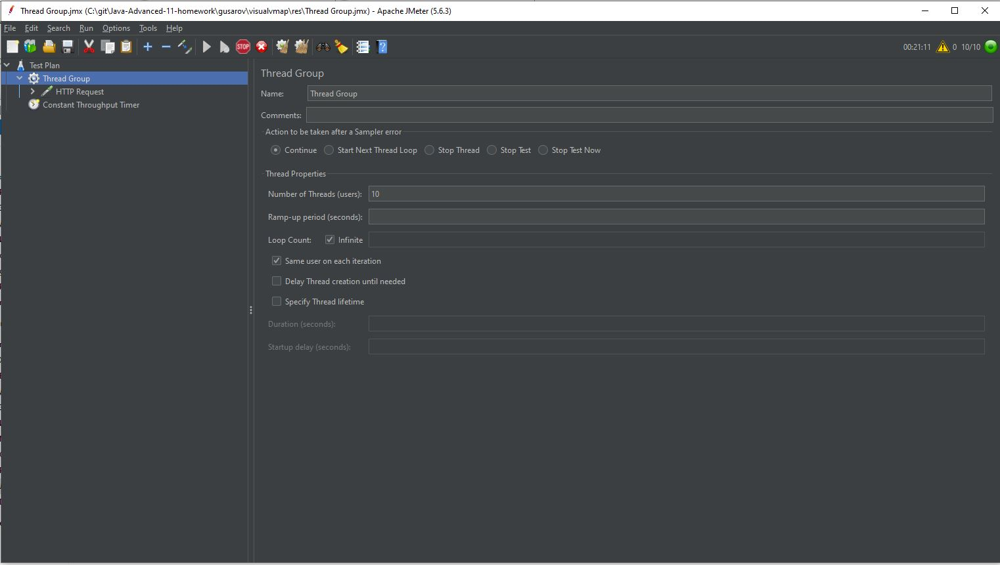

# VisualVM & AsyncProfiler 

### Описание:
* Swagger: http://127.0.0.1:8090/swagger-ui/index.html
* Добавлен метод (POST) http://localhost:8090/api/v1/users которому в теле передаётся login и password
* Логин уникальный, длина логина и пароля ограничена 100 символами.

### Нагрузка 10 rps:
JMeter посылает 10 запросов в секунду.

### VisualVM:
После прогрева запускаем VisualVM --> Profile -->JDBC. Останавливаем выборку и видим в запросах SELECT (Invocations 2) 

По хорошему достаточно один раз проверить есть ли у нас такой пользователь в бд перед добавлением (Добавляем фильтр для просмотра одного действия)

Смотрим код и видим что метод выбора по логину вызывается 2 раза в строках (37 и 47)

Комментируем лишний вызов

Ещё раз профилируем и видим что теперь вызовы выполняются один раз

### AsyncProfiler:
Запускаем (подаём нагрузку) записываем. 

В контроллере вызов сервиса забрал 95%

Заходим в сервис и смотрим как эти проценты распределены:

В контроллёре вывод в лог если навести на процент то можно увидеть подробности
