# App for JMH Test

Running profiles:
- unit-test - run unit tests
- jmh - run benchmark tests

## Throughput test

### MD5

### SHA256

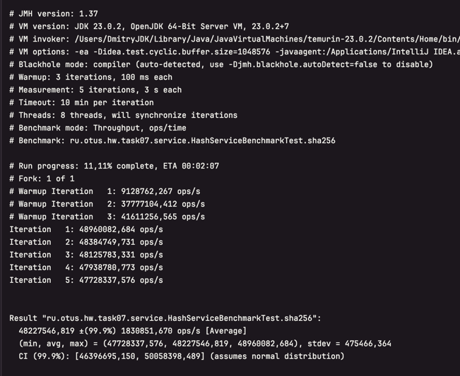

### SHA512

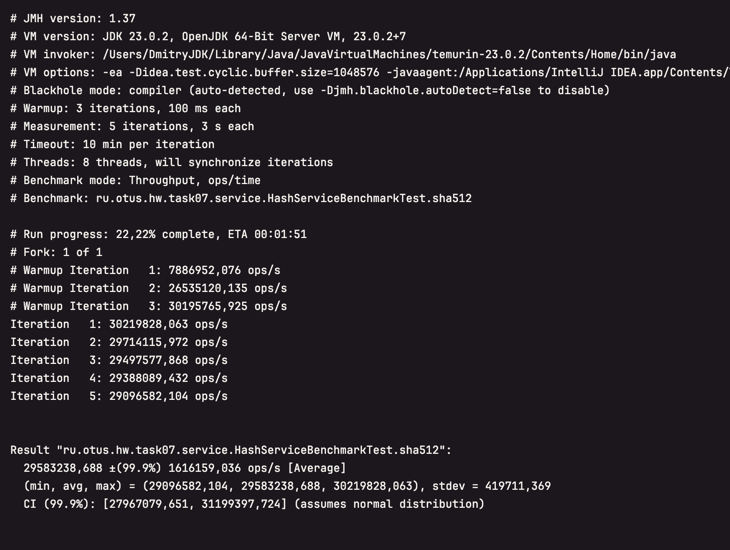

## Average test

### MD5

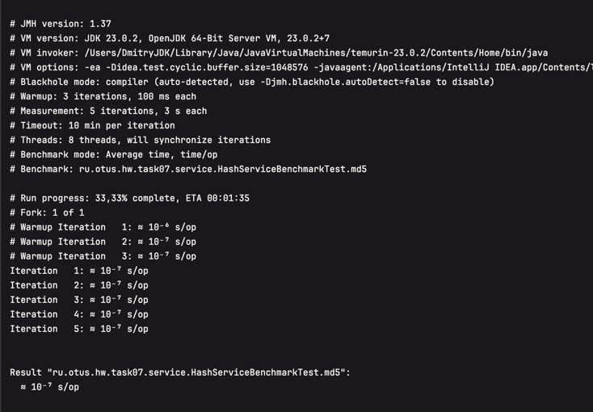

### SHA256

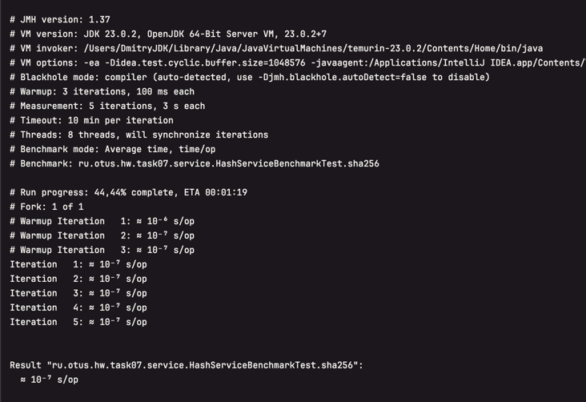

### SHA512

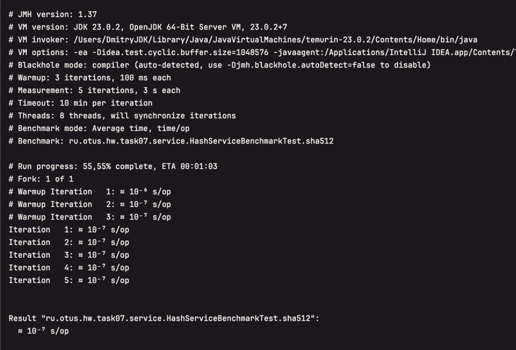

## Sampling time test

### MD5

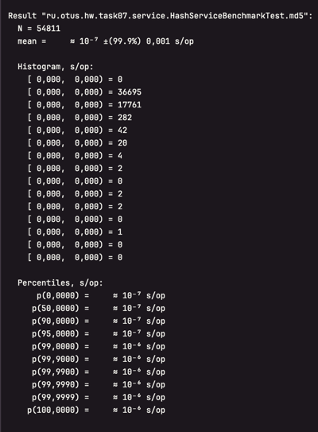

### SHA256

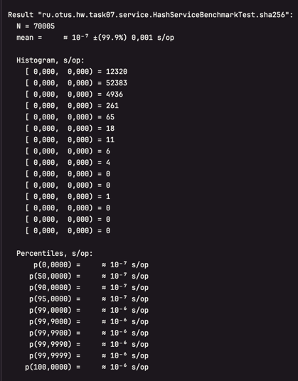

### SHA512

## Single shot test

### MD5

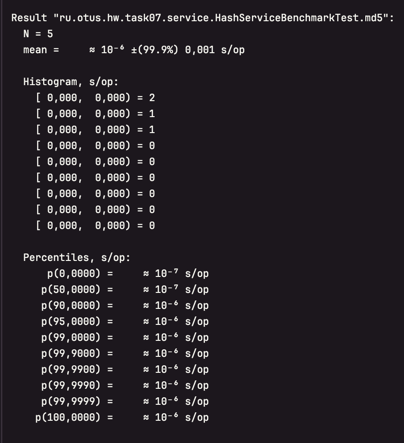

### SHA256

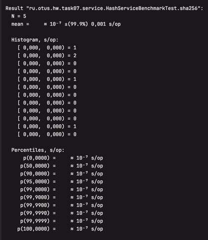

### SHA512

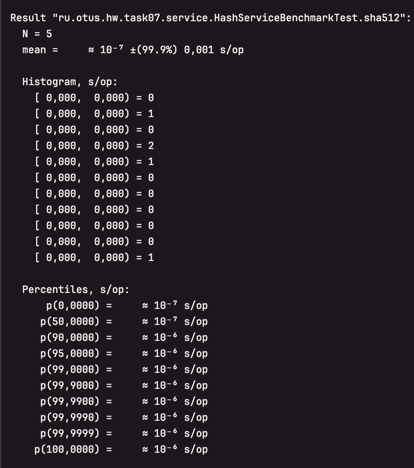

## SUMMARY

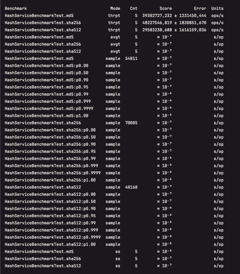

## Samples

### consume cpu

### default state for thread

Comment `@State(Scope.Thread)` and get error

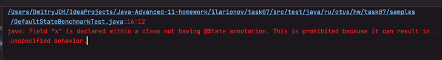

uncomment and run

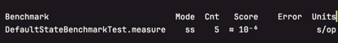

### run-to-run test

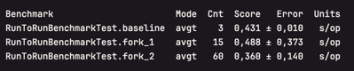

## User service test

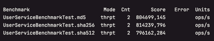

# Summary after review

На Mac OS, чипсете M3 лучше всех показал себя алгоритм SHA256

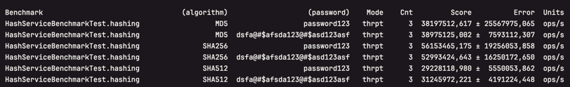