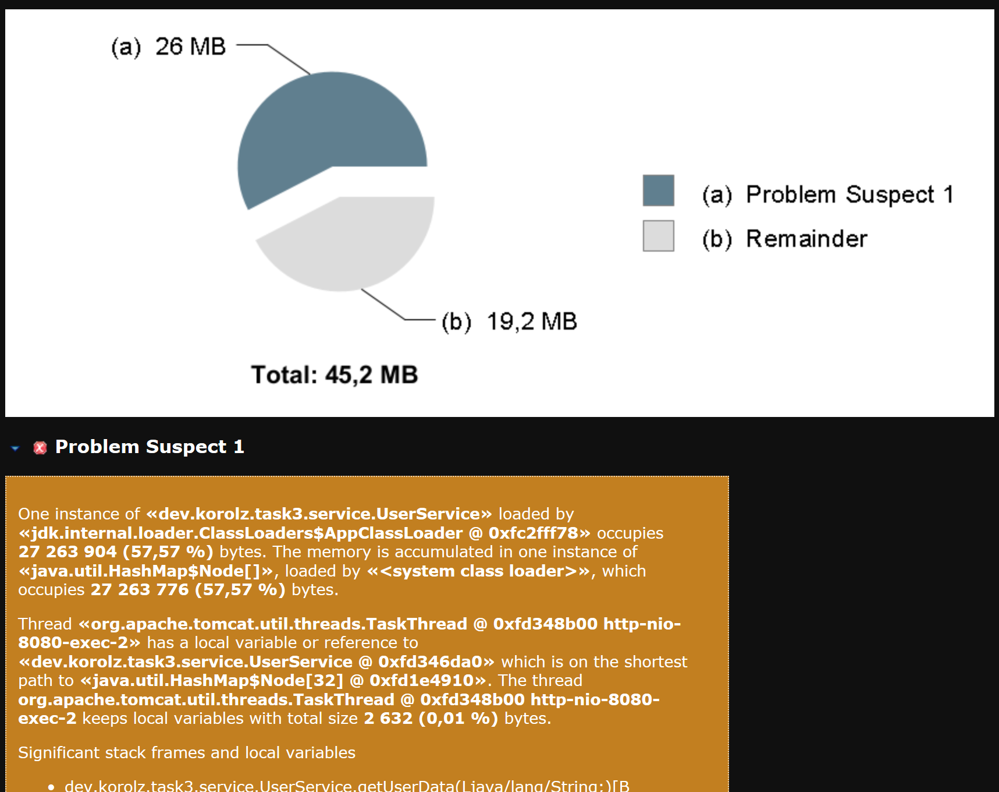

# Приложение для анализа утечек памяти

## Описание

Приложение для со специальной утечкой памяти, связанной с кэшем.

## Проблема
- Утечка памяти возникает в связи с тем, что объекты в `userCache` не удаляются, а их число не контролируется.
- В результате, при длительном использовании приложения, память заполняется объектами, которые больше не нужны, что приводит к переполнению памяти и сбоям в работе приложения.
- Кэш изначально реализован с использованием `HashMap`, что приводит к тому, что старые записи не удаляются, и память заполняется.

## Анализ

**Что сделано**:
- Проведено нагрузочное тестирование с использованием JMeter
- Проведено предварительное исследование с использованием Eclipse Memory Analyzer Tool для анализа дампа памяти.
  

## Решение проблемы
Для предотвращения переполнения памяти была использована структура данных LinkedHashMap с реализацией LRU (Least Recently Used).
Это позволило ограничить количество записей в кэше и автоматически удалять самые старые записи, когда их количество превышает заданный лимит.

## Параметры запуска приложения

   ```bash
   -XX:+HeapDumpOnOutOfMemoryError -Xmx64m