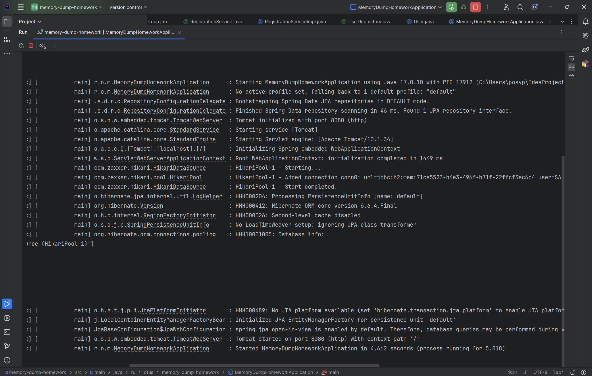
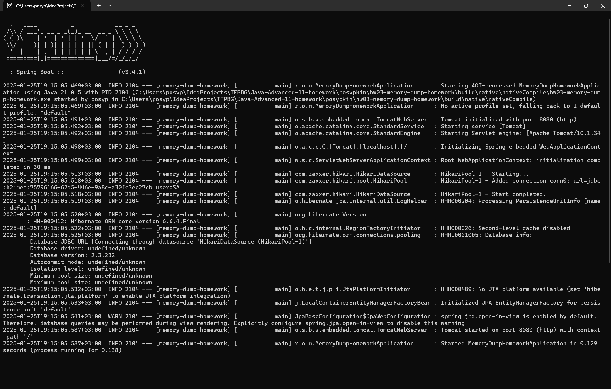
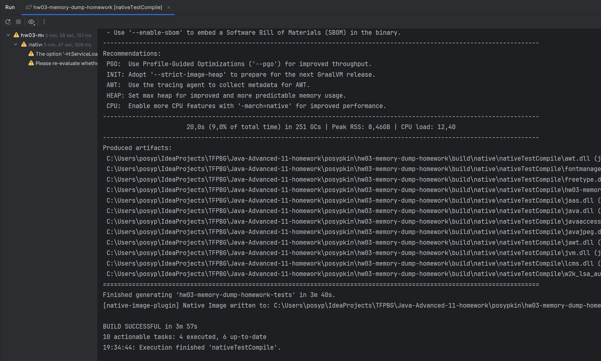
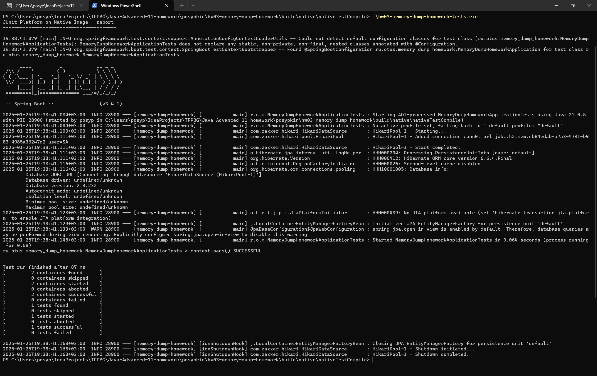

### Домашнее задание на тему: Поиск утечки памяти в приложении

Запуск от java 17 и выше

1. Запускаем приложении с следующими аргументами //-Xmx32m -Xms32m
2. Даем нагрузку для этого есть файл Simple Thread Group.jmx который используем в jmetre
3. спустя примерно 2 минуты получаем OutOfMemmory

### Домашнее задание на тему: Анализ ускорения работы приложения при работе на GraalVM

Запуск на JVM

Запуск exe файла собранного с помощью Native Image

Железо на котором выполнялся запуск:

Запуск nativeTestCompile

