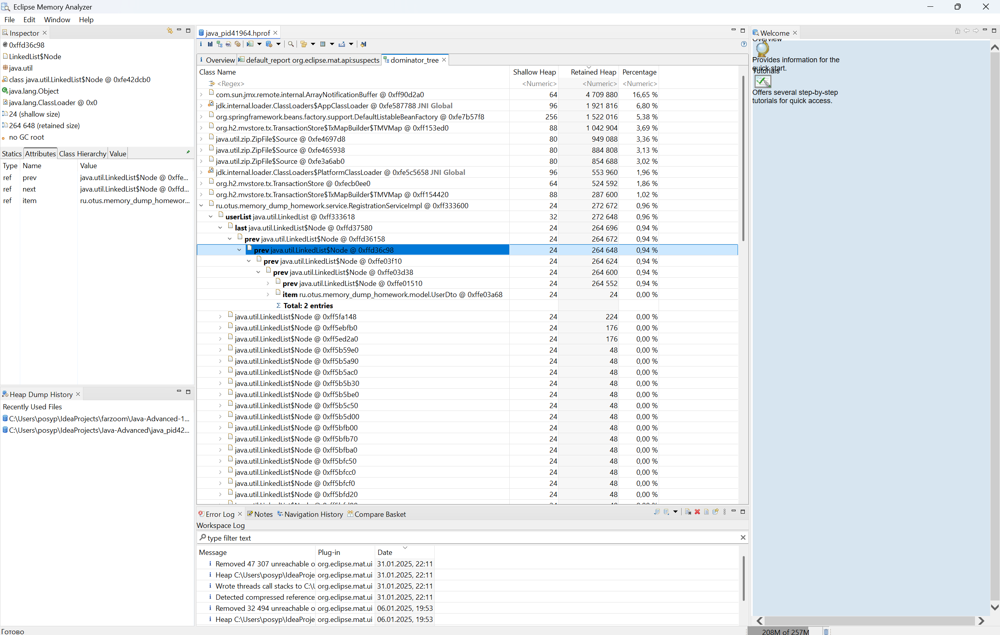

Домашнее задание на тему: Поиск утечки памяти в приложении

Запуск от java 17 и выше

1. Запускаем приложении с следующими аргументами //-Xmx32m -Xms32m
2. Даем нагрузку для этого есть файл Simple Thread Group.jmx который используем в jmetre
3. спустя примерно 2 минуты получаем OutOfMemmory

Поиск утечки после всех системных классов в dominator tree видим скопление классов в нашем array list
Так как общий размер хипа очень мал то системные данные занимают много места и выезжают на первые строки
