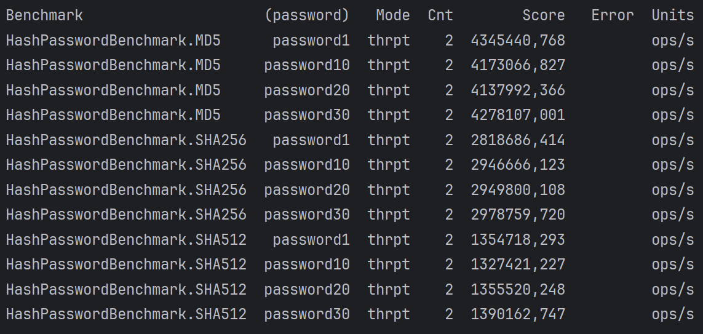
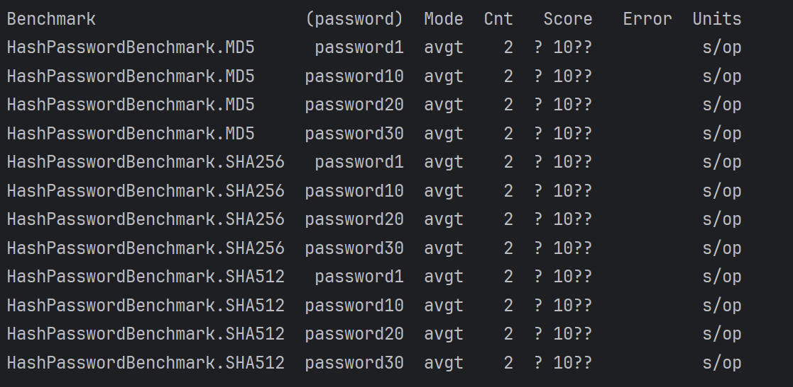
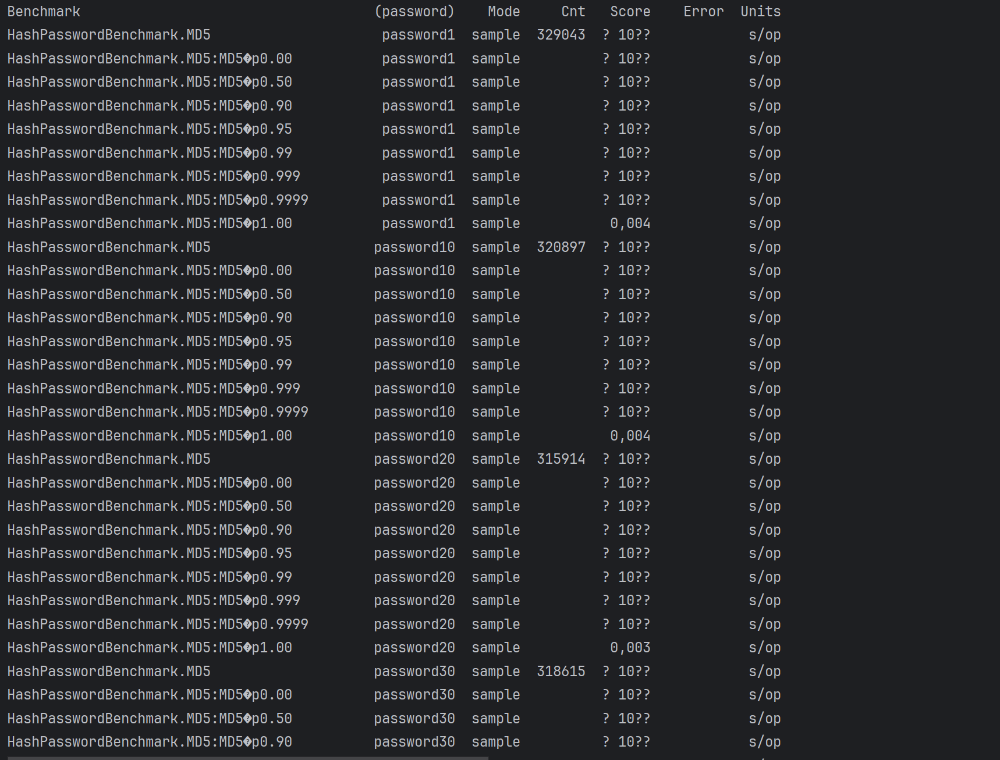
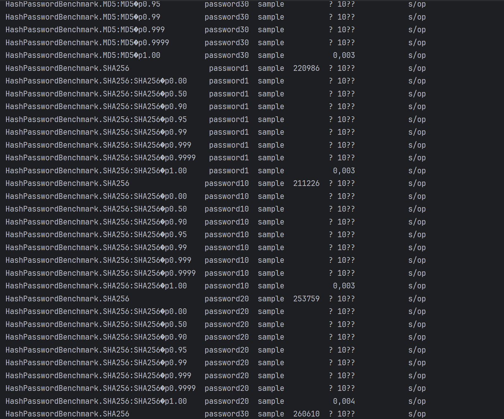
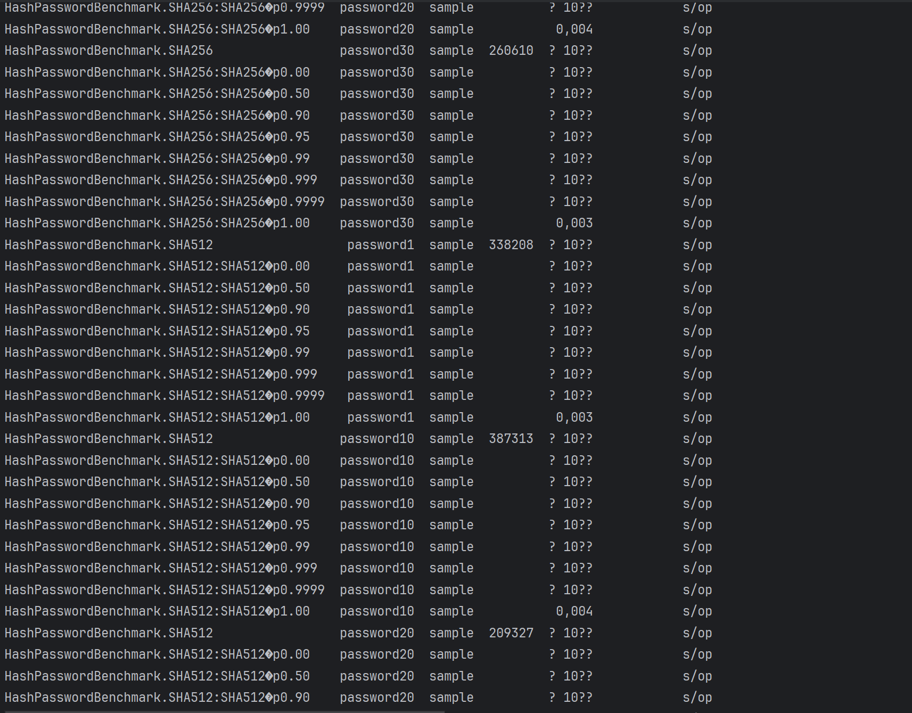
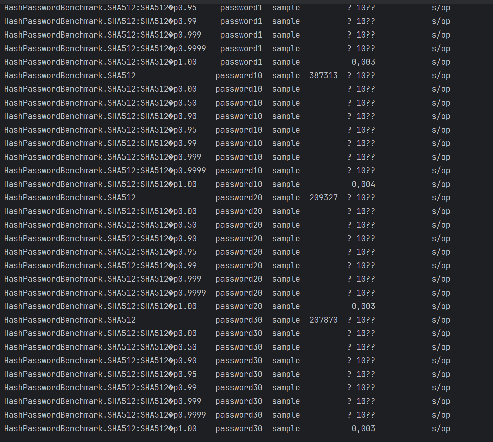
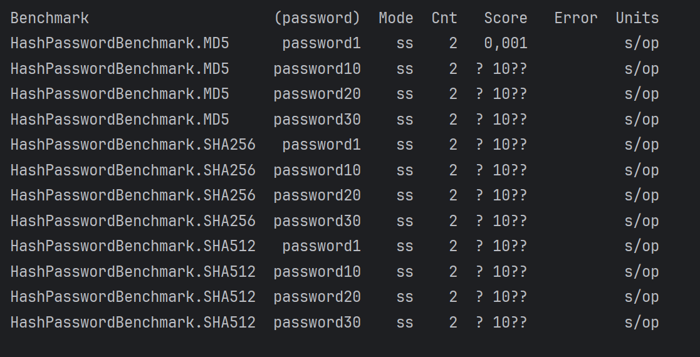

# Домашнее задание на тему: Реализация benchmark для алгоритма

- Throughput тестирование

#### Вывод: Больший rps показывает алгоритм MD5 я выбираю его

- Average time **(не информативное)**

- SimpleTime

- SingleShotTime
 **(не информативное)**