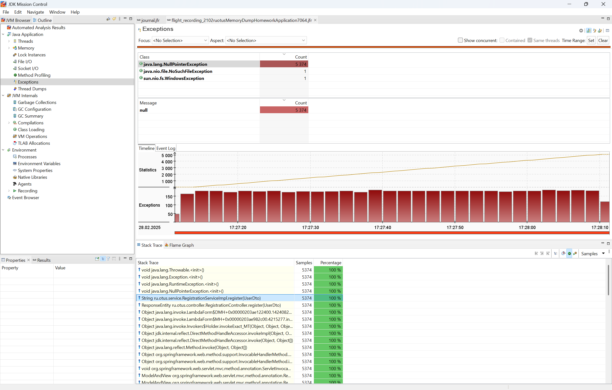
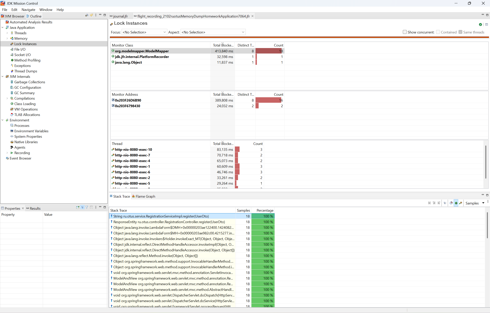
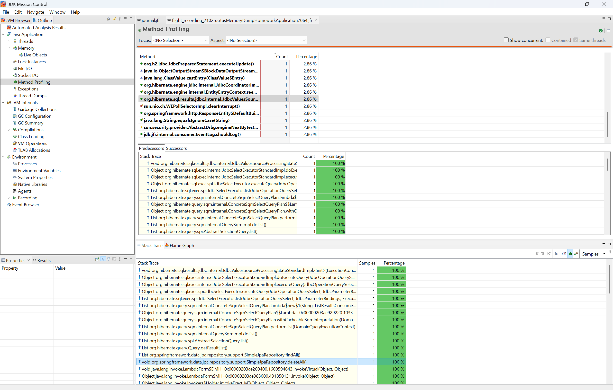

Домашнее задание на тему: Диагностика приложения с помощью JFR

Запуск от java 17 и выше

1. Запускаем сервис, файл для Jmetre лежит в resource.
Даем нагрузку с помощью JMetre
2. с помощью команды ``jcmd`` узнаем pid
3. далее с помощью команды ``jcmd <pid> JFR.start duration=60s filename=journal.jfr``
делаем профилирование
4. результат профилирования лежит [тут](./result-jfr/journal.jfr)
5. Добавляем ошибки [сюда](src/main/java/ru/otus/service/RegistrationServiceImpl.java)
6. Находим в ошибках наш класс 

7. В lock находим наш класс который блокирует монитор

8. Находим наш лишний запрос
