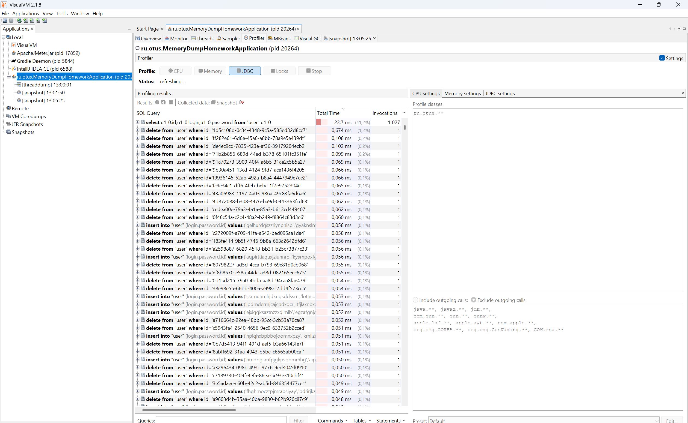
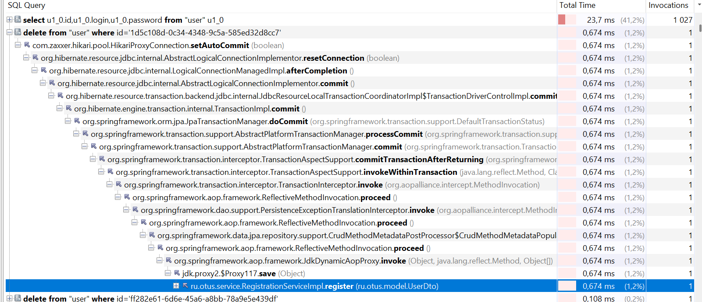
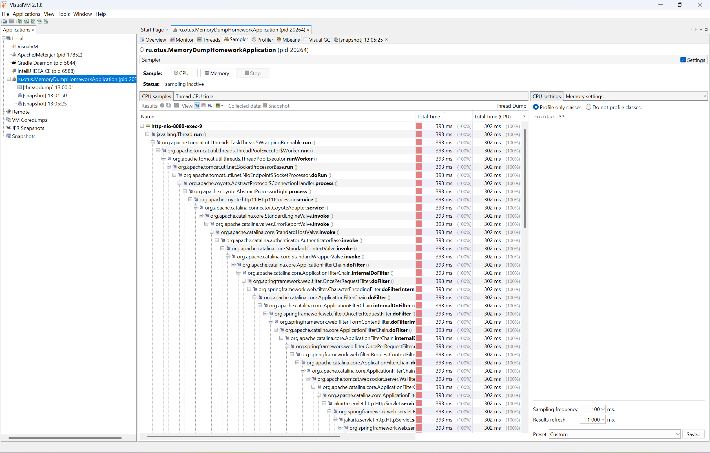
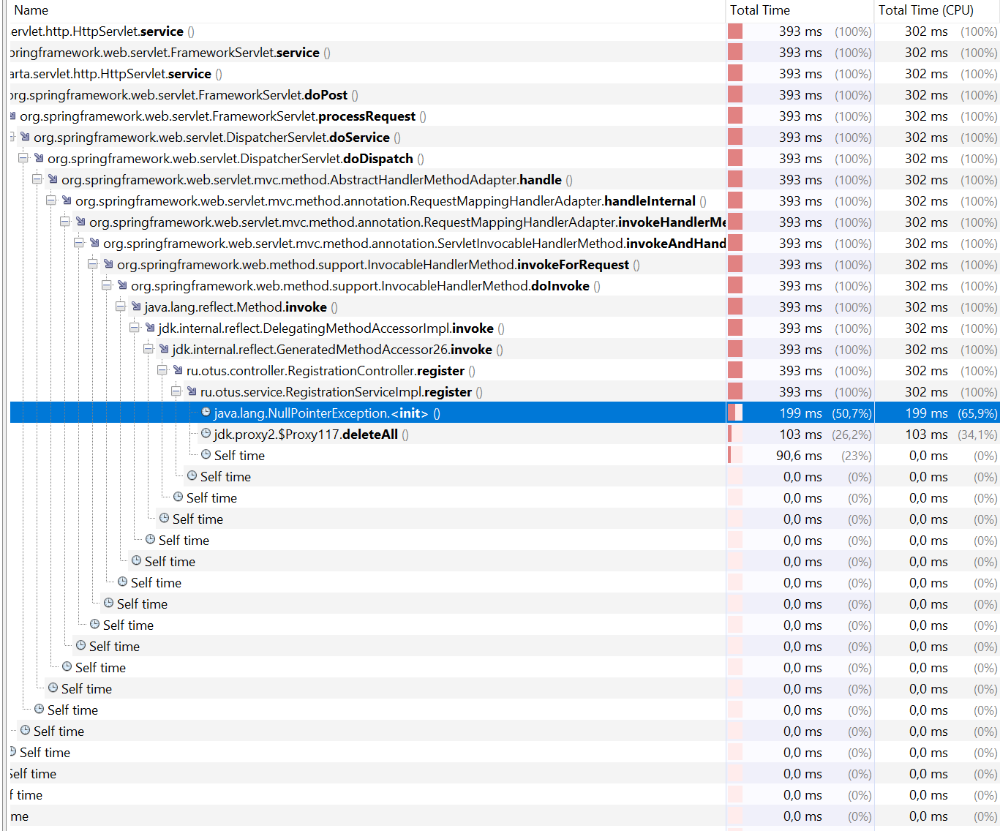

Домашнее задание на тему: Профилирование с помощью visualvm

Запуск от java 17 и выше

1. Добавляем ошибки [сюда](src/main/java/ru/otus/service/RegistrationServiceImpl.java)
2. Запускаем сервис, файл для Jmetre лежит в resource.
Даем нагрузку с помощью JMetre
3. Смотрим через visualvm, здесь мы видим что отправляются странные запросы на удаление пользователей

4. далее мы видим в стэк трэйсе от куда этот запрос отправляется

5. в sampler мы фильтруем вызовы только наших методов

6. и здесь видим exception и вызов delete all

7. у меня бесплатная версия IDEA поэтому не могу запустить asyncprofiler