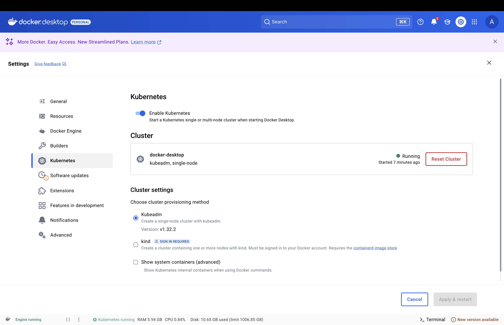

Домашнее задание на тему: Helm

запускаем kuber в docker


переключаем контекст
```shell
kubectl config use-context docker-desktop
```

встаем на папку hw13-docker

```shell
cd hw13-docker
```

билдим образ из предыдущего проекта предварительно билдим проект
````shell
gradle build
docker build -t my-java-app:latest .
````

деплоим наш helm chart
```shell
helm upgrade --install backend-deployment ./helm
```

дергаем запрос
```
http://localhost:30080/registration/greeting
```

получаем result

