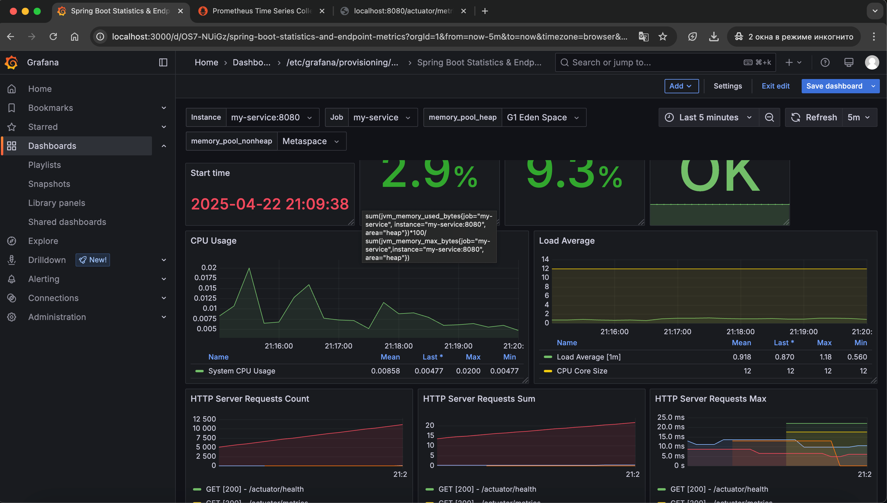
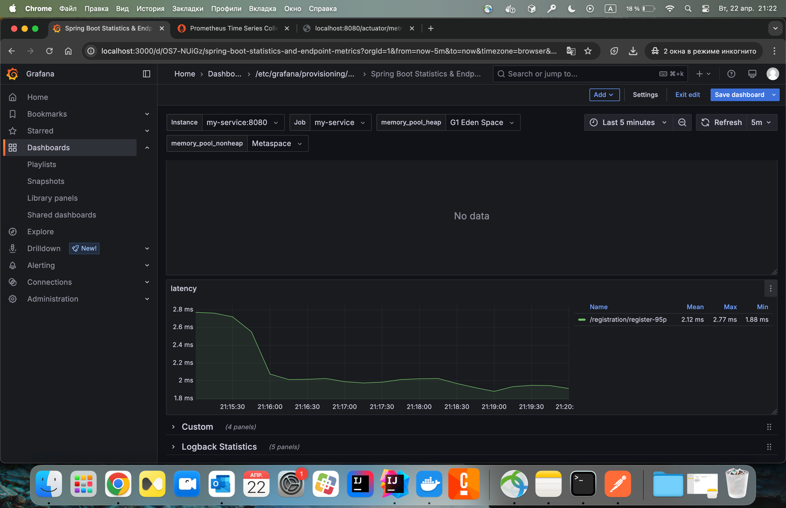
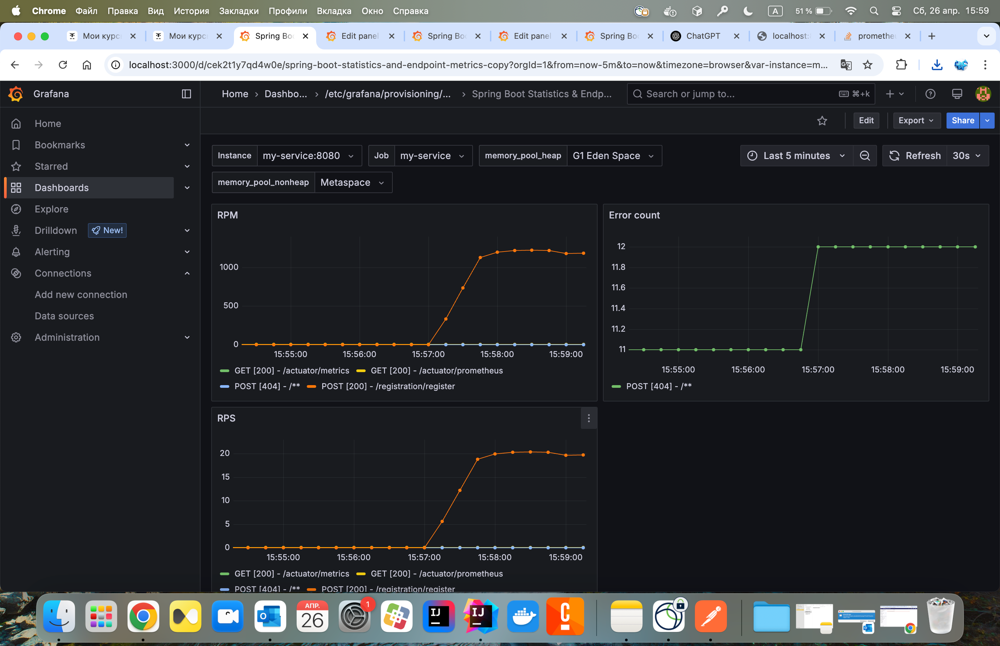

Домашнее задание на тему: Prometheus & Grafana

Запуск
````shell
docker-compose -f infra/docker-compose-metrics.yml -p otus up -d
````

Остановка
````shell
docker-compose -f infra/docker-compose-metrics.yml -p otus down 
````





RPS, RPM и error

