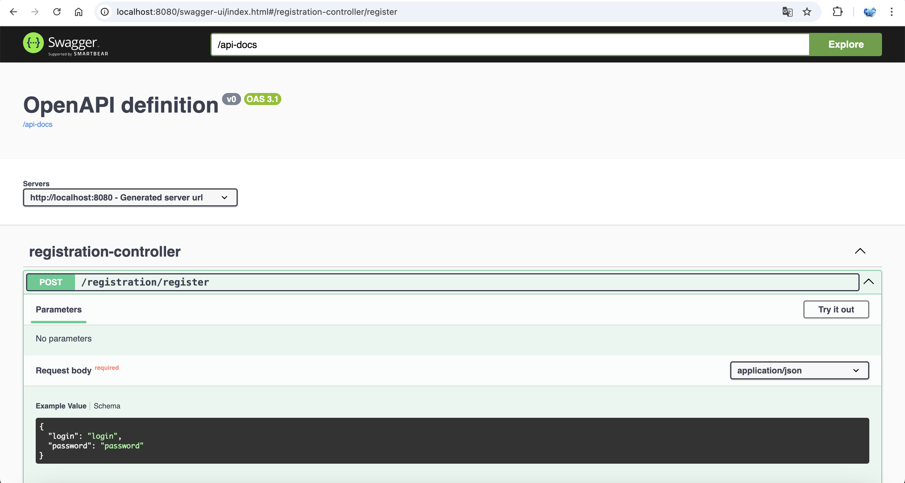

Домашнее задание на тему: Описать Rest сервис с помощью OpenAPI

Запуск от java 17 и выше

1. Подключил springdoc в проект
2. Описал DTO и параметры эндпойтов аннотациями из OpenAPI (@Schema, @Parameter)
3. Настроил эндпойнт для OpenAPI по адресу /api-docs
```yaml
springdoc:
  api-docs:
    path: /api-docs
```
4. Подключить SwaggerAPI и замапать его на /api-docs-ui
```yaml
springdoc:
  swagger-ui:
    path: /api-docs-ui
```
