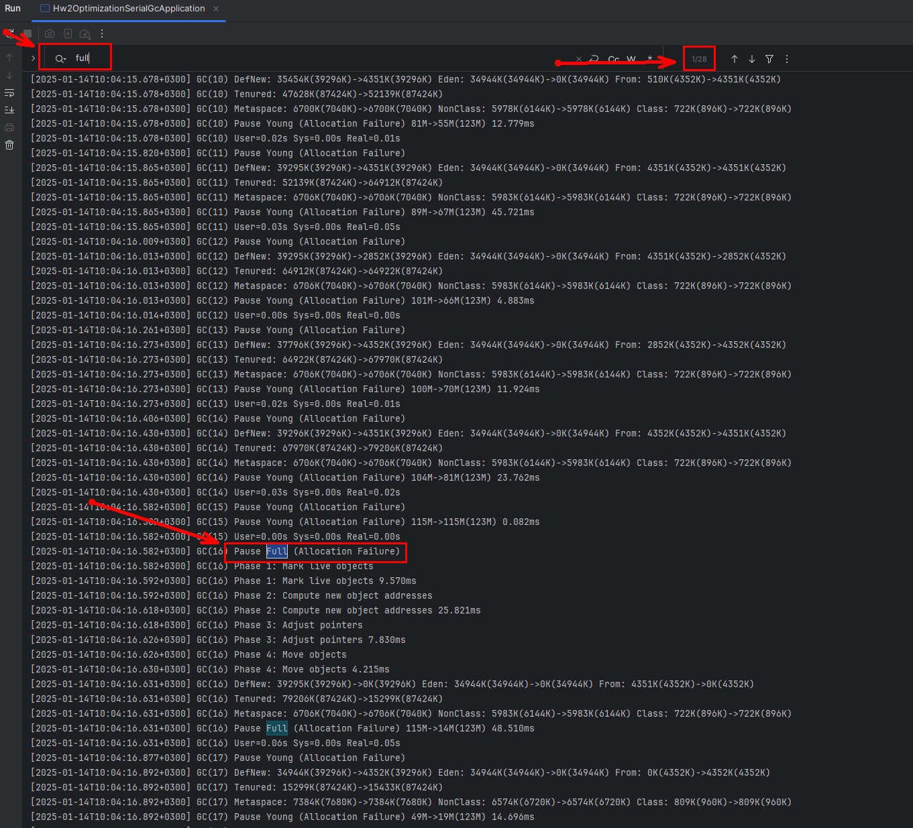
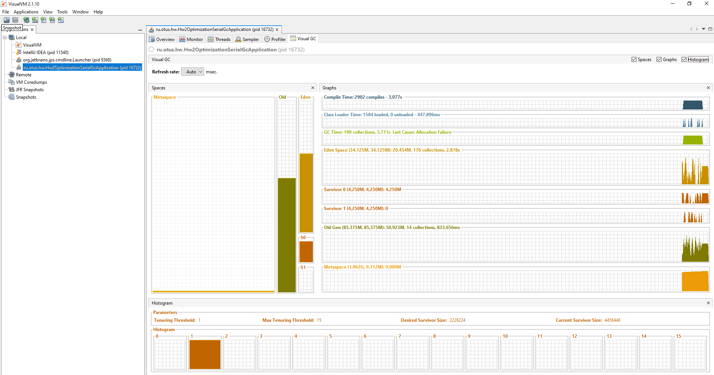
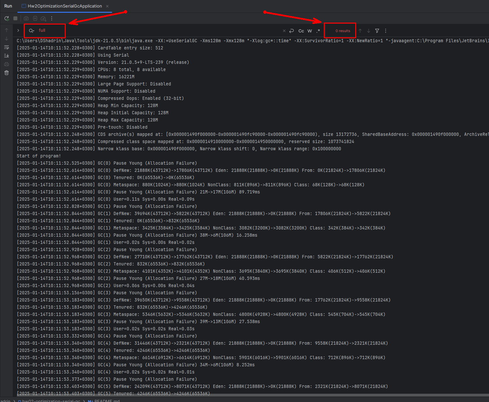
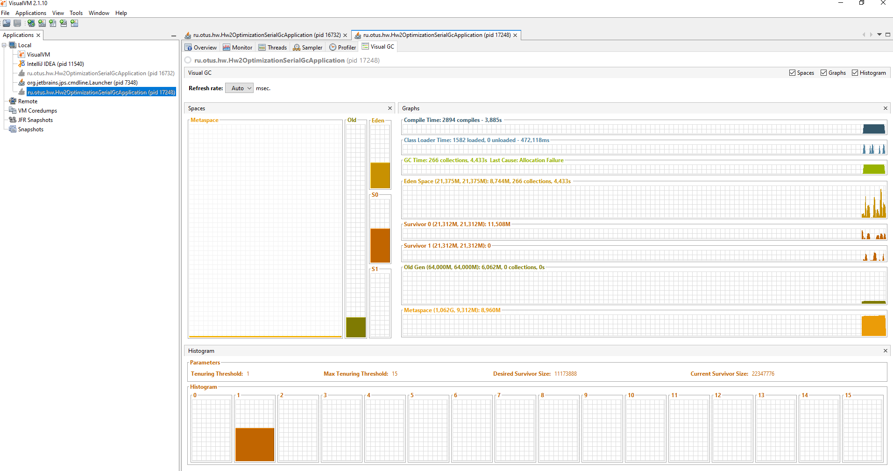

# Домашнее задание №2
### Оптимизация SerialGC

### Цель:
Данная работа позволит закрепить изученный материал по работе с параметрами GC и с инструментами мониторинга работы GC

### Описание/Пошаговая инструкция выполнения домашнего задания:
1. Скачать visualVm ( https://visualvm.github.io/)
2. Запустить visualVm
3. Установить плагин Visual GC для visualVm
4. Создать проект Practice (или скачать с репозитория https://github.com/OtusTeam/Java-Advanced.git java-memory/gc_serial_parallel_cms )
5. Установить параметры запуска приложения -XX:+UseSerialGC -Xms128m -Xmx128m -Xlog:gc*::time
6. Запустить приложение
7. В логах найти хотя бы одно Pause Full
8. Настроить -XX:SurvivorRatio=? или/и -XX:NewRatio=? Так что бы приложение не запускало полную сборку до конца своего выполнения

### Критерии оценки:
Во время работы приложения не запускается полная сборка
По выполнению ДЗ укажите какие параметры VM выставили

### Реализация:
1. Запуск приложения с дефолтными настройками: -XX:+UseSerialGC -Xms128m -Xmx128m -Xlog:gc*::time
    #### Результат: GC с полной сборкой запускался 28 раз
    
    
2. Запуск приложения с настройками -XX:SurvivorRatio=1 и -XX:NewRatio=1: -XX:+UseSerialGC -Xms128m -Xmx128m -Xlog:gc*::time -XX:SurvivorRatio=1 -XX:NewRatio=1
   #### Результат: Запуска GC с полной сборкой не было
   
   

### Ответ: -XX:+UseSerialGC -Xms128m -Xmx128m -Xlog:gc*::time -XX:SurvivorRatio=1 -XX:NewRatio=1