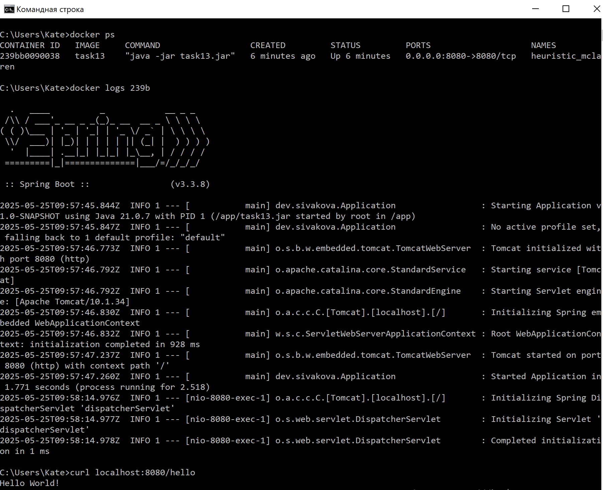

# Spring Boot приложение с Docker-контейнеризацией

Приложение реализует простой сервис с эндпойнтом для возврата приветственного сообщения.
Сервис упакован в Docker-образ и запускается в контейнере на основе официального JDK-образа.

## Архитектура

- `HelloController` — REST API-эндпойнт `/hello`
- Dockerfile с многоступенчатой сборкой (`multi-stage build`)

## Запуск приложения в Docker-контейнере

в директории task13 выполните команду сборки Docker-образа:

```
docker build -f Dockerfile -t task13 ../
```

Далее запустите контейнер выполнением команды:

```
docker run -p 8080:8080 task13
```

## Тестирование

### Проверка эндпойнта:

```
curl http://localhost/hello
```

### Скриншот работы приложения в Docker-контейнере:

