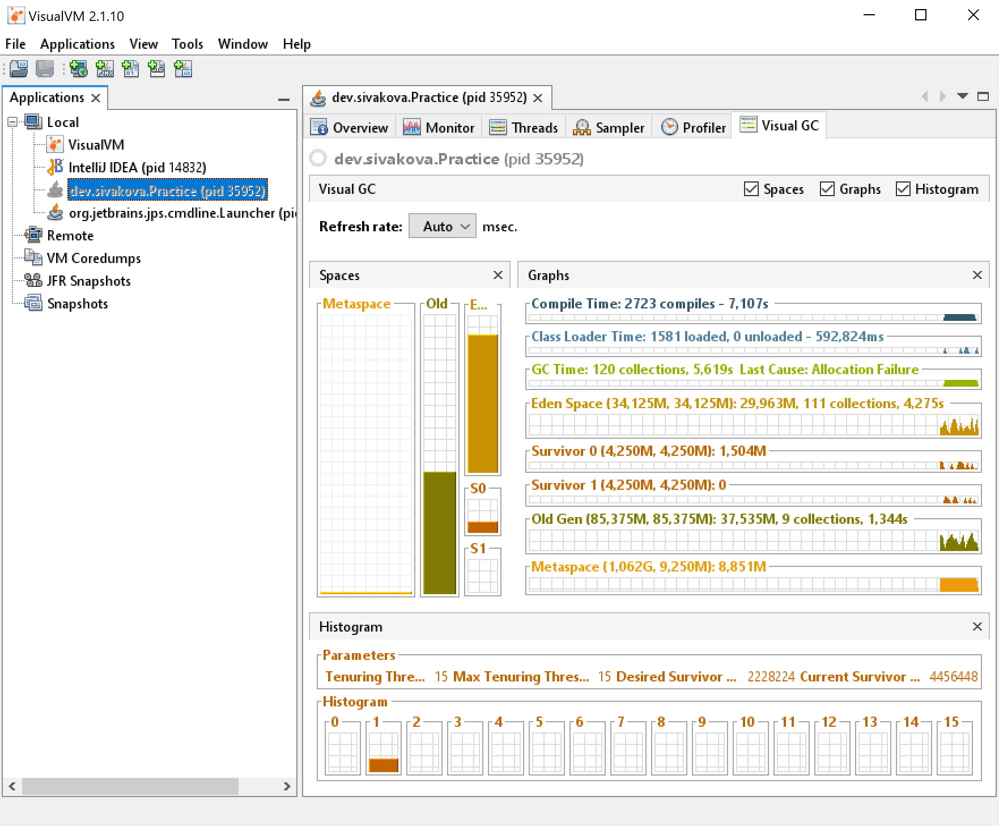
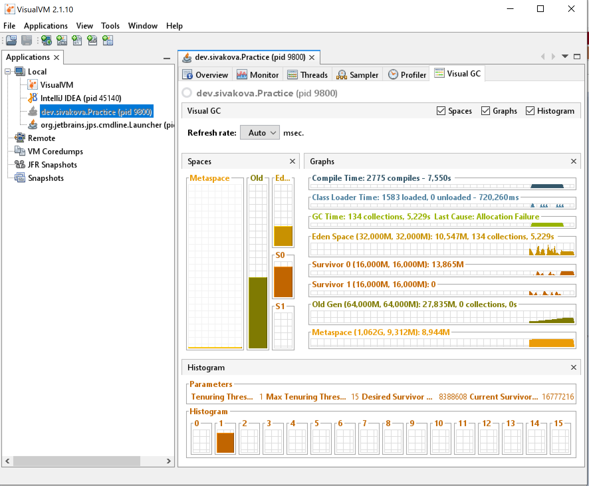

## Программа для демонстрации оптимизации SerialGC
Программа представляет собой демонстрацию оптимизации SerialGC

### Запуск программы до оптимизации SerialGC
Запустить приложение (класс dev.sivakova.Practice) со следующими VM опциями:
```console 
-XX:+UseSerialGC -Xms128m -Xmx128m -Xlog:gc*::time
```
### Демонстрация работы GC до оптимизации

На скриншоте VisualVM видно, что полная сборка мусора происходила 9 раз.
Всего было 120 сборок мусора.

### Запуск программы для демонстрации оптимизации SerialGC
Запустить приложение (класс dev.sivakova.Practice) со следующими VM опциями:
```console
-XX:+UseSerialGC -Xms128m -Xmx128m -Xlog:gc*::time -XX:SurvivorRatio=2 -XX:NewRatio=1
```
### Демонстрация работы GC после оптимизации

На скриншоте VisualVM видно, что полная сборка мусора не происходила.
Всего было 134 сборок мусора.
В результате оптимизации (установка VM опций -XX:SurvivorRatio=2 -XX:NewRatio=1) удалось добиться отсутствия полной сборки мусора во время работы программы,
при этом количество сборок в young generation возросло незначительно. 