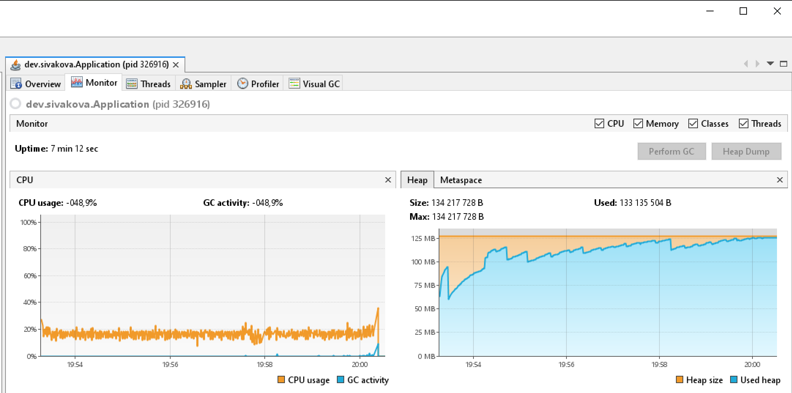
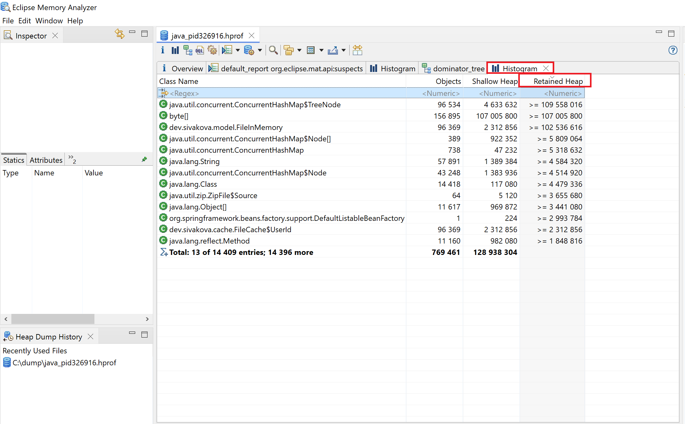
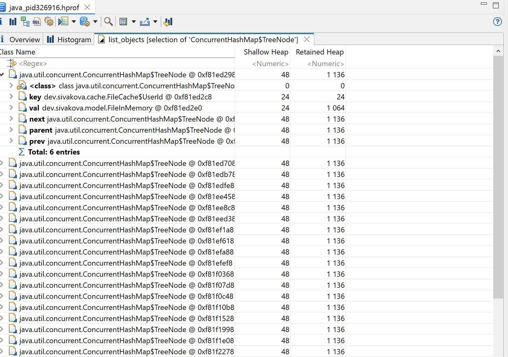

## Программа для демонстрации обнаружения утечки памяти
Программа представляет собой Spring Boot приложение для демонстрации обнаружения утечки памяти.

### Запуск приложения
Запустить приложение со следующими VM опциями:
```console 
-Xms128m -Xmx128m -XX:+HeapDumpOnOutOfMemoryError -XX:HeapDumpPath=<путь_для_сохранения_дампа_памяти>
```

### Архитектура приложения
Приложение состоит из следующих основных компонентов:
- Сервис регистрации пользователя в системе;
- Кэш с информацией по пользователю в виде массива байт.


### Демонстрация обнаружения причины утечки памяти
Для имитации нагрузки был добавлен CommandLineRunner,
данный объект осуществляет добавление пользователя в базу данных с последующим получением по нему информации из кэша.
````
 @Bean
    public CommandLineRunner demo(UserRepository userRepository, AddressCache addressCache) {
        return (args) -> {
            User user = new User("John",
                    "secret");
            userRepository.save(user);
            while (true)
            {
                final FileInMemory userFile = addressCache.get(user);
            }
        };
    }
````
Как видно из кода выше, во время работы происходит постоянное обращение к кэшу для получения информации по одному и тому же пользователю.
Однако через несколько минут приложение падает с ошибкой: 
````
java.lang.OutOfMemoryError: Java heap space
````

На скриншоте VisualVM видно, как heap память постепенно заполнялась, 
и несмотря на периодические сборки мусора, достигла своего лимита.

### Поиск причины утечки памяти с помощью Eclipse Memory Analyzer
После открытия дампа памяти в программе Eclipse Memory Analyzer, перейдем в раздел Histogram и отсортируем список объектов по Retained Heap
как показано на рисунке ниже.

Можно отметить, что классы ConcurrentHashMap$TreeNode byte[] и FileInMemory 
имеют много инстансов и занимают большую часть памяти.

Перейдем в список ссылок ведущих от объектов класса TreeNode. На скриншоте видим,
что объекты класса TreeNode ссылаются на FileInMemory и UserId.

**После исследования данных классов, было обнаружено, что у класса UserId, который используется в качестве ключа кэша, не переопределен метод equals.**
