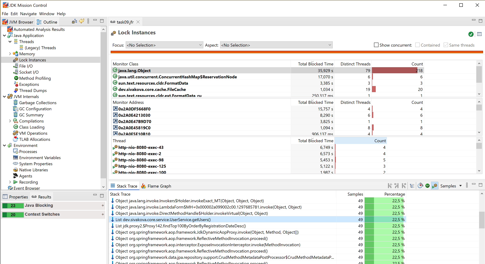
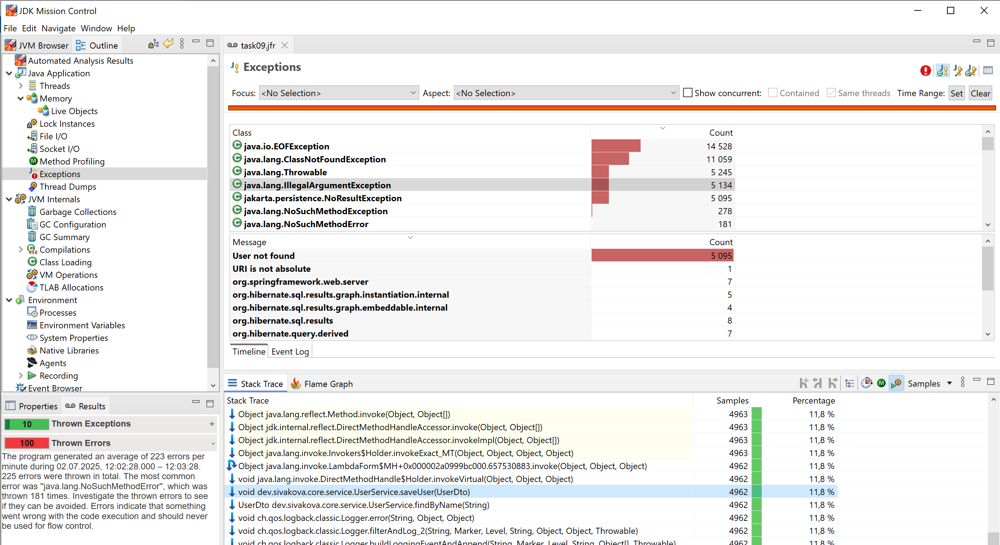
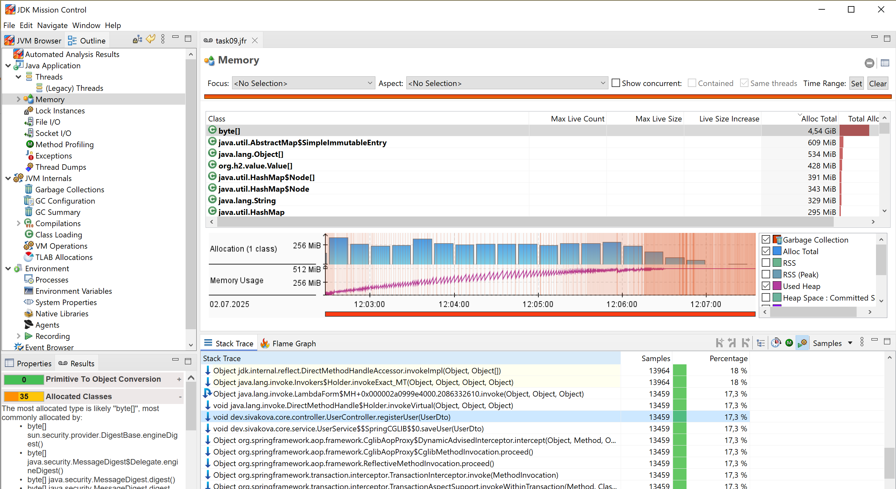
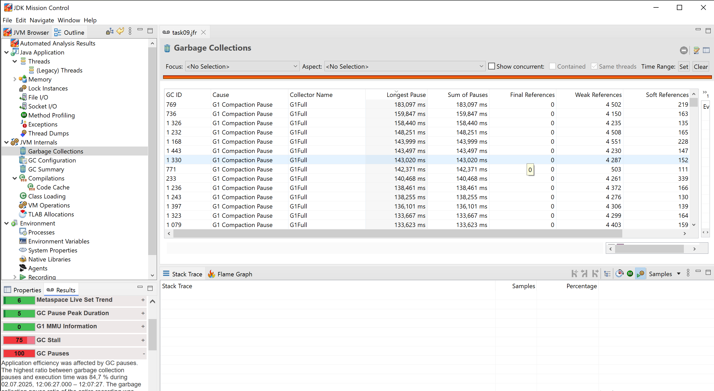

# Приложение для демонстрации обнаружения проблем производительности с Java Flight Recorder (JFR)

## Данный проект представляет собой сервис регистрации пользователей, имеющий следующие ошибки производительности:
- Избыточная синхронизация
- Лишние исключения
- Утечка памяти через кэш
## Архитектура приложения
Приложение состоит из следующих основных компонентов:
- Сервис регистрации пользователей и получения информации о зарегистрированных пользователях;
- Кэш с информацией по пользователю в виде массива байт.
## Запуск приложения
в корне проекта выполните:
```bash
mvn clean install
```
## Запуск сервиса регистрации пользователей с JFR
в корне проекта выполните:
```bash
java -Xmx512m  -XX:+UnlockDiagnosticVMOptions -XX:+DebugNonSafepoints -XX:StartFlightRecording:exceptions=all,duration=5m,filename=task09.jfr,settings=profile -jar target/task9-1.0-SNAPSHOT.jar
```
В результате выполнения команды будет запущен сервис регистрации пользователей с включенным Java Flight Recorder (JFR) для сбора данных о производительности и исключениях.
По истечении 5 минут будет создан файл `task09.jfr`.
## Подача нагрузки на сервис регистрации пользователей
Подача нагрузки на сервис регистрации пользователей осуществляется с помощью JMeter. Файл тестового плана auth_service_test_plan.jmx находится в корне проекта.
## Проблемные участки кода
### Избыточная синхронизация
```java
@Component
public class FileCache {
private final Map<UserId, FileInMemory> entries = new ConcurrentHashMap<>();

    public synchronized FileInMemory get(final User user) {
        UserId userId = new UserId(user.getId());
        return entries.computeIfAbsent(userId,
                key -> new FileInMemory("file.bin", new byte[1024]));
    }
}
```
Проблема: ConcurrentHashMap потокобезопасен, и synchronized здесь избыточен, создаёт лишние блокировки.
#### Анализ в Java Mission Control
Открыть task09.jfr в JMC и использовать вкладку "Lock Instances" для анализа блокировок:

На скриншоте выше видно, что методе getUsers() происходит частое ожидание блокировки, что указывает на избыточную синхронизацию.
### Лишние исключения
````java    
public UserDto getUserById(long id) {
    return userRepository.findById(id)
            .map(user -> {
                var fileInMemory = fileCache.get(user);
                return toUserDto(user);
            })
            .orElseThrow(() -> new IllegalArgumentException("User not found with id: " + id));
}
````
Проблема: выбрасывание исключения при каждом отсутствии пользователя — это дорого при высокой нагрузке.
#### Анализ в Java Mission Control
Открыть task09.jfr в JMC и использовать вкладку "Exceptions" для анализа исключений:

На скриншоте выше видно, что исключения с типом `IllegalArgumentException` выбрасываются при вызове метода сохранения пользователя.
### Утечка памяти в кэше
```java     
private class UserId {
    private final long id;

    public UserId(final long id) {
        this.id = id;
    }

    public long getId() {
        return id;
    }
}
```
```java
serId userId = new UserId(user.getId());
entries.computeIfAbsent(userId, key -> new FileInMemory(...));
```
Проблема: UserId не переопределяет equals() и hashCode(), что приводит к тому, что даже для одного и того же ID кэш создаёт новый объект.
#### Анализ в Java Mission Control
Открыть recording.jfr в JMC и использовать вкладку "Memory" для анализа использования памяти:

На скриншоте выше видно как память постепенно заполняется объектами byte[] что привело к OutOfMemoryError.
Так же на скрине ниже показана вкладка Garbage Collection, где видно, что сборка мусора не освобождает память из-за утечки:

