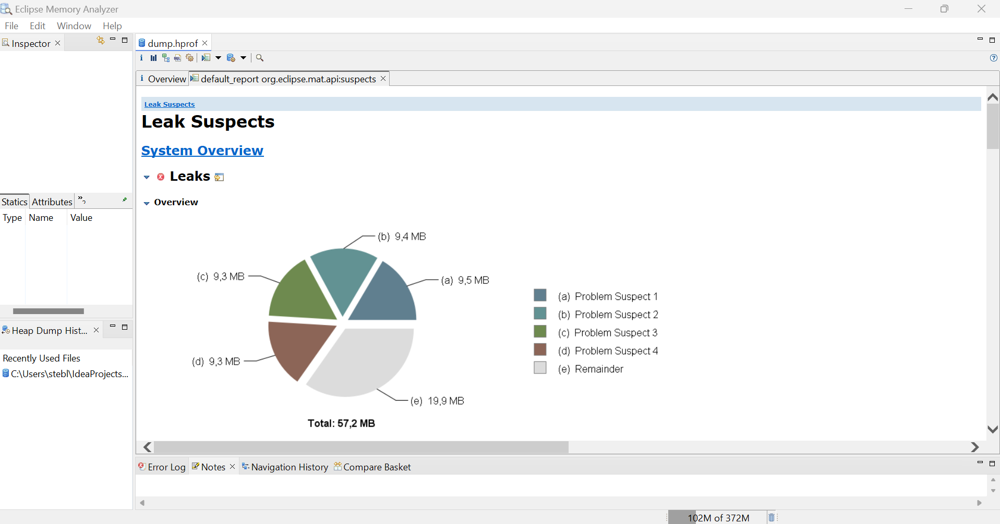
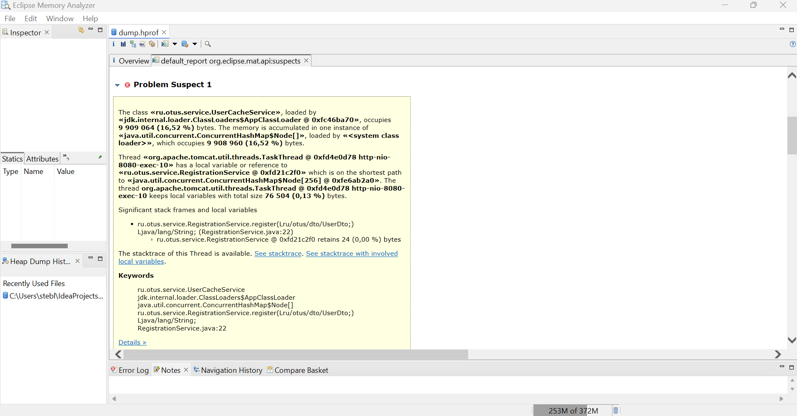
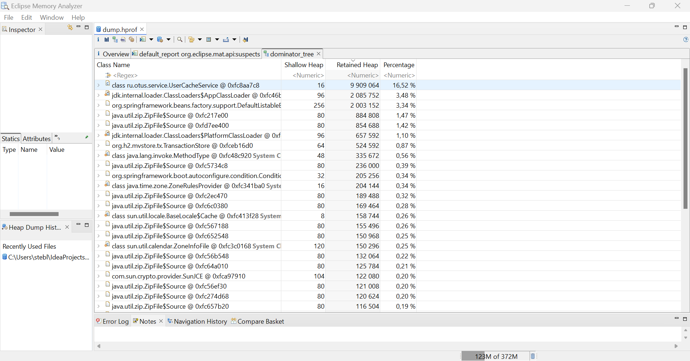
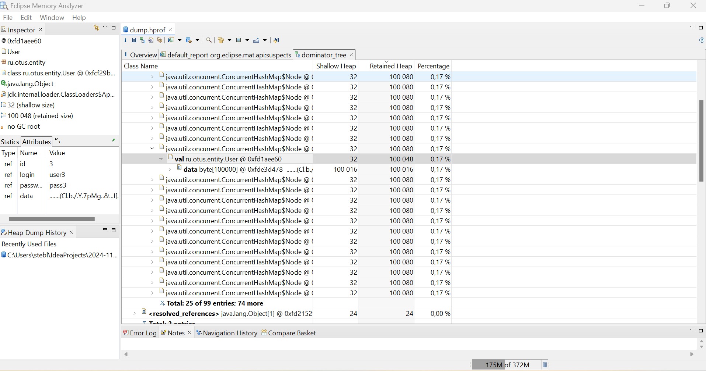

# Домашнее задание №3

## Поиск утечки памяти в приложении

Для запуска:

```bash 
mvn spring-boot:run
```

После запуска приложения, примерно через 1 минуту, вылетало OutOfMemory Exception:
```console
2025-01-06T19:33:05.248+01:00  INFO 21176 --- [    virtual-254] ru.otus.service.RegistrationSimulator    : Registration user number 98 => User registered successfully!
java.lang.OutOfMemoryError: Java heap space
Dumping heap to ./dump.hprof ...
Heap dump file created [91283499 bytes in 0.095 secs]
```

На диаграмме есть несколько подозреваемых структур, все они связаны.

При анализе видно, что утечка происходит из-за класса UserCacheService.
Остальные подозреваемык структуры это класс User, а также вспомогательные структуры для h2 БД.

Для подтверждения, открываем Dominator Tree и сортируем по Retain heap

Видим, что в нашем кэше находится 99 объектов, каждый из которых ~100KB.


Для исправления утечки была изменена структура на ConcurrentSkipListMap, 
добавлены WeakReference, а также добавлена очистка половины элементов кэша,
при достижении threshold размера.

## Цель:

Создать тестовой приложение с утечкой памяти и найти её с помощью специальных инструментов

## Описание/Пошаговая инструкция выполнения домашнего задания:

1. Реализовaть простое приложение на spring boot:

    1.1 Сервис регистрации пользователя в системе: rest service принимающий login и password от пользователя
    
    1.2 Для хранение данных использовать БД H2
    
    1.3 Для доступа к данным использовать Spring JPA

2. Заложить проблему, вызывающую OutOfMemoryError. Примечание: приложение должно постепенно копить мусор в течение нескольких минут

3. Запускать приложение с инструкцией, позволяющей собирать дамп хипа перед падением

4. Провести анализ дампа инструментам Eclipse Memory Analyzer Tool, найти утечку, и предоставить скиншот того места, где можно сделать вывод об утечку (с комментариями, поясняющими почему вы считаете это место утечкой)

5. Поправить утечку памяти (отдельным коммитом в пулл реквесте).
