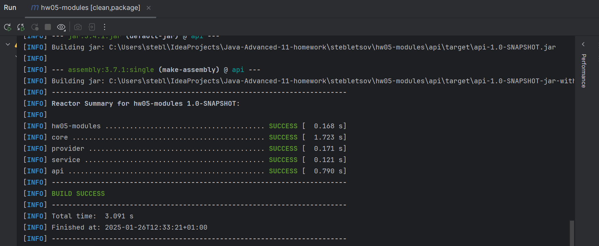
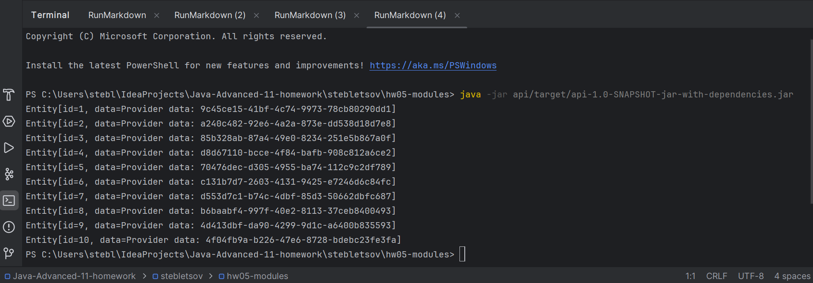

# Домашнее задание №5

## Реализация Java Module

## Для сборки fat jar со всеми зависимостями, запускаем из корня проекта:

```console 
mvn clean package
```


## Для запуска:

```bash 
java -jar api/target/api-1.0-SNAPSHOT-jar-with-dependencies.jar
```

## Цель:

Реализовать мультимодульный проект с использованием Java module, 
используя её механизмы инкапсуляции.

## Описание/Пошаговая инструкция выполнения домашнего задания:

Написать пример приложения, использующего модульную систему.

Требования:


1) Приложение должно состоять из 4 модулей: api, service, provider, core

2) api - главный верхнеуровневый модуль который запускает приложение (тут же и контроллеры)

3) service (придумайте свое название) - сервис, который сохраняет в базу данные

4) provider (придумайте свое название) - сервис, который предоставляет модулю service данные

5) core - сохраняет в базу

6) вместо реальных интеграций, просто имитируйте их. Например, core проставляет id для сущности и сохраняет в коллекцию

7) в каждом модуле должен быть описан module-info.java


