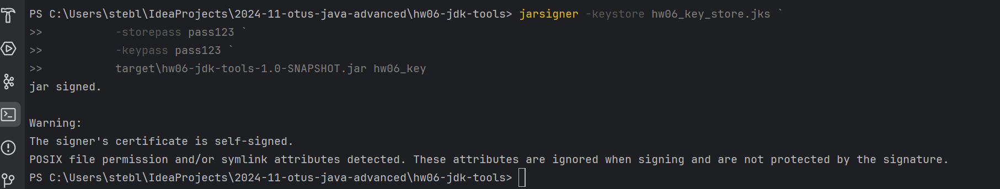

# Домашнее задание №6

## Создать сертификат с помощью keytool

### собираем jar 

```bash 
mvn clean package
```


```console 
keytool -genkeypair `
        -alias hw06_key `
        -keyalg RSA `
        -keysize 2048 `
        -keystore hw06_key_store.jks `
        -validity 365 `
        -storepass pass123 `
        -keypass pass123 `
        -dname "CN=SelfSigned, OU=HomeWork, O=Otus, L=Chelyabinsk, ST=Cheyabinskay, C=RU"
```


```console
keytool -list -v -keystore hw06_key_store.jks -storepass pass123
```


```console
jarsigner -keystore hw06_key_store.jks `
          -storepass pass123 `
          -keypass pass123 `
          target\hw06-jdk-tools-1.0-SNAPSHOT.jar hw06_key
```


```console
jarsigner -verify target\hw06-jdk-tools-1.0-SNAPSHOT.jar
```


### проверяем зависимости для jar
```console
jdeps --list-deps target\hw06-jdk-tools-1.0-SNAPSHOT.jar
```


```console
jlink --module-path $JAVA_HOME/jmods `
      --add-modules java.base `
      --output light_jre 
```


```console
./light_jre/bin/java -jar target\hw06-jdk-tools-1.0-SNAPSHOT.jar
```


## Цель:

Создать сертификат с помощью keytool, подключить его в приложение и продемонстрировать
его использование (по REST, gRPS и прочее)

## Описание/Пошаговая инструкция выполнения домашнего задания:

1. keytool & jarsigner
Выпустить самоподписанный сертификат, подписать им jar-файл(из одного класса с методом main()), верифицировать подпись
2. jlink
Написать класс с одним методом main(), и из него собрать custom lighthweight jre, и запустить свою программу с помощью этой jre
3. сделать скриншоты выполненной работы, запушить в виде отчета в репо с ДЗ