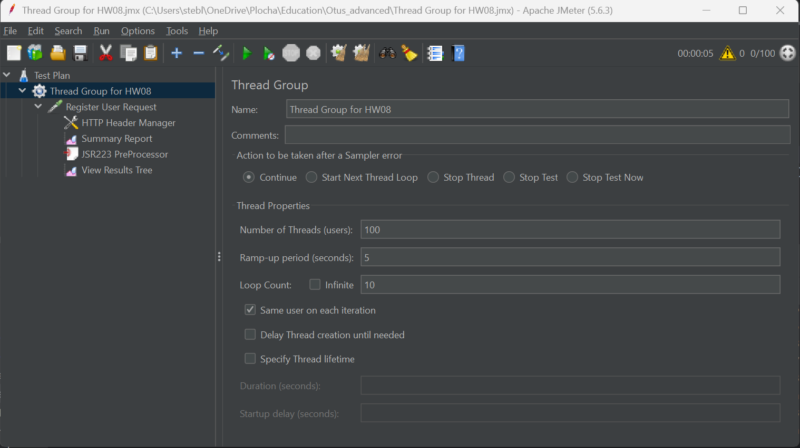
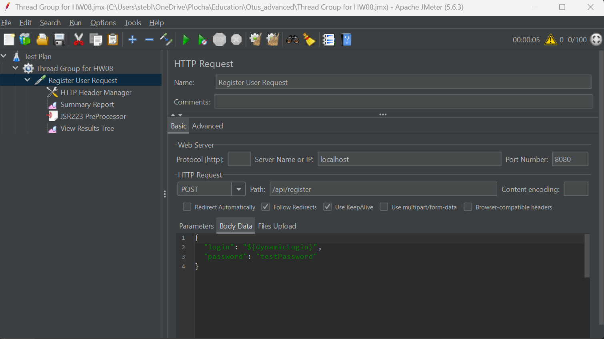
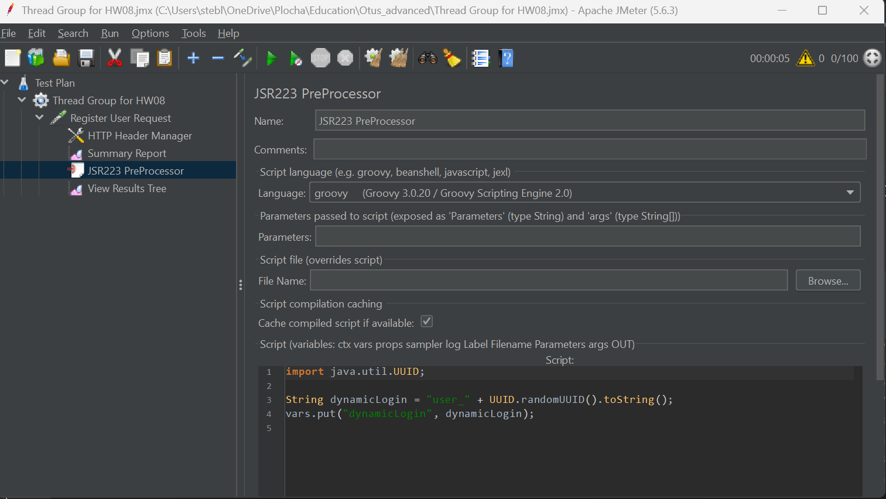
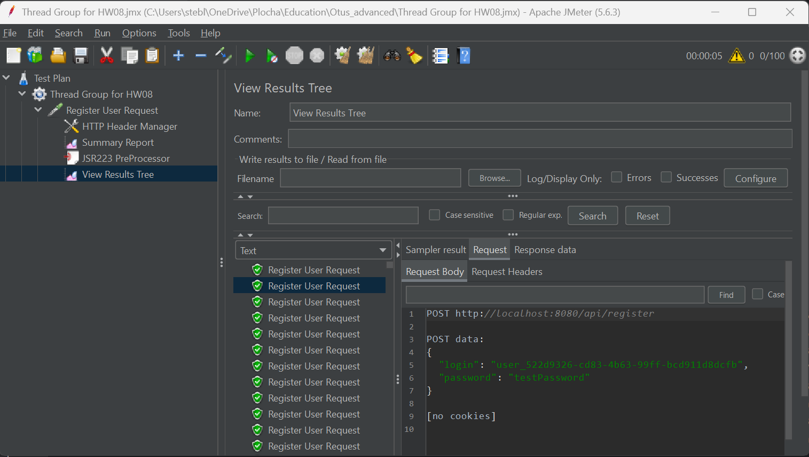
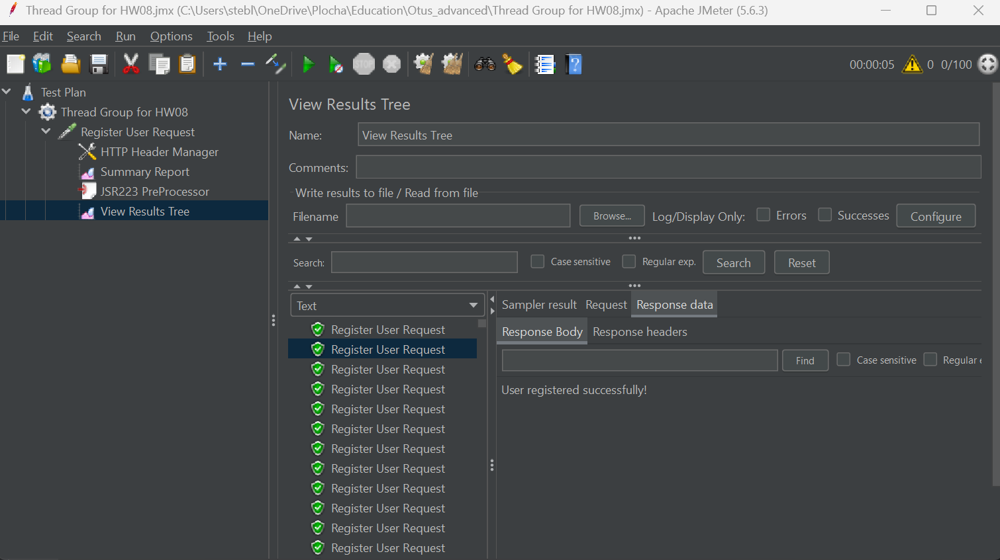
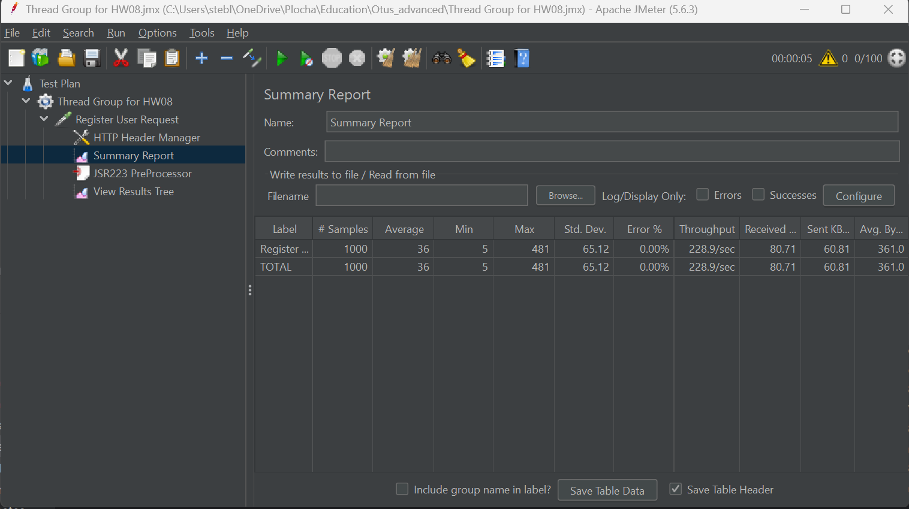
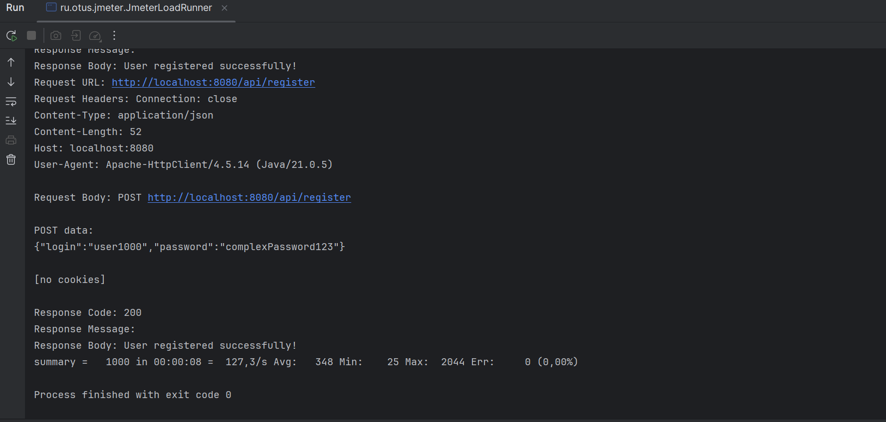

# Домашнее задание №8

## Реализовать генератор нагрузки

## Используемые параметры

- Количество потоков: 100
- Время разогрева: 5 сек
- Количество циклов: 10 
- Сгенерированный скрипт Jmeter через UI: Thread Group for HW08.jmx
- Сгенерированный скрипт Jmeter программно: script.jmx

## Jmeter UI

## Jmeter Runner

## Цель: Сделать генератор нагрузки для выбранного протокола

## Описание/Пошаговая инструкция выполнения домашнего задания:

Для выполнения задания потребуется сервис регистрации пользователя, реализованный ранее.

Создать тестовый план с регулиремым RPS.

- Сделать тесты через UI-ный интерфейс Jmetera

- Сделать тесты через отдельный подмодуль с библиотекой Jmeter.

При старте данного подмодуля jar должен запускаться и генерировать нагрузку на основное приложение