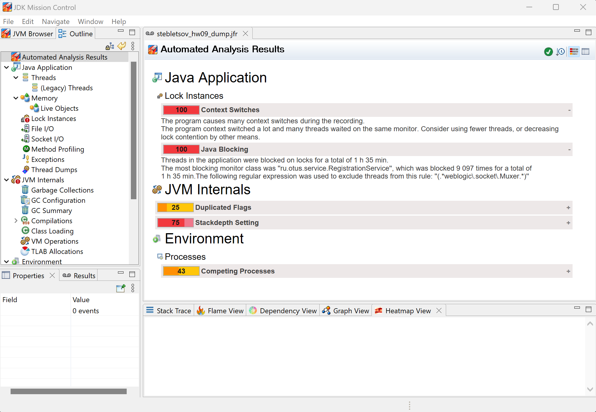
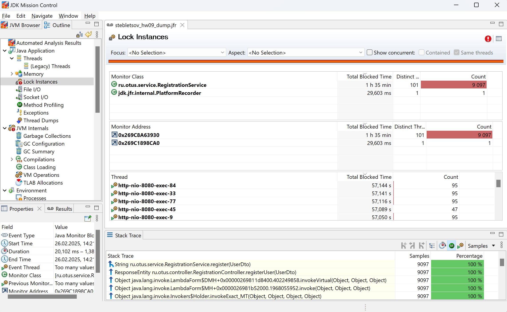
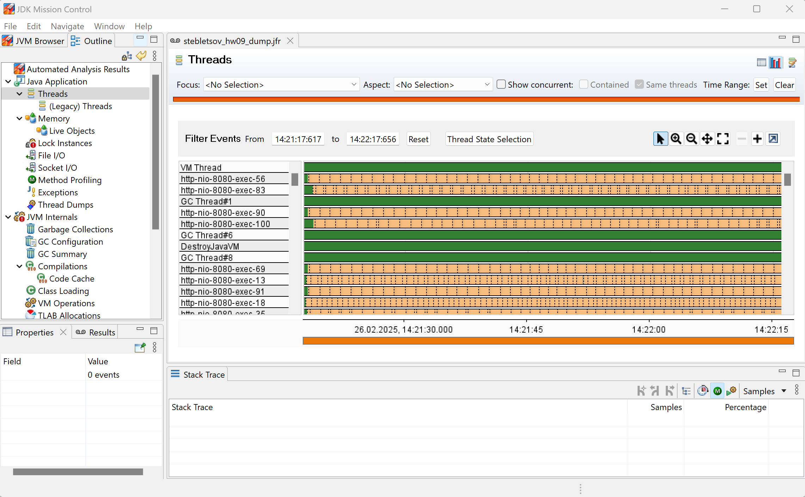
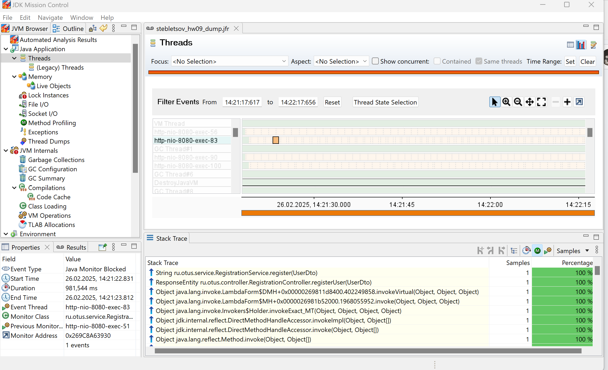
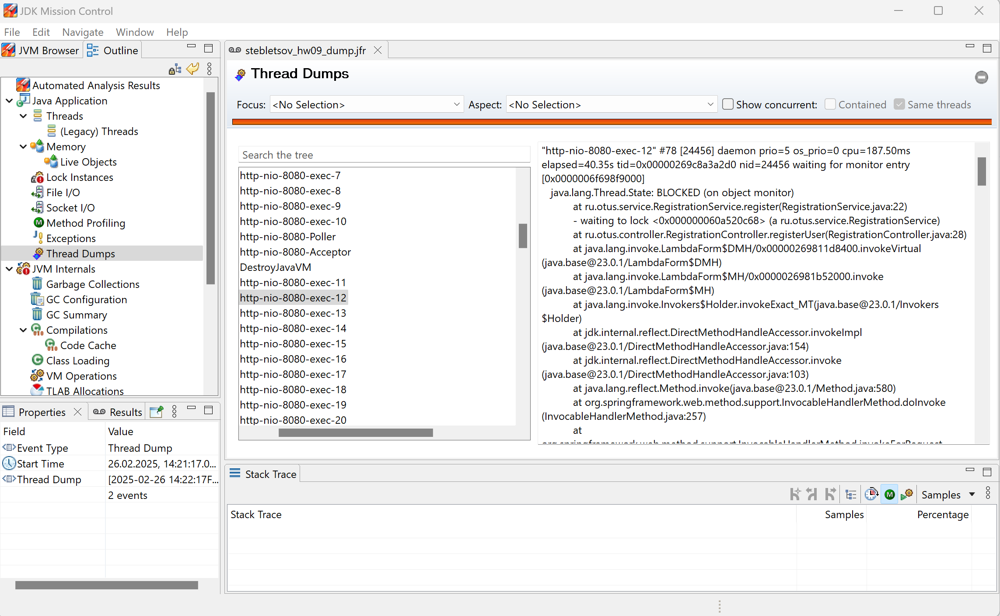

# Домашнее задание №9

## Диагностика приложения с помощью JFR

### узнать текущий pid приложения
```shell 
jcmd
```

### снять дамп используя pid приложения
```shell 
jcmd 24524 JFR.start duration=60s filename=stebletsov_hw09_dump.jfr
```

JMC атоматизированный отчет уже указывает на проблемы синхронизации:
- Программа вызывает много переключений контекста во время записи.
- Контекст программы часто переключался, и многие потоки ждали на одном и том же мониторе.
- Потоки в приложении были заблокированы
- Самым блокирующим классом монитора был 'ru.otus.service.RegistrationService', который был заблокирован 9 097 раз



Вкладка Lock Instances подтверждает эти выводы:


Во вкладке Threads мы можем видеть состояние всех потоков во время снятия дампа


Многие потоки заблокированы, это указывает на то, что они ждут ресурс, который заблокирован другим потоком.


Чтобы посмотреть детали блокировки, заходим во вкладку Thread Dumps
Видим, что поток пытается получить блокировку на метод ru.otus.service.RegistrationService.register

```text
java.lang.Thread.State: BLOCKED (on object monitor)
at ru.otus.service.RegistrationService.register(RegistrationService.java:22)
waiting to lock <0x000000060a520c68> (a ru.otus.service.RegistrationService)
```



Вывод: мы видим, что потоки блокируются на одном и том же ресурсе - методе ru.otus.service.RegistrationService.register, 
это может быть признаком того, что в программе есть участок кода где неэффективно используется синхронизация.
Это может привести к низкой производительности и многократным блокировкам. В нашем случае синхронизация этого метода избыточна, т.к. Spring Data JPA и так управляет потокобезопасностью в рамках транзакции.

## Цель: Реализовать тестовый пример, содержащий проблемы, которые потом продемонстировать в JFR

## Описание/Пошаговая инструкция выполнения домашнего задания:

1) Для выполнения задания потребуется сервис регистрации пользователя, реализованный ранее.

2) Написать тестовый профиль с использованием JMeter

3) Провести профилирование приложения с помощью JFR

4) Имитировать проблемы в приложении:
- лишние исключения
- лишние запросы к БД
- ненужные блокировки syncronized или Lock
- свои варианты

5) На основе анализа журнала JFR найти проблемы в приложении и обосновать, как прийти к такому заключению
о проблемах. В отчет можно включать скрины JMC, ссылки на исходный код.
