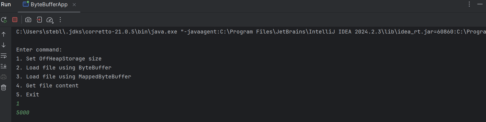
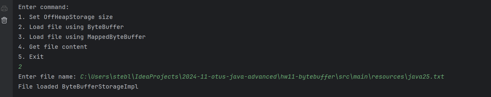
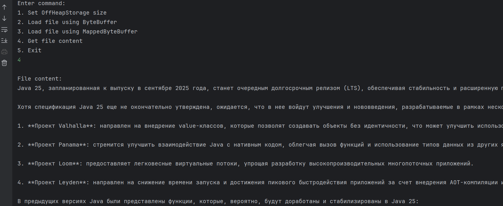
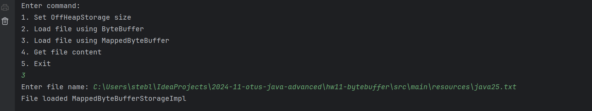
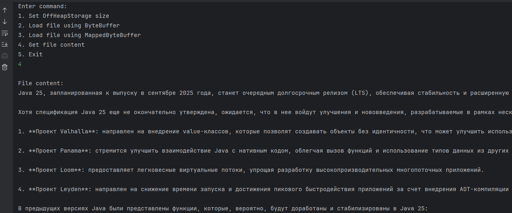

# Домашнее задание №11

## Использование ByteBuffer

При запуске можно установить размер буфера (по умолчанию 512)

Пробуем загрузить файл используя ByteBuffer:

Печатаем содержимое файла:

Пробуем загрузить файл используя MappedByteBuffer:

Печатаем содержимое файла:

## Цель: Реализовать хранение данных в off-heap

## Описание/Пошаговая инструкция выполнения домашнего задания:

Реализовать класс для хранения данных в off-heap, используя инструменты
библиотеки Java NIO:ByteBuffer и MappedByteBuffer(обязательные реализации).
Так же можно использовать свое решение, но примеры реализаций с ByteBuffer 
и MappedByteBuffer обязатeльны. 
Данные списываются с файла и записываются в off-heap хранилище.

Пользователь может задавать размер off heap хранилища и вводить название файла.
Если файл не найден, то бросается исключение.

