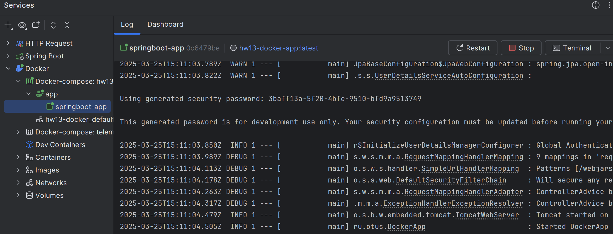
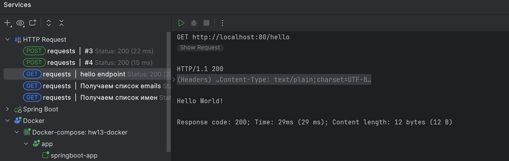
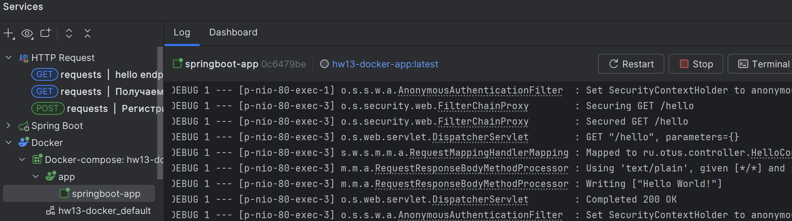
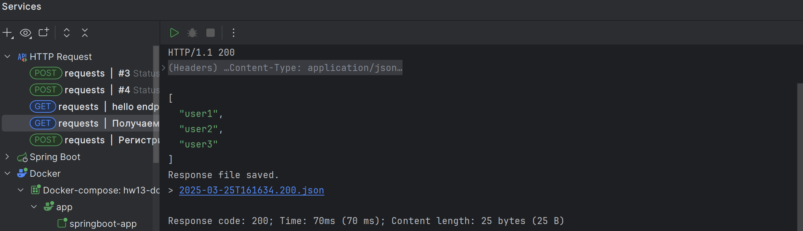
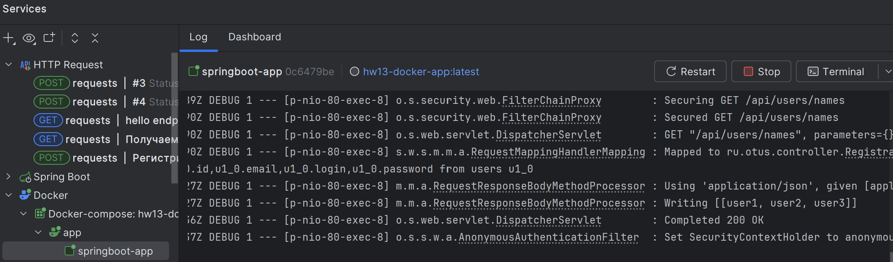

# Домашнее задание №13

## Запуск SpringBoot приложения в Docker

## Цель: Создать SpringBoot приложение с эндпоинтами и запустить его в Docker

Собираем jar:
```shell
mvn clean package
```

Собираем docker образ и cтартуем его или стартуем из Idea:
```shell
docker-compose up --build
```



Проверяем доступен ли сервис из контейнера:


В логах контейнера видим обработанный запрос:


Получение списка пользователей:


Проверям опять в логах контейнера обработанный запрос:


## Описание/Пошаговая инструкция выполнения домашнего задания:

* Добавить в Spring приложение новый энпойнт - GET /hello, который будет возвращать строку "Hello world!"
* Собрать JAR файл своего приложенния
* Создать docker образ на основе образа с JDK:
* Образ должен быть в формате Dockerfile
* При запуске контейнера, должно запускать приложение
* Энпойнты должны быть доступны по порту 80
