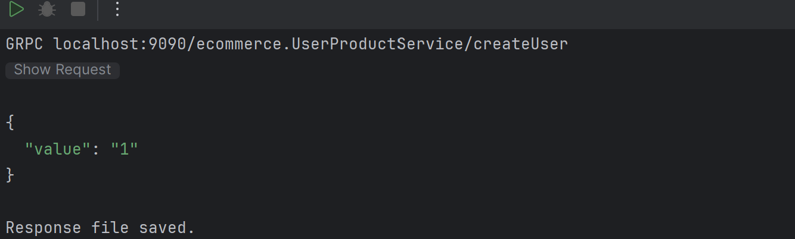
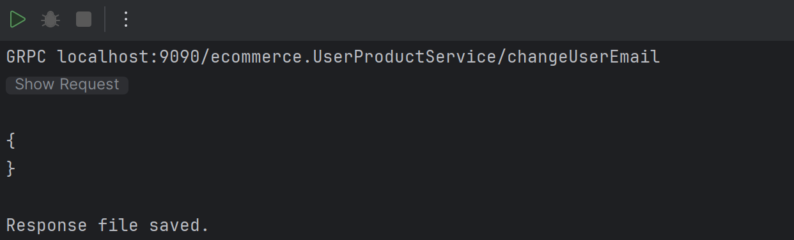
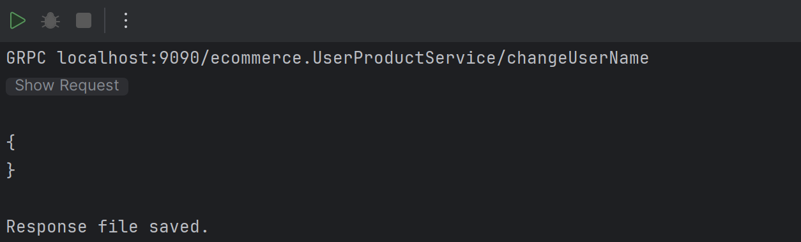
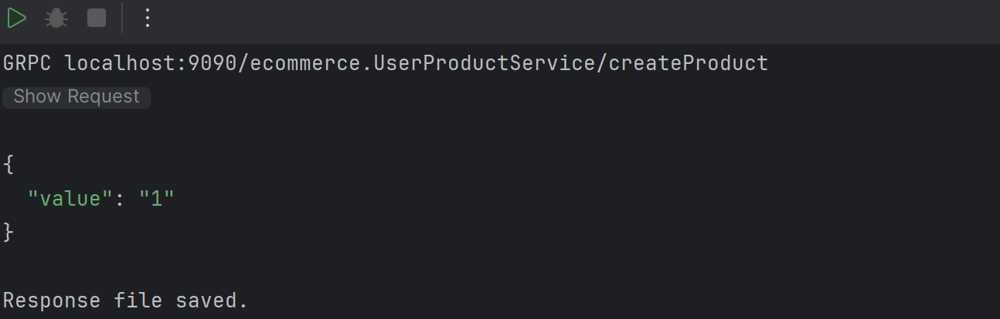
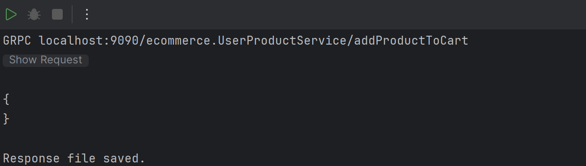
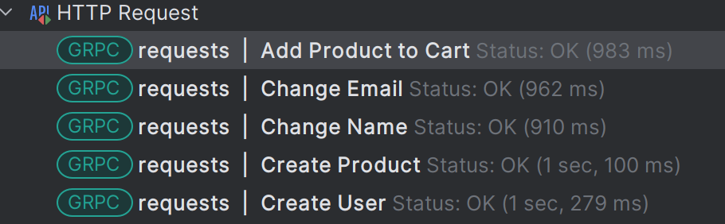
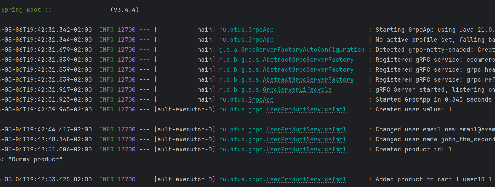

# Домашнее задание №17

##  описать gRPC сервис

Собираем package
```shell
mvn clean package
```

Проверяем работу сервиса через requests.http






Все запросы успешно выполнились:


Проверяем логи сервера:


## Цель:

*  Описать gRPC сервис и приложить скриншоты вывода консоли в пул реквест (вместе с рабочим
   кодом)

## Описание/Пошаговая инструкция выполнения домашнего задания:

* Подключить gRPC в проект и Реализовать сервис в Java
* Описать сущности при помощи protobuf:
    *  User (email, username, id),
    *  Product (name, id)
  
* Описать сервис при помощи protobuf:
    * createUser(email, username) returns id
    * changeUserEmail(id, email)
    * changeUserName(id, username)
    * createProduct(name) returns id
    * addProductToCart(userId, productId)

Критерии оценки:
* Все сущности и сервис реализованы правильно
* Проект должен собираться без ошибок а protobuf генерировать сущности и интерфейсы
* Есть скриншоты вывода консоли


