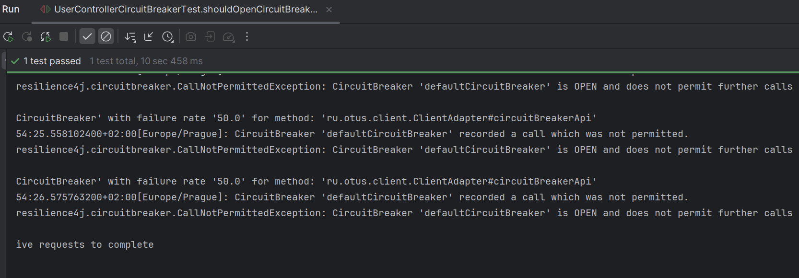
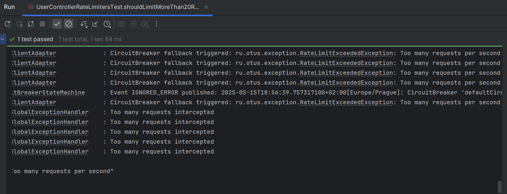
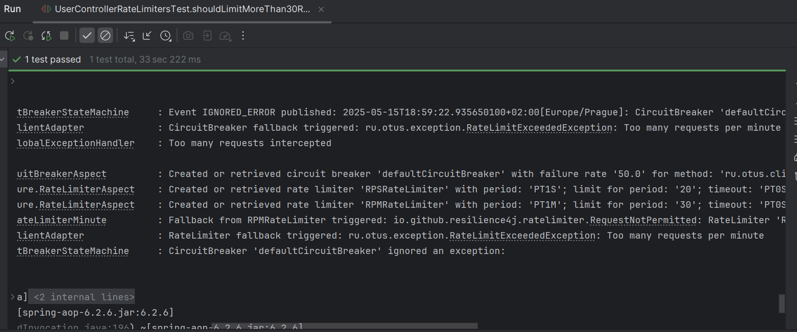

# Домашнее задание №18

##  Реализовать сервис с повышенной отказоустойчивостью

Собираем package
```shell
mvn clean package
```

Для проверки использовались тесты с RestClient:

CircuitBreaker открывается т.к. в течение 10 секунд были неуспешные запросы:


RPSRateLimiter срабатывает при более 20 запросах в секунду:


RPMRateLimiter срабатывает при более 30 запросах в минуту:


## Цель:

* Реализовать сервис (Rest или gRPC) защиту от ошибок с использованием CircuitBreaker и с защитой от перегрузки (RateLimiter)

## Описание/Пошаговая инструкция выполнения домашнего задания:

* Создать новый Rest или gRPC сервис (можно использовать [https://start.spring.io/](https://start.spring.io/))
* Добавить в контроллер метод получения возраста пользователя по его id (возраст можно формировать рандомно)
* Сделать защиту от перегрузки метода, используя RateLimiter из библиотеки resilience4j:
  * не более 20 запросов в секунду
  * не более 30 запросов в минуту
* Сделать защиту от ошибок с использованием CircuitBreaker из библиотеки resilience4j, если:
  * 50% запросов за последние 10 секунд не были выполнены (SlidingWindowType.TIME_BASED)
* Написать тесты:
  * метод не позволяет выполнить более 20 запросов в секунду
  * метод не позволяет выполнить более 30 запросов в минуту
  * метод не выполянтеся, если 50% запросов за последние 10 секунд были не успешные
