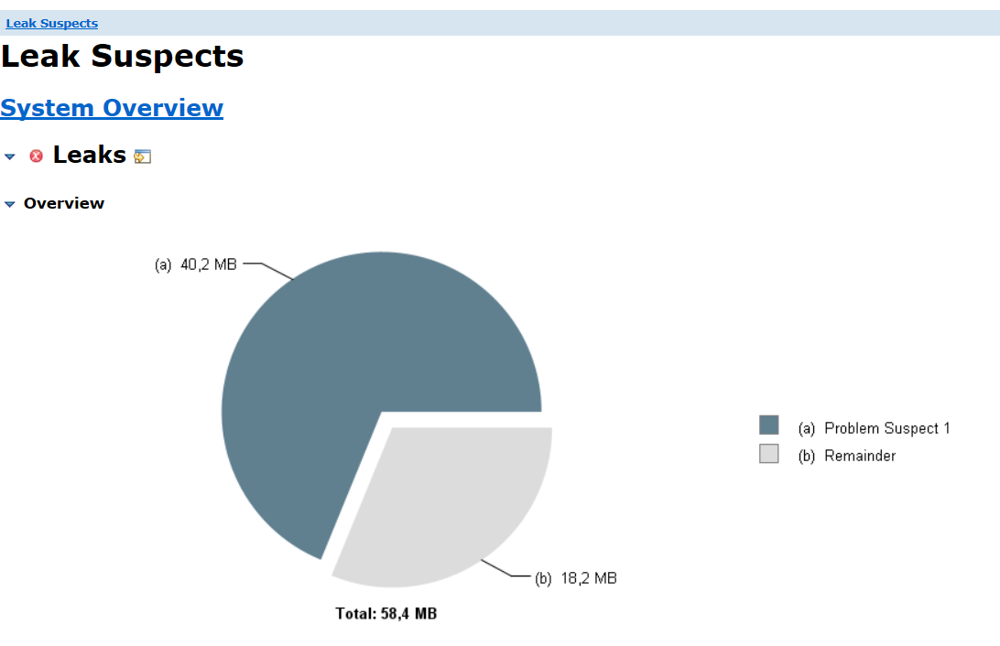
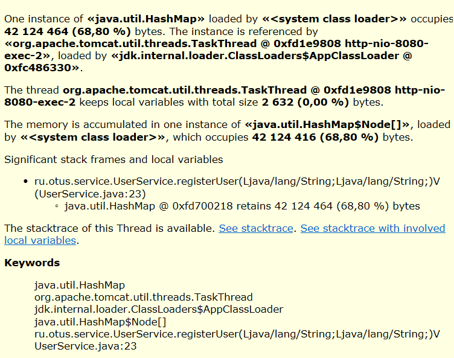

# Приложение для анализа утечек памяти

## Описание

Это приложение предназначено для примера анализа и устранения утечек памяти.

### Проблема
- Утечка памяти возникает в связи с тем, что объекты в `userCache` не удаляются, а их число не контролируется.

## Анализ

- **Что сделано**: Проведено предварительное исследование с использованием Eclipse Memory Analyzer Tool для анализа дампа памяти.


- 
## Параметры запуска приложения

   ```bash
   -Xms64m -Xmx64m -XX:+PrintGCDetails -XX:+HeapDumpOnOutOfMemoryError -XX:HeapDumpPath=./dump.hprof
