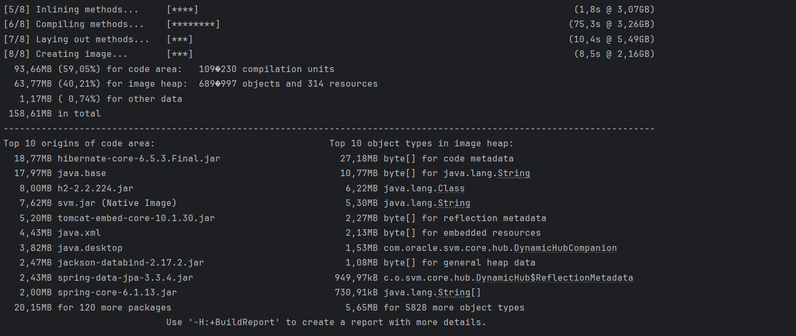
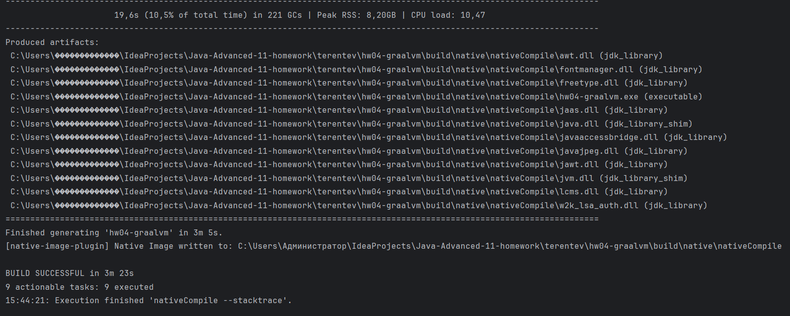
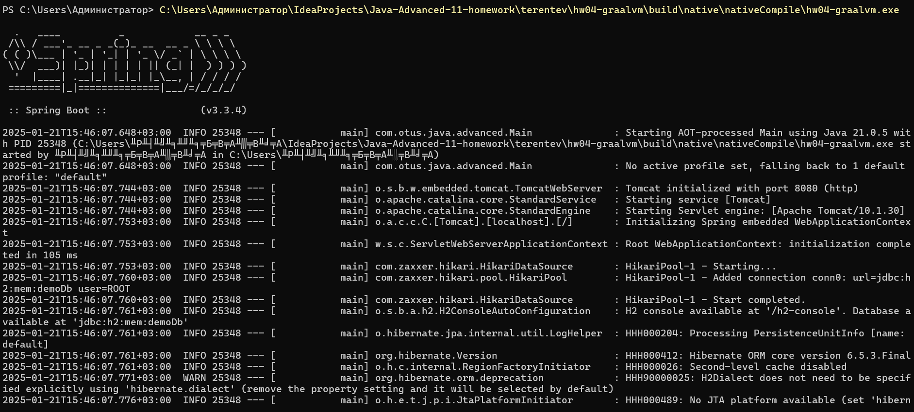
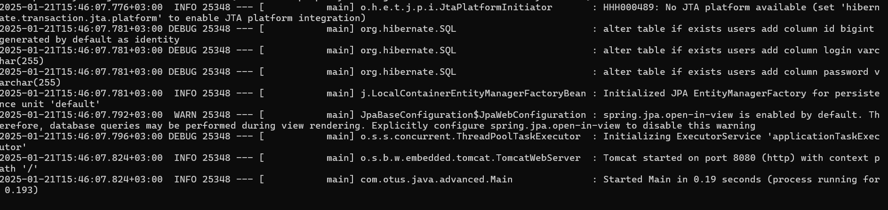

# Приложение для анализа утечек памяти

## Описание

Это приложение предназначено для тренировки с GraalVM на основе приложения из третьего модуля.

## Что было сделано
- Скопировано приложение из предыдущей работы, но на Gradle
- Добавлен плагин org.graalvm.buildtools.native
- Добавлен юнит-тест без использования Mockito
- Запущен плагин nativeCompile
- Получившийся в результате файл .exe запущен через терминал
- Запущен плагин nativeTestCompile

## Итоги
Запуск приложения обычным способом показал, что оно стартует за 3.908 seconds, через нативный образ получилось намного быстрее — за 0.189 seconds. 
Но сборка нативного образа заняла более трёх минут.

## Скриншоты
- Запуск nativeCompile:

- Запуск .exe через терминал:

