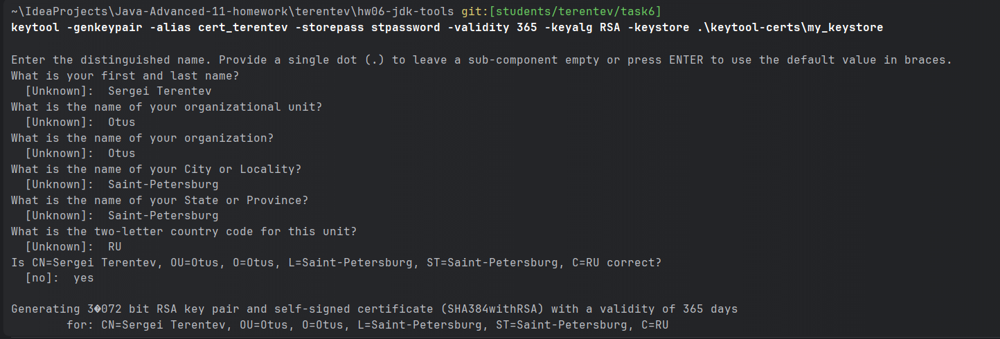
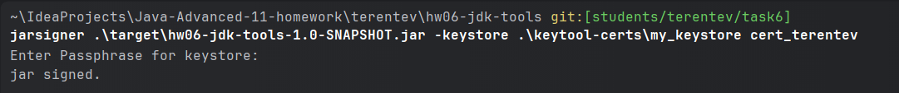
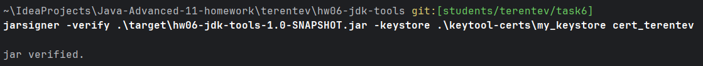
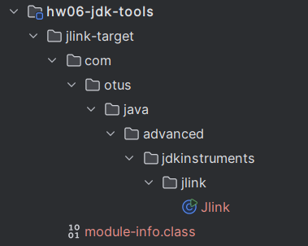
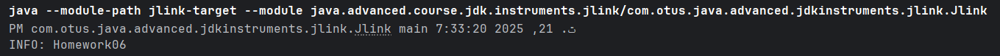
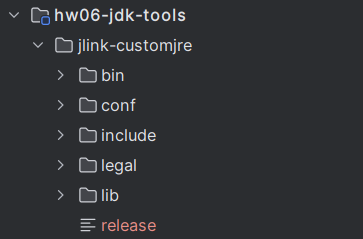
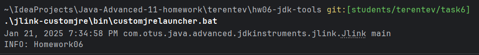

# Приложение для изучения инструментов JDK

## Создание сертификатов
В рамках задания при помощи keytool был создан сертификат, а потом подписан jar-файл и подпись была верифицирована
```
keytool -genkeypair -alias cert_terentev -storepass stpassword -validity 365 -keyalg RSA -keystore .\keytool-certs\my_keystore
```


```
jarsigner .\target\hw06-jdk-tools-1.0-SNAPSHOT.jar -keystore .\keytool-certs\my_keystore cert_terentev
```


```
jarsigner -verify .\target\hw06-jdk-tools-1.0-SNAPSHOT.jar -keystore .\keytool-certs\my_keystore cert_terentev
```


## Создание легковесной jre
В рамках задания при помощи jlink была легковесная jre, а также запущен полученный bat

```
javac -d jlink-target .\src\main\java\module-info.java
```


```
javac -d jlink-target --module-path jlink-target .\src\main\java\com\otus\java\advanced\jdkinstruments\jlink\Jlink.java
```



```
java --module-path jlink-target --module java.advanced.course.jdk.instruments.jlink/com.otus.java.advanced.jdkinstruments.jlink.Jlink
```



```
jlink --launcher customjrelauncher=java.advanced.course.jdk.instruments.jlink/com.otus.java.advanced.jdkinstruments.jlink.Jlink --module-path "C:\Users\Администратор\IdeaProjects\Java-Advanced-11-homework\terentev\hw06-jdk-tools\jlink-target;C:\Users\Администратор\.jdks\corretto-21.0.5\jmods" --add-modules java.advanced.course.jdk.instruments.jlink --output jlink-customjre
```



```
.\jlink-customjre\bin\customjrelauncher.bat
```

