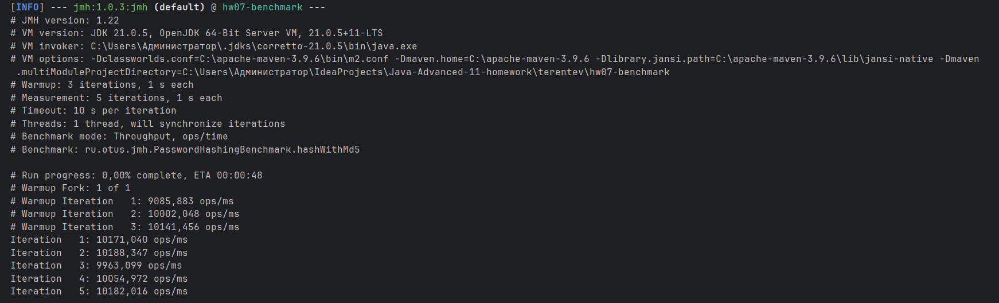
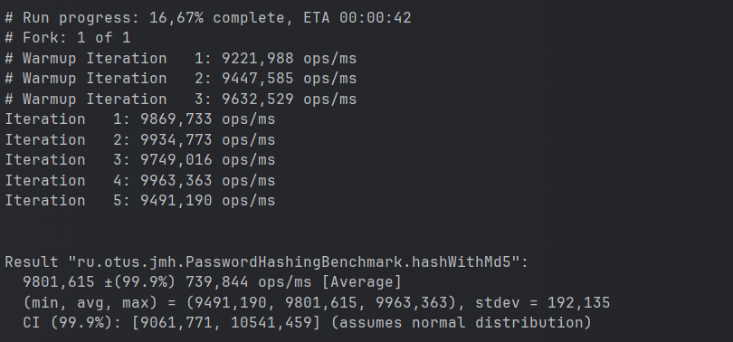
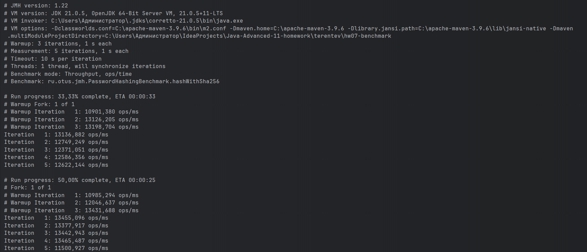
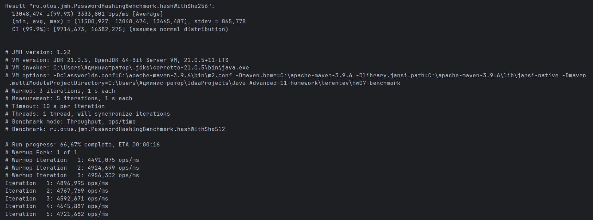
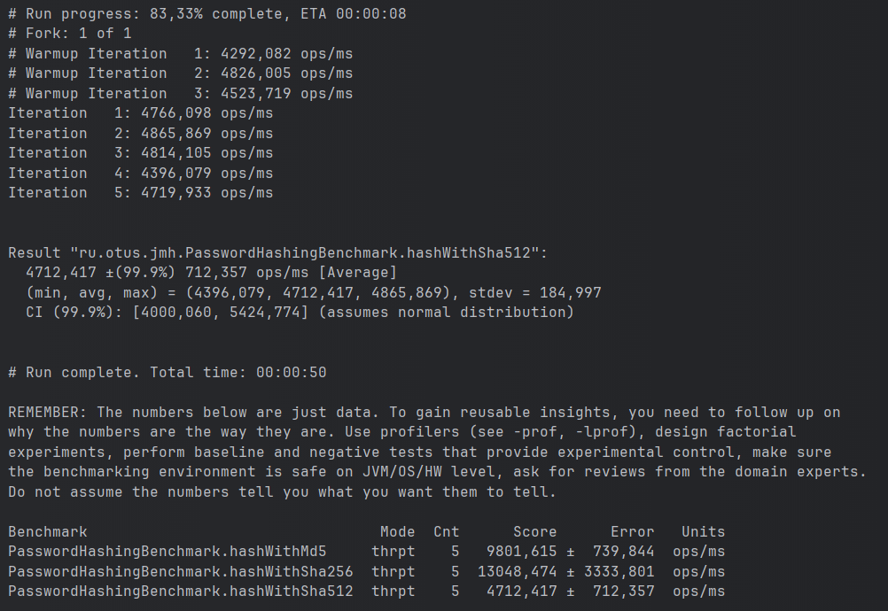

# Бенчмарк алгоритмов хэширования пароля

## Описание
Это приложение реализует тестирование производительности различных алгоритмов хеширования паролей с использованием JMH

## Запуск
```
mvn clean install
```

## Результаты тестирования
Тесты измеряют пропускную способность (Throughput), выраженную в операциях в миллисекунду.

| Алгоритм | Средняя производительность (ops/ms) | Погрешность (±99.9%) |
|----------|-------------------------------------|----------------------|
| MD5      | 9801,615                            | 739,844              |
| SHA-256  | 13048,474                           | 3333,801             |
| SHA-512  | 4712,417                            | 712,357              |

## Скриншоты запуска






## Выводы
- SHA-256 показывает наибольшую пропускную способность.
- MD5 немного уступает SHA-256, но остаётся быстрым.
- SHA-512 значительно медленнее MD5 и SHA-256, но обеспечивает более высокую криптографическую стойкость.