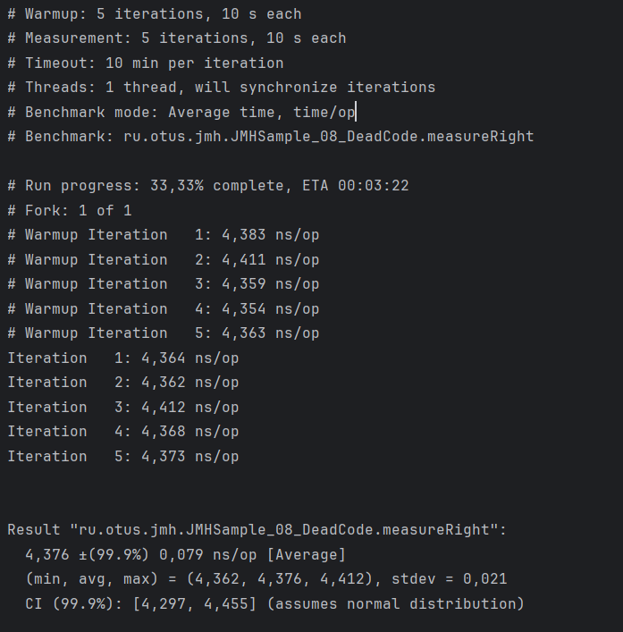

# Бенчмарк алгоритмов хэширования пароля

## Описание
Это приложение реализует тестирование производительности различных алгоритмов хеширования паролей с использованием JMH

## Запуск
```
mvn clean install
```

## Результаты тестирования
Тесты измеряют пропускную способность (Throughput), выраженную в операциях в миллисекунду.

| Алгоритм | Средняя производительность (ops/ms) | Погрешность (±99.9%) |
|----------|-------------------------------------|----------------------|
| MD5      | 9801,615                            | 739,844              |
| SHA-256  | 13048,474                           | 3333,801             |
| SHA-512  | 4712,417                            | 712,357              |

## Скриншоты запуска


## Выводы
- SHA-256 показывает наибольшую пропускную способность.
- MD5 немного уступает SHA-256, но остаётся быстрым.
- SHA-512 значительно медленнее MD5 и SHA-256, но обеспечивает более высокую криптографическую стойкость.

## Запуск тестов jmh-samples
### JMHSample_08_DeadCode
- Показывает влияние удаления "мёртвого" кода на бенчмарки.
- `measureRight` (4,376 ns/op) корректно использует `Blackhole`, `measureWrong` (5,179 ns/op) демонстрирует нестабильные результаты из-за возможного удаления кода JVM.
- `baseline` (0,390 ns/op) измеряет минимальную стоимость вызова пустого метода.




### JMHSample_26_BatchSize
- Демонстрирует влияние размера batch на измерения производительности.
- `measureWrong_1` (~10⁻⁵ s/op) и `measureWrong_5` (~10⁻⁴ s/op) зависят от накладных расходов JMH.
- `measureRight` (0,015 s/op) использует batch size и даёт более стабильные измерения.


### JMHSample_32_BulkWarmup
- Использует `BULK` warmup, прогревая все тесты перед измерением.
- `measure_c1` (~1.85 ns/op) стабилен, `measure_c2` (~2.2 ns/op) показывает замедление, возможно, из-за кеширования или JIT.
- Подходит для тестов с сильным влиянием JIT-компиляции.


