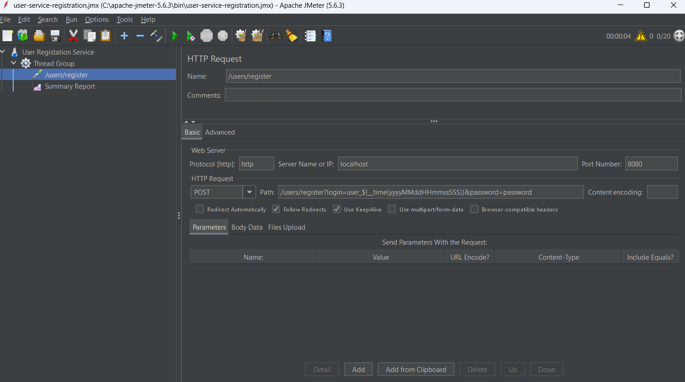
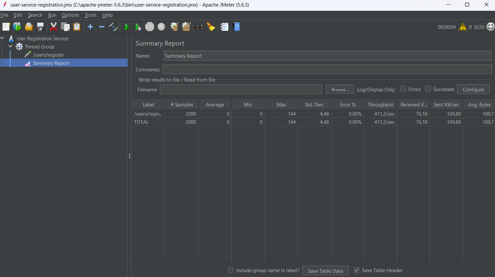
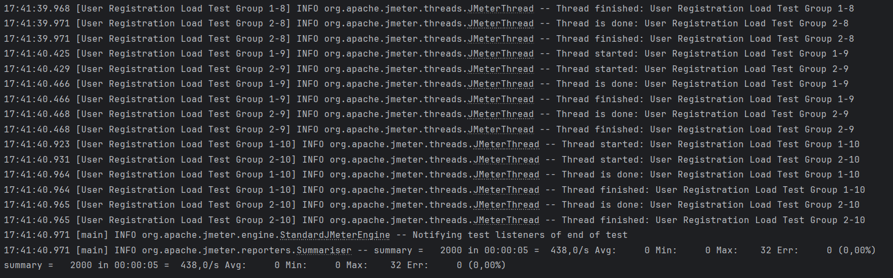

# Нагрузочное тестирование

## Описание
Это задание для тестирования нагрузки на сервис регистрации пользователей с помощью JMeter. Тесты проверяют производительность и устойчивость сервиса при массовой регистрации пользователей.

## Конфигурация
- Количество потоков: 10 — количество пользователей, которые будут зарегистрированы одновременно.
- Время разгона: 5 секунд — время, в течение которого будут активироваться все потоки.
- Циклы: 100 — количество повторений теста для каждого потока.

## Отчёты
Запуск через UI: user-service-registration.jmx
Запуск через IDEA: jmeter-script.jmx

## Скриншоты

