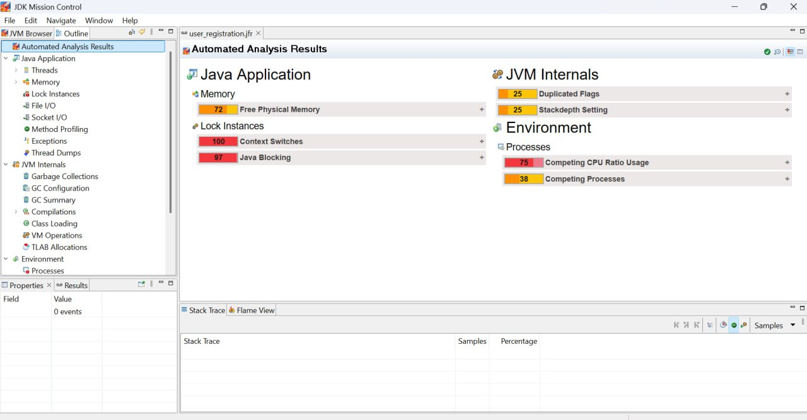
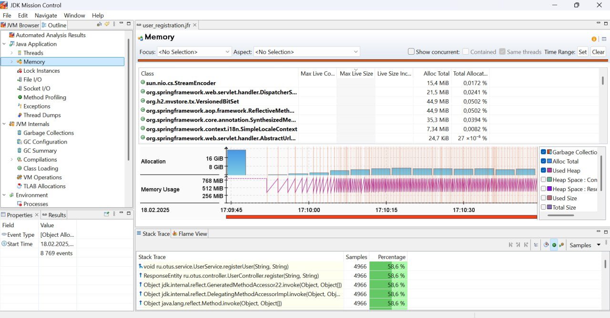
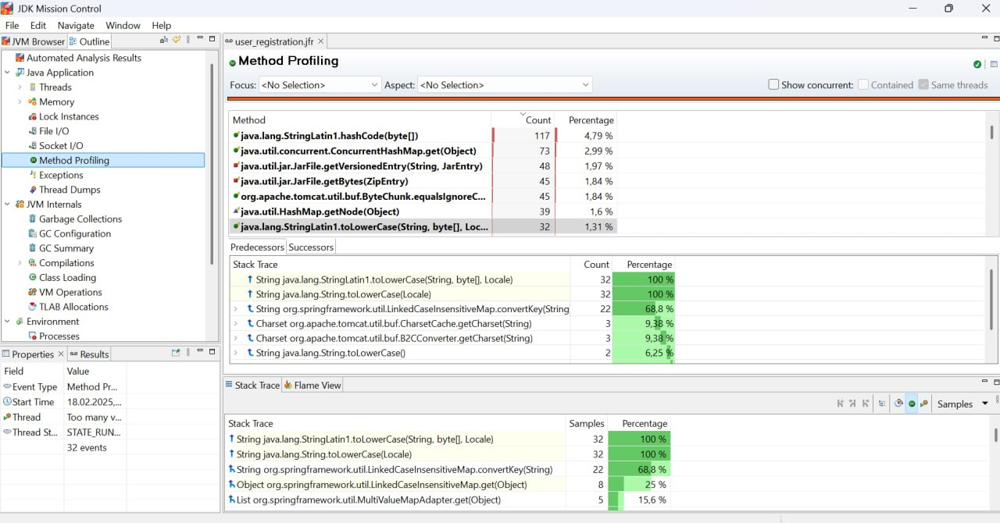
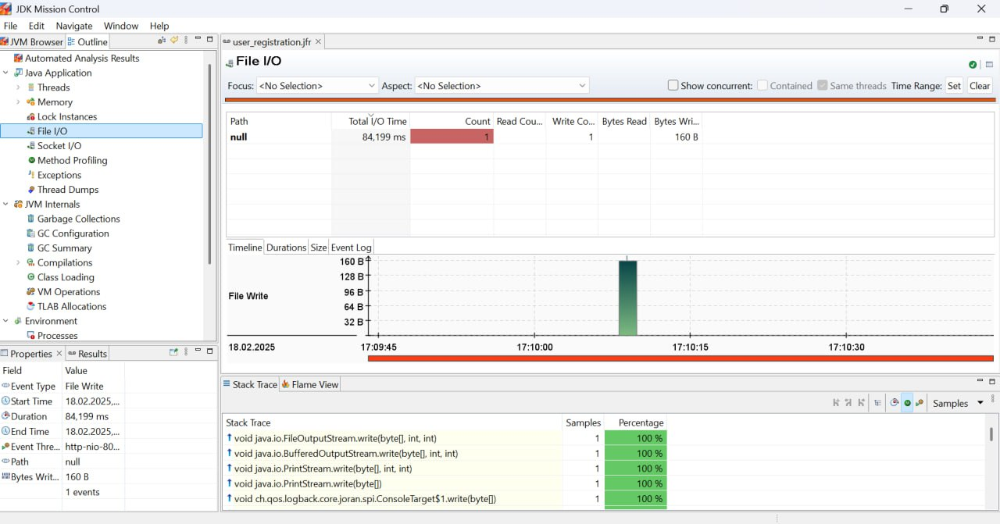
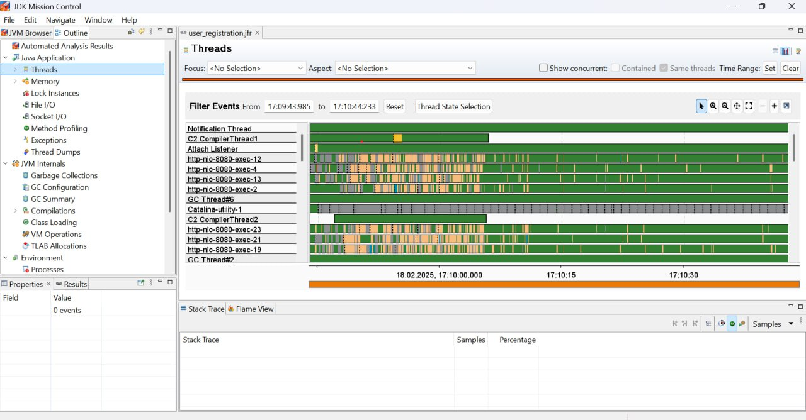
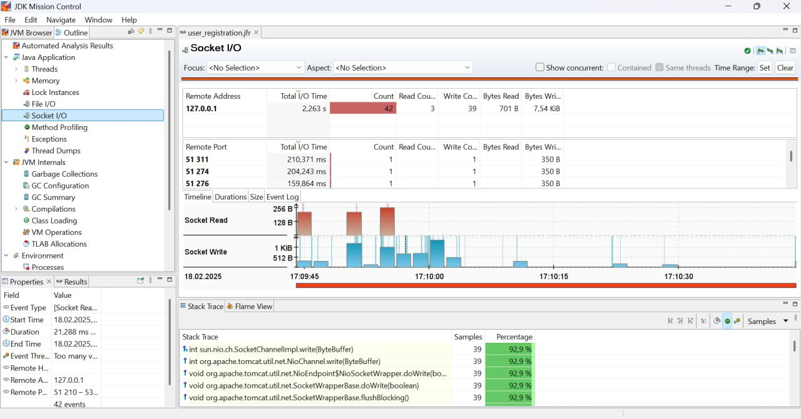
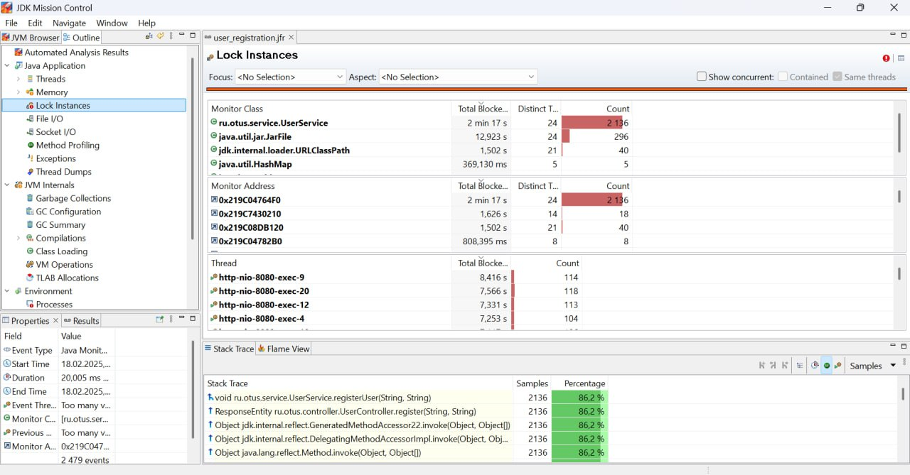

# Профилирование приложений

## Описание
Это задание для профилирования сервиса регистрации пользователей с помощью JMC. Для этого в классе UserService были добавлены проблемы, а нагрузка создавалась при помощи JMeter.

## Выявленные проблемы
Методы registerUser() и getUserData() могут вызывать задержки, так как:

- Метод registerUser() сначала захватывает synchronized, а затем lock.lock(), что приводит к потенциальным блокировкам.
- В Thread Dumps было замечено, что несколько потоков ожидают освобождения lock, вызывая заторможенность системы.

В разделе "I/O Activity" обнаружены частые обращения к userRepository.findById(user.getId()).

- Этот запрос выполняется сразу после save(), что избыточно, так как объект уже есть в памяти.

## Скриншоты

## Вывод
На основе анализа JFR можно улучшить производительность сервиса:

- Оптимизировать конкурентный доступ к данным.
- Снизить нагрузку на GC путём пересмотра кеша.
- Минимизировать лишние запросы к базе.