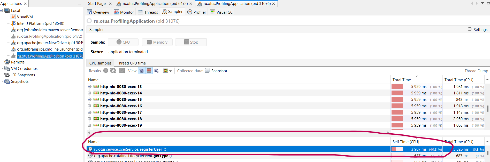
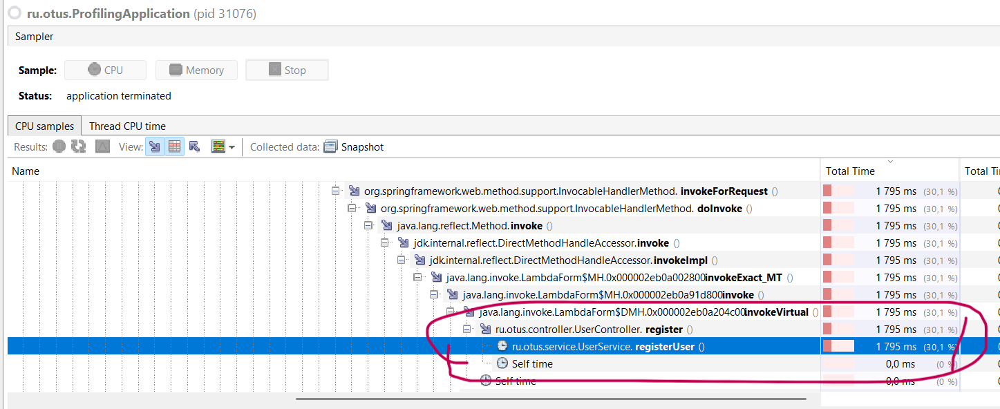

# Профилирование приложений при помощи VisualVM

## Описание
Это задание для профилирования сервиса регистрации пользователей с помощью VisualVM. Для этого в классе UserService был добавлен ненужный lock, а нагрузка создавалась при помощи JMeter.

## Профилирование
После снятия snapshot в hot spots вверху рейтинга обнаруживаем метод registerUser(), на который было потрачено более 40% CPU.
Также то, что на выполнение этого метода отводилось много времени, смотрим в древовидной структуре CPU Samples. 

## Скриншоты

## Вывод
При помощи VisualVM можно быстро находить места в программе, которые выполняются дольше всего. Это не всегда может быть проблемой, но к таким местам в программе стоит присмотреться.