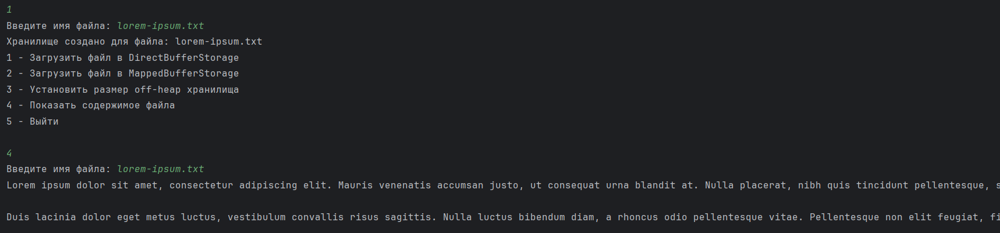
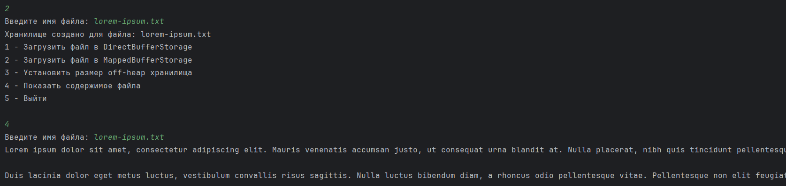

# Использование ByteBuffer

## Цель
Реализовать хранение данных в off-heap

## Описание
Реализовать класс для хранения данных в off-heap, используя инструменты библиотеки Java NIO:ByteBuffer и MappedByteBuffer. Данные списываются с файла и записываются в off-heap хранилище.

## Скриншоты

