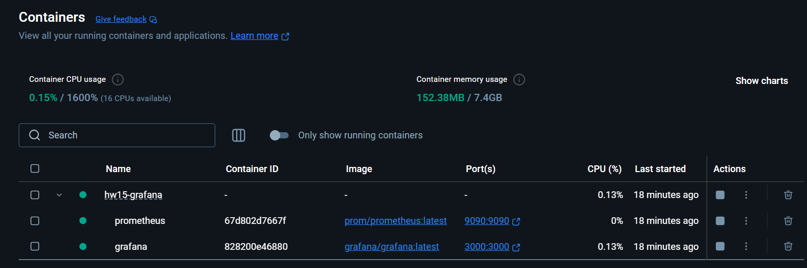
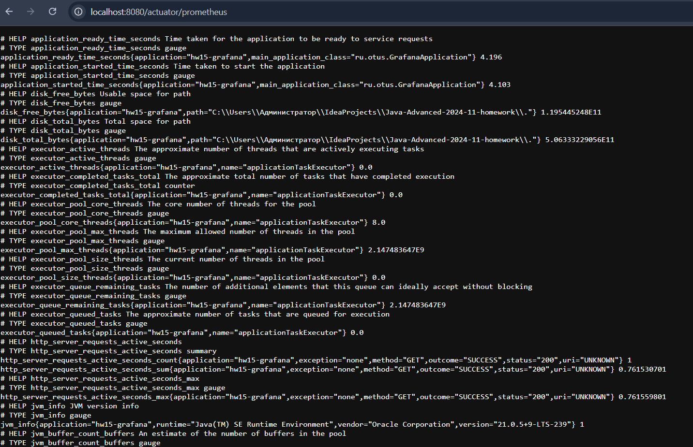
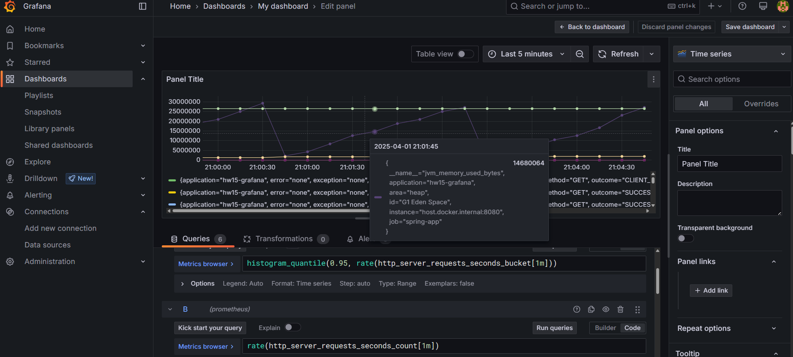
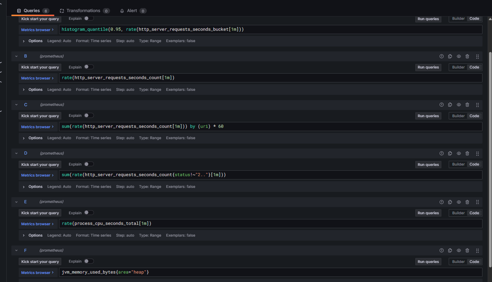

# Создать метрики для отслеживания нагрузки на Rest сервис

## Цель
Покрыть rest-сервис метриками, построить дашборд к Grafana и продемонстрировать результаты дашборда, подавая нагрузку через JMeter

## Скриншоты
1. 
2. 
3. 
4. 