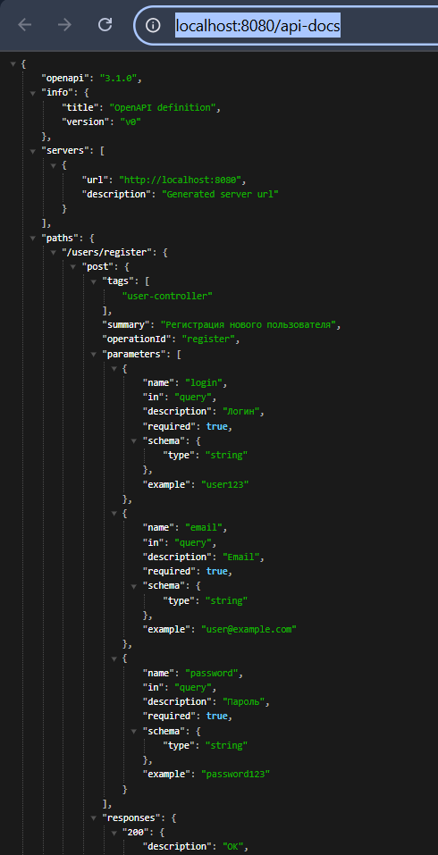
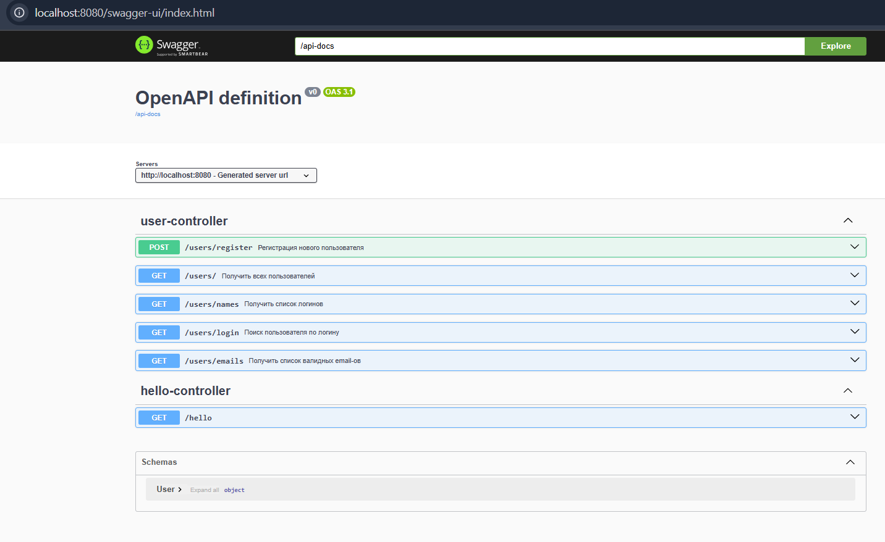

# Описать Rest-сервис с помощью OpenAPI

## Цель
1. Подключить springdoc в проект
2. Описать DTO и параметры эндпойтов аннотациями из OpenAPI (@Schema, @Parameter)
3. Настроить эндпойнт для OpenAPI по адресу /api-docs
4. Подключить SwaggerAPI и замапать его на /api-docs-ui
5. 
## Скриншоты
1. 
2. 