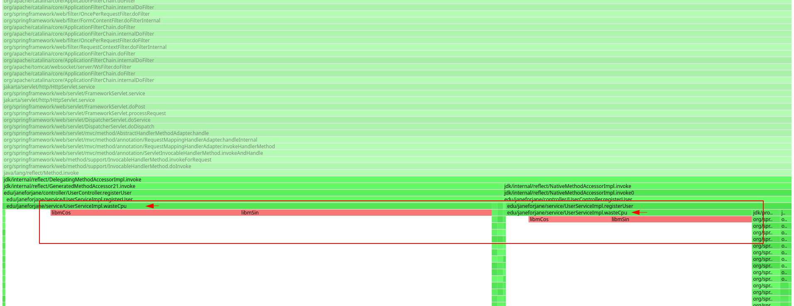

# Общее описание приложения
Это демонстрационное приложение на Spring Boot, 
которое имитирует проблемы для демонстрации 
процесса профилирования с помощью async-profiler. 


## Architecture
### Основные классы и их взаимодействие
User:
Класс, представляющий пользователя. Содержит поля id, login, password и largeData. Поле largeData не сохраняется в базе данных и используется для усиления утечки памяти.

UserRepository:
Интерфейс, расширяющий JpaRepository, для взаимодействия с базой данных H2.

UserService:
Сервис, содержащий бизнес-логику для регистрации пользователей. Сохраняет все зарегистрированные объекты User в кэш (что вызывает утечку памяти), а также в БД.

UserController:
Контроллер, обрабатывающий HTTP-запросы. Взаимодействует с UserService для регистрации пользователей.


Приложение использует встроенную базу данных H2 для хранения данных пользователей.

### Взаимодействие классов
UserController принимает HTTP-запросы на регистрацию пользователей и передает данные в UserService.
UserService проверяет наличие логина в кэше и базе данных, создает новый объект User с большими данными и сохраняет его в кэш и базу данных.
UserRepository используется для взаимодействия с базой данных H2.


## Описание проблемы и анализ

### CPU-затратные операции

#### Code

**UserService**:

```java
public class UserServiceImpl {

    public void registerUser() {
        wasteCpu();
        userRepository.save(input_user);
    }

    private void wasteCpu() {
        long result = 0;
        for (int i = 0; i < 1_000_000; i++) {
            result += Math.sin(i) * Math.cos(i); // нагрузка на cpu
        }
        System.out.println(result);
    }
}
```

#### Настройки профилирования

```bash
-e cpu -d 40 -f waste-cpu-flamegraph.html <PID>
```


#### Анализ flamegraph

    Файл:
    waste-cpu-flamegraph.html

Скрин:



    Выводы 
    → большой процент использования CPU методом wasteCpu
    → wasteCpu заметно доминирует в графе


