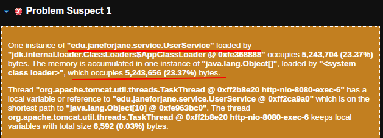

# Memory Leak Demo Application

## Общее описание приложения

Это демонстрационное приложение на Spring Boot, которое имитирует утечку памяти. Приложение сохраняет все пришедшие запросы на регистрацию пользователей в кэш, что приводит к постепенному увеличению потребления памяти. Для усиления утечки памяти, каждый объект `User` содержит большой массив данных, который не сохраняется в базе данных, но занимает значительное количество памяти.

Приложение использует встроенную базу данных H2 для хранения данных пользователей.

## Architecture

### Основные классы и их взаимодействие

1. **User**:
    - Класс, представляющий пользователя. Содержит поля `id`, `login`, `password` и `largeData`. Поле `largeData` не сохраняется в базе данных и используется для усиления утечки памяти.

2. **UserRepository**:
    - Интерфейс, расширяющий `JpaRepository`, для взаимодействия с базой данных H2.

3. **UserService**:
    - Сервис, содержащий бизнес-логику для регистрации пользователей. Сохраняет все зарегистрированные объекты `User` в кэш (что вызывает утечку памяти), а также в БД.

4. **UserController**:
    - Контроллер, обрабатывающий HTTP-запросы. Взаимодействует с `UserService` для регистрации пользователей.

### Взаимодействие классов

- **UserController** принимает HTTP-запросы на регистрацию пользователей и передает данные в **UserService**.
- **UserService** проверяет наличие логина в кэше и базе данных, создает новый объект `User` с большими данными и сохраняет его в кэш и базу данных.
- **UserRepository** используется для взаимодействия с базой данных H2.


## Run

Запуск приложения осуществляется посредством плагина `exec-maven-plugin`

Для запуска приложения с настройками памяти и автоматическим сбором дампа хипа при возникновении `OutOfMemoryError`, 
приложение требуется запускать со следующими параметрами:

- `-Xms32m -Xmx32m`
- `-XX:+HeapDumpOnOutOfMemoryError`


Для запуска, находясь в директории проекта, выполните команду в консоли:

```commandline
mvn clean compile exec\:java -Dexec.mainClass="edu.janeforjane.Main" -Dexec.args="-Xms32m -Xmx32m -XX:+HeapDumpOnOutOfMemoryError"
```

## How to Use

### Описание необходимых действий со стороны клиента

Для регистрации нового пользователя необходимо отправить POST-запрос 
на endpoint `/api/users/register` с параметрами `login` и `password`.

#### Пример запроса:

```commandline
POST http://localhost:8080/api/users/register?login=exampleUser&password=examplePass
```

##  Testing memory leak

Для проведения нагрузочного тестирования и инициирования утечки памяти в приложении необходимо:

    выполнить более 5 http-запросов к приложению

Эти запросы инициируют создание большого количества данных в приложении, что в конечном итоге приводит к исчерпанию
памяти и возникновению `OutOfMemoryError: Java heap space`.

Это можно сделать с помощью:

- **Http-клиент** - каждый запрос должен содержать уникальное значение параметра `login`
- **JMeter** - файл `doc/test_log-pass-service.jmx` - содержит тестовый план  для JMeter, который запускает несколько HTTP-запросов к приложению.


##  Heap dump analysis results

Выполнено с помощью Eclipse Memory Analyser.

Дамп хипа: `doc/HeapDumpOnOutOfMemoryError.hprof`

### Default report

Объект класса `UserService` указан как "Problem Suspect 1" 
в отчете Memory Leaks и занимает значительное количество памяти.



### Dominator tree

Объект класса `UserService` и связанный с ним объект `cachedUsers` имеют самый большой объем retained heap в отчете Dominator Tree, 
что указывает на то, что они удерживают много других объектов


### Top consumers

Объект класса `UserService` находится на первом месте в списке Biggest Objects 
в отчете Top Consumers, что указывает на то, что он занимает значительное количество памяти


